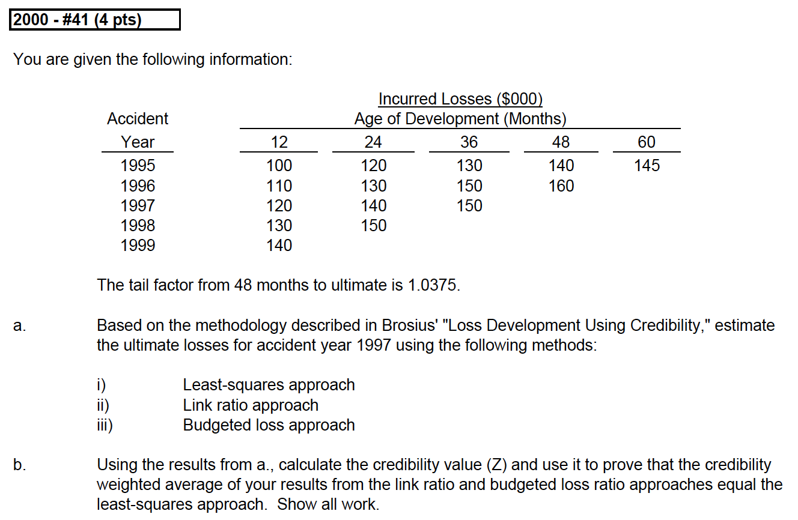
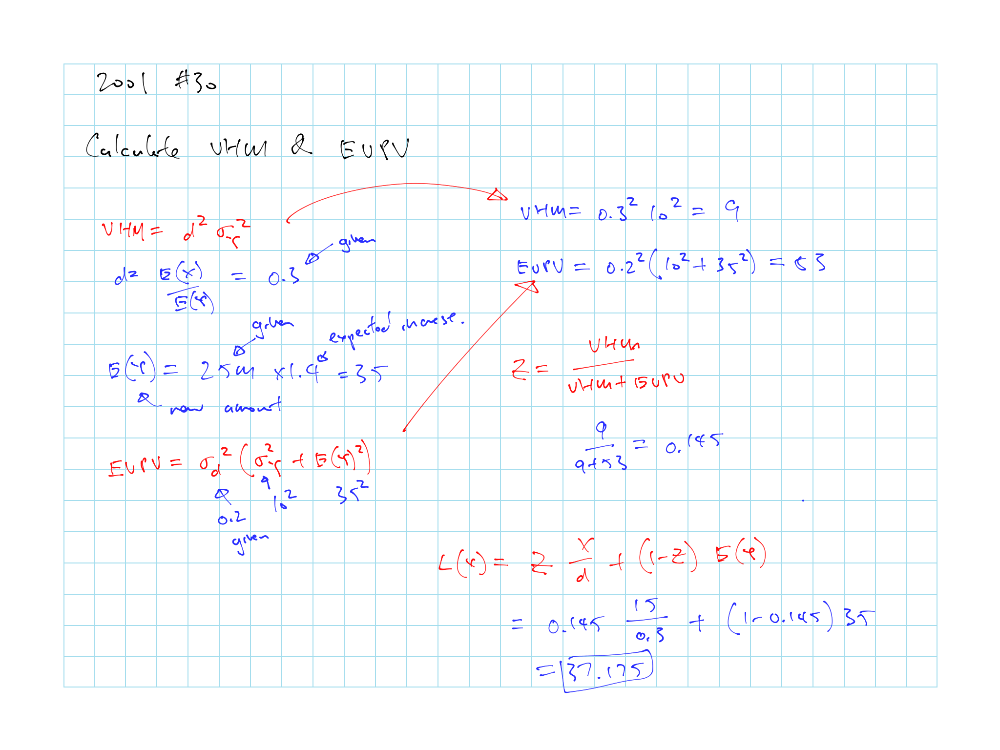

# (PART) Estimation of Policy Liabilities {-}

# Loss Development Using Credibility - E. Brosius

***Least Square***

* Least Square formula (\@ref(prp:least-sq))

    * Know how to do them on the calculator
    
    * Remember to adjust for exposure if needed

* Theorectical dis^n^ formulas: Poisson - Binomial (\@ref(prp:poi-bin)) and Negative Binomial - Binomail (\@ref(prp:nb-bin))

* Know the [conclusions](#conclusions) on LS

* Know the [caveat](#LS-Caveat) on least square

***Method comparisons***

* Formula for each given methods (Table \@ref(tab:method-form-ref))

* [Pros and cons](#Trad-Caveat) of each method

* The different $a$ and $b$ for each methods

***[Bayesian Credibility](#bay-cred)***

* Best linear estimator formula (\@ref(prp:bayes-ble))

* Know which method is best given the Cov and Var relationships (Table \@ref(tab:bayes-variance))

* [Development Formula](#cred-dev):  
Can use the credibility formula to get the LS results

* [Case load effect](#case-load)

***Additional [considerations](#consid) for calculations***

## Method Assumptions

Table: (\#tab:method-form-ref) Formula for a given method

| Method        | Formula      | Restrictions   |
| ------------- | ------------ | -------------- |
| Least Squares | $y = a + bx$ | No Restriction |
| Chainladder   | $y = bx$     | a = 0          |
| BF            | $y = a + x$  | b = 1          |
| ELR           | $y = a$      | b = 0          |

```{proposition, least-sq, name = "Least Squares Formula"}


$b = \dfrac{\overline{xy} - \bar{x}\bar{y}}{\overline{x^2}-\bar{x}^2} = \dfrac{\mathrm{Cov}(X,Y)}{\mathrm{Var}(X)}$

$a = \bar{y} - b\bar{x}$

Notes:

* In the example here we are looking at the ATA development

* This is effectively a credibility weighting system (giving more or less weight to the observed x as appropriate)

```

```{block, calc-note, type='rmdtip'}
Above caluclation can be done with the table features on TI-30XS
```

### Caveat with Traditional Method {#Trad-Caveat}

* ***Chainladder***:

    Difficult to select LDF when they vary greatly from year to year

* ***BF***:

    Doesn't work well with negative development
    
* ***ELR***:

    Ignores actual experience
    
* Difficulty with parameter estimation when loss patterns are changing

    * When the **nature of loss experience** is changing the use of unadjusted data can lead to errors

* Variability within a stable book still have sampling error

    $\Rightarrow$ *b* that doesn't reflect the true underlying characteristics

### Least Squares Pros & Cons {#LS-Caveat}

Pros

* Good when dist^n^ is the same across multiple years
  
    * As we are assuming a common $Y$ and $X$ over the years

* Good when there is little data and fluctuations in the year to year losses

* Good when the randomness of the data is primarily driven by process variance

Cons

* Bad when systemic shift year to year e.g. inflation, legal environment (Tort reform)

    * $\therefore$ best to adjust for inflation and putting all the years on a constant dollar basis before using the LS method
    
    * Also should adjust for exposure
    
        * As the expected value increase $\propto$ exposure and the covariances increase $\propto$ squared exposure

### Practical Considerations for the Least Square Method {#consid}

**Normalize** the losses by dividing with premium since LS assume constant distribution and also ***adjust for inflation***

Calculates ATU, so needs the tail factor first and also start from the oldest period

Recursively go backwards using the previous estimates

$Z = \dfrac{b}{c}$; $c$ is the ATU

Notes on parameters:

* $a$ = Projected ultimate if no losses are reported

* AY matures $\Rightarrow a \: \downarrow$; $Z \uparrow$; $c \downarrow$

* If a < 0 $\Rightarrow$ Use Chainladder to make a = 0

* If b < 0 $\Rightarrow$ Use ELR

* If b = 1 $\Rightarrow$ Same as BF

## Best Estimate based on Bayes (with Theoretical Distribution)

```{proposition, poi-bin, name = "Poisson - Binomial"}
Assume the loss reporting follows a theoretical distribution

* $Y =$ (Ultimate) # of claims incurred each year $\sim Poi(\mu)$

* $X =$ # of claims reported by year end $\sim Bin(y,d)$

    * i.e. each claim have probability $d$ of being reported in the first year

**Ultimate claims** = $Q(x) = x + \mu(1-d)$

**Unreported claims** = $R(x) = \mu(1-d)$

* (Expected # of claims) $\times$ (Expected % Unreported)
    
* Similar to the BF Method

```

```{proof}
$Q(x)$ is the estimator of $Y$. It's the sum of all possible $y$'s $\times$ probability of the result being $y$ given $x$

$\begin{align}
  Q(x) &= \sum \limits_{y = x}^{\infty} y \Pr(Y = y \mid X = x) \\
  Q(x) &= \sum \limits_{y = x}^{\infty} y \dfrac{\Pr(Y = y)\Pr(X = x \mid Y = y)}{\sum_i \Pr(Y = i) \Pr(X = x \mid Y = i)} \\
\end{align}$

And we get Ultimate claims = $Q(x) = x + \mu(1-d)$
```

```{proposition, nb-bin, name = "Negative Binomial - Binomial"}
Assume the loss reporting follows a theoretical distribution

* $Y =$ (Ultimate) # of claims incurred each year $\sim NB(r, p)$

    * $Y =$ # of failures until $r$ success with success probability = $p$

    * $\mathrm{E[Y]} = \dfrac{r(1-p)}{p}$

* $X =$ # of claims reported by year end $\sim Bin(y,d)$

**Unreported claims** = $R(x) = \dfrac{s}{1-s}(x + r)$ 

* $s = (1-d)(1-p)$
```

### Comparing Loss Development Methods

1. Simulate loss based on one of the theortical distribution

2. Apply the various loss development method and calculate their respective parameters ($y = a + b x$)

3. Compare the estimated parameters with the true parameters based on the underlying theortical distribution

4. Also compare the MSE from different methods

## Bayesian Credibility {#bay-cred}

We can't use the Bayes theorem as in the previous section if we don't know the underlying distribution

```{proposition, bayes-ble}
Estimate the ultimate losses using the **best linear estimator** of Y|X, $L(x)$

$L(x) = (x - \mathrm{E[X]})\dfrac{Cov(X,Y)}{Var(X)} + \mathrm{E[Y]}$

* Y = Ultimate Losses; X = Reported Losses

* Use this when we don't know the distribution of the random variable

* $L(x) = Q(x)$ when $Q(x)$ is linear
```

```{remark}
This is like the Bühlmann method, where $L$ is a linear function that minimizes $\mathrm{E}_X\left[\left(Q(X) - L(X)\right)^2\right]$

If $L(x) = a + b x$ then we minimize $\mathrm{E}_X\left[\left(Q(X) - a - bX \right)^2\right]$
```

Table: (\#tab:bayes-variance) Intuitive interpretation of $L(x)$

| Scenarios | Implications | Interpretation |
| --------------------------- | --------------------------- | --------------------------- |
| $x = \mathrm{E[X]}$ | $L(X) = \mathrm{E[Y]}$ | Losses are coming in as expected, estimate of ultimate losses is unchanged | 
| $\mathrm{Cov(X,Y)} \approx 0$  | $L(X) \cong \mathrm{E[Y]}$ | $X$ and $Y$ are only loosely related $\Rightarrow$ Use ELR Method |
| $\mathrm{Cov(X,Y)} \ll \mathrm{Var(X)}$ | $L(X) \cong \mathrm{E[Y]}$ | $X$ and $Y$ don't vary together | 
| $\mathrm{Cov(X,Y)} \approx \mathrm{Var(X)}$ | $L(X) \approx x + \left[\mathrm{E}[Y] - \mathrm{E}[X] \right]$ | Same as BF Method |
| $\mathrm{Cov(X,Y)} \gg \mathrm{Var(X)}$ | $X$ and $Y$ move togther, $Y$ is significantly influenced by $X$ | Use Dev Method |

### Practical Application (LS Development)

```{proposition, dev-form-1, name = "Development Formula 1"}
Estimate $\mathrm{E}[X]$, $\mathrm{Var}(X)$, and $\mathrm{Cov}(X,Y)$ from data (i.e. a series of past years) assuming a common $Y$ and $X$

* This $L(x)$ here is the same as the least-square estimate as in \@ref(prp:least-sq)
```

```{proof}
Start with$y = a + bx$ and plug in $a$ and $b$ from proposition \@ref(prp:least-sq)

We get:

$\begin{align}
  y &= (\bar{y} - b\bar{x}) + bx \\
  &= \bar{y} + b \left(x - \bar{x}\right) \\
  &= \left(x - \bar{x}\right) \dfrac{\mathrm{Cov}(X,Y)}{\mathrm{Var}(X)} + \bar{y} \\
\end{align}$

Which equals $L(x)$ $\therefore$ the least-square estimate is the best linear estimate of $Q(x)$
```

```{remark}
If not for sampling error, the least square method will give us the best linear approximation to the Bayesian estimate, regardless of the distributions of $X$ or $Y$
```

### Credibility Form of the Dev' Formula {#cred-dev}

Alternative way to express $L(x)$, following Bühlmann credibility, we express $L(x)$ in terms of:

* Expected Value of the Process Variance ($EVPV$)

    $\mathrm{E}_Y\left[\mathrm{Var}(X \mid Y )\right]$

* Variance of the Hypothetical Mean ($VHM$)

    $\mathrm{Var}_Y(\mathrm{E}\left[X \mid Y \right])$

* We can read $VHM$ as distrust in underwriters and EVPV distrust in the claims department

* Use the method below when the least-square assumption fails

    (i.e. Year to year changes in loss and loss distributions are small, or can be corrected for)

Formula below requires addtional hypothesis (in paper appendix?)

***

```{proposition, dev-form-2, name = "Development Formula 2"}
Suppose that there is a real number $d \neq 0$ such that $\mathrm{E}\left[X \mid Y = y \right] = dy$ for all $y$

$L(x) = Z \underbrace{\dfrac{x}{d}}_{\begin{array}{c} \text{Dev'}\\ \text{Method}\\ \end{array}} + (1-Z)\underbrace{\mathrm{E[Y]}}_{ELR}$

* Formula is the credibility weighting of the chainladder estimate and ELR estimate

* If $EVPV = 0$ $\Rightarrow$ Full weight to the chainladder

* If $VHM = 0$ $\Rightarrow$ Full weight to the $\mathrm{E}[Y]$
```

```{proof}
Start with the proposition \@ref(prp:bayes-ble) and we set $\dfrac{\mathrm{Cov}(X,Y)}{\mathrm{Var}(X)} = \dfrac{1}{d} \dfrac{VHM}{VHM + EVPV}$

$\begin{align}
  L(x) &= (x - \mathrm{E[X]})\dfrac{Cov(X,Y)}{Var(X)} + \mathrm{E[Y]} \\
  &= (x - \mathrm{E[X]}) \left \{ \dfrac{1}{d} \dfrac{VHM}{VHM + EVPV} \right \} + \mathrm{E[Y]} \\
  &= (x - \mathrm{E[X]}) \left \{ \dfrac{1}{d} Z \right \} + \mathrm{E[Y]} \\
  &= Z \dfrac{x}{d} - Z \dfrac{\mathrm{E}[X]}{d} + \mathrm{E}[Y] \\
  &= Z \dfrac{x}{d} - Z \mathrm{E}[Y] + \mathrm{E}[Y] \\
  &= Z \dfrac{x}{d} + (1 - Z) \mathrm{E}[Y] \\
\end{align}$

Which is what we have above in proposition \@ref(prp:dev-form-2)
```

***

```{proposition, cred-dev-m1, name = "Method for Z"}
Calculate Z to use with formula in proposition \@ref(prp:dev-form-2)

$Z = \dfrac{VHM}{VHM + EVPV} = \dfrac{\mathrm{Var_Y(E[X|Y])}}{\mathrm{Var_Y(E[X|Y])}+\mathrm{E_Y[Var(X|Y)]}}$

* $VHM = d^2 \sigma^2_Y$
    
* $EVPV = \sigma^2_d[\sigma^2_Y + \mathrm{E[Y]}^2]$

* $d =$ % reported
```

```{remark}
We use the above $Z$ when underlying distribution not stable (historical not a good predictor)

* LS only works when the underlying dist^n^ are stable

We assumes the following

* $d \: {\perp\!\!\!\!\perp} \: X$: reporting speed does not vary with the volume of claims
    
* $D = \dfrac{X}{Y}$

    * Here we typically assume the $\sigma_{\frac{X}{Y}}$ does not depend on $Y$
    
* Results sensitive to $\mathrm{E[Y]}$ and $\mathrm{E[D]}$ but not the $\sigma$
```

```{remark}
Alternatively, $Z = \dfrac{b}{c}$, where $c$ is the CDF and $b$ is from the LS

* This yield the LS results (Where we assume there's no change in the underlying year to year data)

* Assume same $d$ for any size of $y$; Not necessarily true for large or small $y$
```

```{proof}
Start with $\dfrac{\mathrm{Cov}(X,Y)}{\mathrm{Var}(X)} = \dfrac{1}{d} \dfrac{VHM}{VHM + EVPV}$

Based on \@ref(prp:cred-dev-m1) we have $Z = \dfrac{VHM}{VHM + EVPV}$

And $b$ from \@ref(prp:least-sq) $\dfrac{\mathrm{Cov}(X,Y)}{\mathrm{Var}(X)}$

Then we have $b = \dfrac{1}{d} Z$

Next, $\dfrac{1}{d} = \dfrac{1}{\text{% Reported}} = \text{Reported CDF} = c$

Finally we have $Z = \dfrac{b}{c}$
```

***

```{proposition, spec-poi-bin, name = "Poisson-Binomial Special Case"}


$L(x) = x + (1-d)\mathrm{E(Y)}$

* $Z = d$

* Same as BF

* **BF is optimal** when claim counts follow Poi - Bin
```

```{proof}
Start with $EVPV$ and $VHM$ under the Poisson-Binomial case as discussed in proposition \@ref(prp:poi-bin)

$EVPV = \mathrm{E}[yd(1-d)] = \mu d(1-d)$

$VHM = \mathrm{Var}(yd) = \mu d^2$

Then $Z = \dfrac{\mu d^2}{\mu d^2 + \mu d(1-d)} = d$

And we get what we have from proposition \@ref(prp:spec-poi-bin) $L(x) = x + (1-d)\mathrm{E(Y)}$
```

```{remark}
Note that $L(x) = Q(x)$ (as in proposition \@ref(prp:poi-bin)) since $Q(x)$ is linear, so the best linear estimate = the bayesian estimate
```

***

```{proposition spec-NB-bin, name = "Negative Bin-Binomial Special Case"}


$L(x) = \dfrac{x}{d + p(1-d)} + \dfrac{\mu p (1-d)}{d + p(1-d)}$

* $Z = \dfrac{d}{d + p(1-d)}$
```

```{remark}
$VHM$ is larger here than in the Poi-Binomial case while the $EVPV$ is the same

$\therefore$ $Z$ is larger $\Rightarrow$ Chainladder method gets more weight

Also note that since $Q(x)$ is still linear, $L(x) = Q(x)$
```

### Caseload Effect {#case-load}

In proposition \@ref(prp:dev-form-2) we assumed the expected number of claims reported is $\propto$ number of claims incurred

* Not necessarily true e.g. claim is more likely to be reported in a timely fashion when the caseload (case reserve) is low, and we expect the development ratio $\dfrac{\mathrm{E}[X \mid Y = y]}{y}$ to be not a constant decreasing function of $y$

When $D$ and $Y$ not independent the credibility-based development formula still works (i.e. constant development ratio is not essential for a credibility-based development formula)

* e.g. $d$ larger for small $y$ since small claims are reported more timely, so settle faster

* e.g. the opposite situation when large $y$ has as larger $d$: For a property book when large weather event happens, report quicker

```{proposition, dev-form-3, name = "Development Formula 3"}
Supposed there are real numbers $d \neq 0$ and $x_0$ such that $\mathrm{E}[X \mid Y= y] = dy + x_0$ for all $y$

$L(x) = Z \dfrac{x - x_0}{d} + (1-Z)\mathrm{E[Y]}$

* $Z = \dfrac{VHM}{VHM + EVPV}$
```

```{remark}
Assumptions:

* $\mathrm{E[X|Y=y]} = dy + x_0$

    * $x_0$ is for the fixed salary
    
    * $d \neq 0$

    * Development ratio $= d + \dfrac{x_0}{y}$
    
        Which does decrease as $y$ gets larger
        
    * This gives $\mathrm{E}[X \mid Y = 0] = x_0 > 0$
    
        Which is okay consider claims department in real life

* Impossible to determine $x_0$ and $d$ in practice but this shows that the least square methods still make sense when development ratio varies with caseload
```

## Conclusions {#conclusions}

LS is the best linear estimate of $Q(x)$, the theoretical best estimate of the ultimate loss

LS produce more reasonable results when year to year fluctuations are severe

LS does not do well when the variations are due to underlying changes in the payment pattern (due to internal or external changes)

* e.g. When there is a systematic shift in the business

Subject to sampling error when estimating parameters similar to other methods

## Past Exam Questions

```{block, TIA-Q, type='rmdcaution'}
Haven't done TIA practice questions
```

**Concepts**

* 1996 - #28: Poi-bin process 

* 1996 - #50: When to use LS

* 2000 - #2: Method assumptions

* 2001 - #22: Which method is better given the Cov(X,Y) and Var(X) relationships

* 2003 - #3: $a$ and $b$ for different methods

* $\star$ 2006 - #4: Cov(X,Y) and Var(X) relationships (phrased a bit differently)

* 2006 - #15 d: LS assumptions

* 2007 - #42: Method assumptions

* 2009 - #3 b: LS assumptions (LS not best given $b < 0$)

* 2014 #2: Know assumptions of methods for Dev (fitted line and residuals)

**Full Calculations**

* $\star$ 2000 - #41(fig \@ref(fig:2000-41)): LS, dev and ELR from triangle; Weight the 2 with $Z = \dfrac{b}{c}$ to get to LS

* $\star$ 2001 - #31(fig \@ref(fig:2001-30)): Use VHM and EVPV for

* 2002 - #21: LS, dev and ELR from triangle and weight for LS

* 2008 - #9: LS, dev and ELR from triangle

* $\star$ 2008 - #10a: VHM and EVPV calc

    * Double check the $\sigma_y$ calc make sense

* $\star$ 2011 #1: a) LS w/ exposure adjustment b) Assess LS parameters resonability c) Draw the relationship of losses to date vs ultimate for the 3 methods

* 2012 ‐ #1 b: Solving equations to back out numbers using BK and BF method

* 2012 - #4: LS and know that LS gives the optimal linear weight based on $\dfrac{b}{c}$

* 2014 #1: a) VHM and EVPV b) Why LS is not appropriate

**Simple Plug and Play**

* 1998 - #19: BF with LS

* $\star$ 2003 - #22: Dev and ELR, key is to adjust for exposure

* 2005 - #12: LS calc by $a$ and $b$

* 2006 - #5: LS calc by $a$ and $b$

* 2006 - #15 a-c: Dev, BF, and cred

* 2009 - #3 a: LS Calc

* 2012 ‐ #1 a: Dev, BF, Benktander 

### Question Highlights

```{r 2000-41, echo = FALSE, out.width='100%', fig.show='hold', fig.cap='2000 Question 41'}

knitr::include_graphics('questions/2000-41A.png')
```

```{r 2001-30, echo = FALSE, out.width='100%', fig.show='hold', fig.cap='2001 Question 30'}
knitr::include_graphics('questions/2001-30Q.png')

```