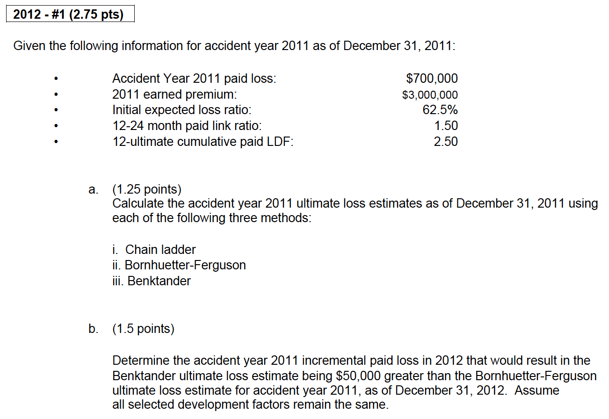
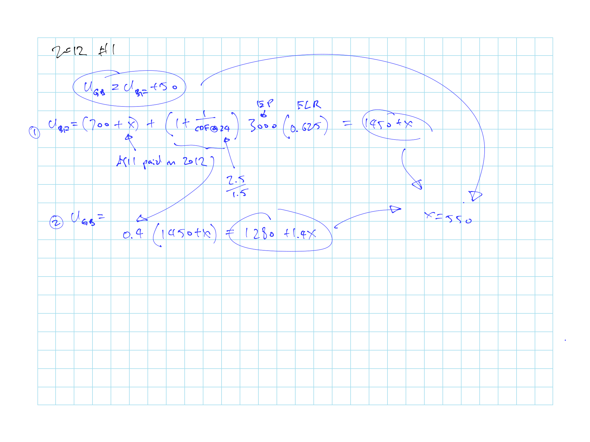

# A2 Credible Claims Reserve: The Benktander Method - T. Mack

## Cliff's Summary

Know the GB method formula and properties

* Recognize actual emergence faster

### Types of Exam Questions

Haven't done TIA practice questions

**Concepts**

* 2006 - #16 b c: GB method vs BF and dev
    * Lower MSE and gives weight to both a-priori and emerged
* 2007 - #46 b-c: BF weight, BF drawback, GB advantages over BF
* 2008 - #10 b-c: Comparison of methods and GB as credibility weight
* 2013 - #4 b: GB approaches CL as more iterations are done

**Simple Plug and play**

* 2004 - #31: GB method ultimate
* 2005 - #16: GB method ultimate
* 2006 - #16 a: GB method ultimate
* 2012 - #1 a: GB BF Dev
* $\star$ 2014 - # 5: Credibility weight methods from the Clark paper on LDF curve fitting
    * Weight to the Dev method is $(1-q_k)$

**Other**

* [2012 - #1 b](#2012-1): Minor arithmetic
* 2013 - #4 a: Back out LDFs with BF and GB methods

## Benktander Method (GB)

$R_{GB} = q_kU_{BF}$

* $q_k = (1 - p_k)$ = % unpaid loss @ $k$

* $U_{BF} = C_k + q_kU_0$

* Weight on $U_0$ is $q_k^2$

Recognizes actual emergence faster $\Rightarrow$ Less weight on the a-priori

* BF reduces the use of actual loss to the extent of the complement credibility

$U_{GB} = (1-q_k)U_{CL} + q_kU_{BF}$

### MSE

MSE of Benktander is almost as small as the MSE of the optimal credibility in most cases

$MSE(R_{GB}) < MSE(R_{BF})$

* When $p_k \in [0, 2c^*]$; $c^*$ is the optimal credibility

* Doesn't hold if $c^*$ is small and $p_k$ is large

### Theorem 3.1

Theorem 3.1: As you iterate the Benktander many more times, the weight to $U_0$ approaches 0 and full credibility goes to the CL method

## Past Exam Questions

2012 - #1

