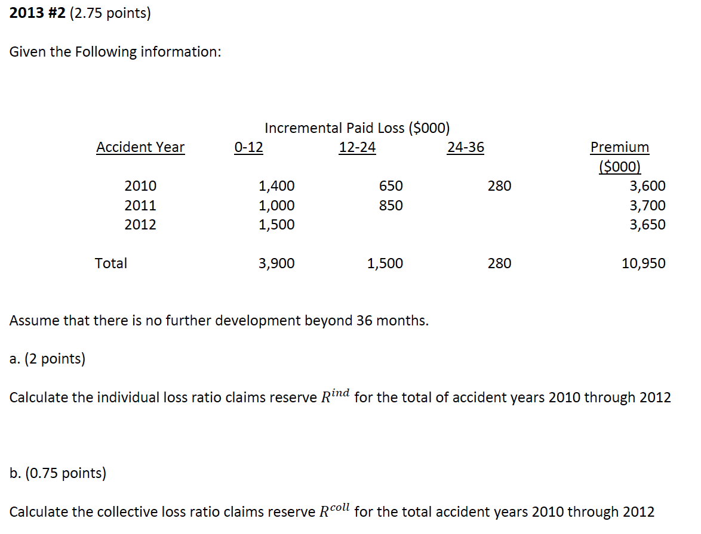

# Credible Claims Reserve: Benktander, Neuhaus and Mack - W. Hurlimann

Everything is based on a special method to calculate the $ELR$ and $LDFs$

* $ELR$ is based on the whole triangle $\sum$-ing up column LRs

* $LDFs$ are based $\dfrac{\text{Col LRs}}{ELR}$

* Key is just to watch out for incremental vs cummulative

Know the $Z$ for different methods (Table \@ref(tab:method-tbl-cred))

* The $Z$ is for weighting the **reserve**

* Optimal credibility formula assumes $U_i^{BC} {\perp\!\!\!\!\perp} C_i$ and $R_i$

## Loss Ratio Claims Reserve

$m_k$: **Expected loss ratio @ each age** $k$

* Based on **incremental** column paid loss ratios

* $k \in \{1, ..., n \}$ For $n$ development periods

$ELR$: **Expected loss ratio**:  

* $ELR = \sum \limits_{k=1}^n m_k$

* a priori ELR for collective loss ratio approach

* Use for the entire triangle

$p_k$: **% Losses emerged** for exposure period $k$

* $p_k = \dfrac{\sum \limits_{j=1}^{n} m_j}{ELR}$

* Based on column loss ratios $m_k$

* Loss ratio payout factor or loss ratio lag-factor

* $q_k = 1 - p_k$ is the loss ratio reserve factor

### LR Claims Reserve Summary

$$R_i^c = Z_iR_i^{ind} + (1-Z_i)R_i^{coll}$$

Table: (\#tab:method-tbl-cred) Comparison of $Z_i$ for Different Methods

| $Z_i$ | Method |
| ------------------ | ------------------ |
| 1     | Chainladder; Individual LR|
| 0     | BF; Collective LR|
| $p_i$ | Benktander |
| $p_i \times ELR$ | Neuhaus |
| $Z = \dfrac{p_i}{p_i + \sqrt{p_i}}$ | Optimal |

```{remark}


* Neuhaus gives low credibility to lines with low loss ratios $\Rightarrow$ $\Delta$ exposure base will $\Delta$ result

* Optimal credibility is capped @ 0.5

* Benktander and Neuhaus reduce the MSE of the reserve estimate nearly to an optimal level outperforming individual and collective
```

```{proposition, indi-res, name = "Individual Loss Ratio Claims Reserve"}
Analogous to chainladder

$\begin{align}
  R_i^{ind} &= \dfrac{C_{ik}}{p_k} \times q_k \\
  &= \dfrac{C_{ik}}{p_k} - C_{ik} \\
  &= U_i^{ind} - C_{ik} \\
\end{align}$
```

```{proposition, coll-res, name = "Collective Loss Ratio Claims Reserve"}
Analogous to BF

$\begin{align}
  R_i^{Coll} &= q_i(V_i \times ELR) \\
  &= = q_i(U_i^{BC}) \\
\end{align}$

* BC = Burning Cost
```

### Credible LR Claims Reserve

Optimal credibility weights for loss ratio claims reserve

Walk through of how we got the optimal $Z^*$ formula

***

Minimize error between actual and estimate unpaid losses: $MSE(R_i^c) = \mathrm{E}[(R_i^c - R_i)^2]$

$Z^* = \dfrac{p_i}{q_i} \dfrac{Cov(C_i, R_i) + p_i q_i Var(U_i^{BC})}{Var(C_i) + p_i^2 Var(U_i^{BC})}$

* **Assumes** $U_i^{BC} {\perp\!\!\!\!\perp} C_i$ and $R_i$

Comments on the formula:
    
* $p \uparrow \: \Rightarrow \: Z_i^* \uparrow$ because of $\dfrac{p}{q}$

* High $Cov(C_i, R_i)$ $\Rightarrow$ Paid to date and unpaid are correlated $\Rightarrow$ Credibility $\uparrow$

* Large $Var(U_i^{BC})$ $\Rightarrow$ Don't trust a priori

    * $Z \approx \dfrac{p}{q} \times \dfrac{pq}{p^2} = 1$
    
    * Give nearly full credibility to the CL when a priori has large variance

$Z_i^* = \dfrac{p_i}{p_i + t_i}$ After some assumptions about distribution of $\dfrac{c_i}{U_i}$

$Z_i^* = \dfrac{p_i}{p_i + \sqrt{p_i}}$ After some more assumptions

## Remark 6.1

Doing all the above with more "Traditional" method

* Get $p_i$ with $p_i^{CL}$, inverse of the CDF

* Get ELR with Cape Code

    * $\dfrac{\sum\limits_{i,k}S_{ik}}{\sum\limits_i V_i \times p_i^{CL}}$

* Benktander with $Z = p_i$

* Optimal Cape Code $Z = \dfrac{p}{p+\sqrt{p}}$

* BF use some other a-priori that varies by AY and $Z = 0$

    * <span style="color:red">double check the weight, the summary say it is Z=0 but full notes say Z = p</span>

## Notation

For $n \times n$ triangle and losses fully developed at $n$

Where $i$ is exposure period and $k$ is the age

* $S_{ik} =$ Incremental Paid

* $C_{ik} =$ Cumulative Paid

* $U_i =$ Ultimate loss

* $V_i =$ Exposure base

* $m_k =$ expected loss ratio

* $\hat{m}_k =$ estimate of $m_k$


## Past Exam Questions

```{block, type='rmdcaution'}
Haven't done TIA practice questions
```

**Full Calculation**

* 2013 #2 (fig \@ref(fig:2013-2)): Reserve calc 

* $\star$ 2015 #1: Neuhaus and optimal
    
    * <span style="color:red">Why is this needed?</span> $\operatorname{Var}(U_i) = \operatorname{Var}(U_i^{BC})$ for the optimal credibility formula

### Question Highlights

```{r 2013-2, echo = FALSE, out.width='100%', fig.show='hold', fig.cap='2013 Question 2'}

knitr::include_graphics('questions/2013-2A.png')
```