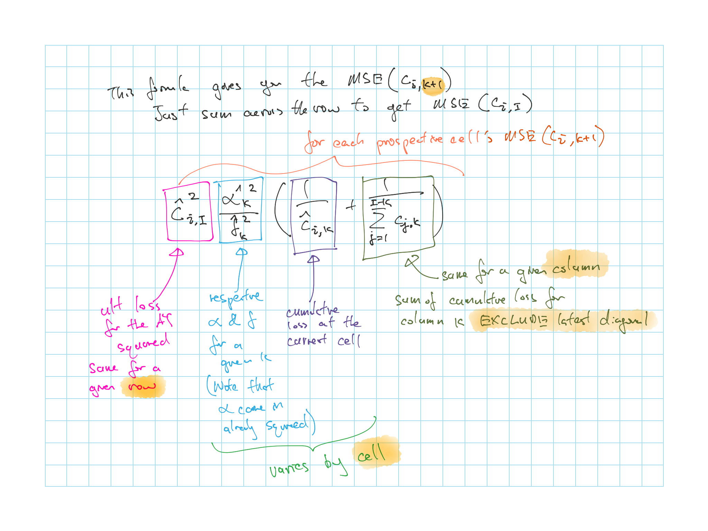
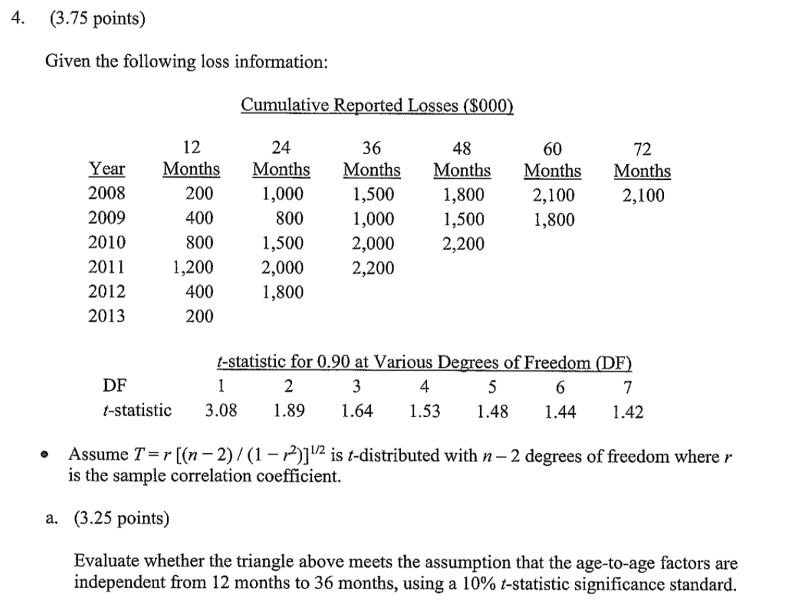
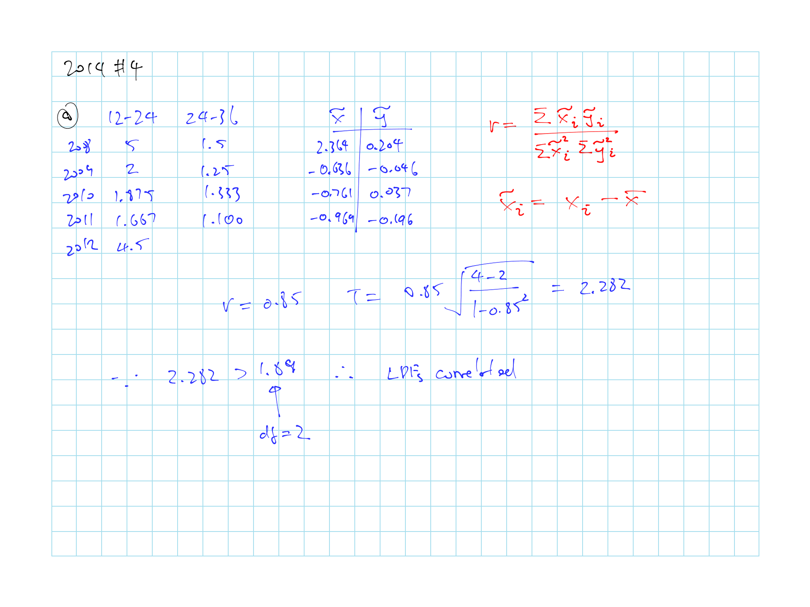
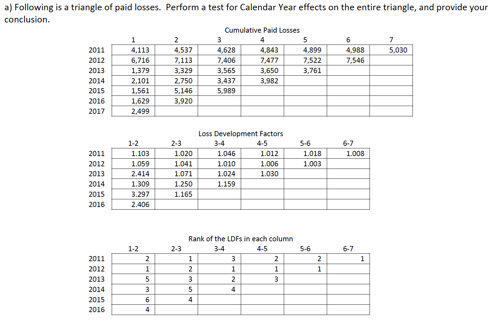

# Measuring the Variability of Chain Ladder Reserve Estimate - T. Mack

$\star$ 3 underlying **assumptions** of [chain ladder](#cl-ass) that makes the [implicit assumptions](#mack-implicit-ass) hold

1. Expected incremental losses are $\propto$ losses to date, dependent on age (prop. \@ref(prp:cl-ass-1))

2. Losses in each AY are $\perp\!\!\!\!\perp$ of the losses in other AYs (prop. \@ref(prp:cl-ass-2))

3. Variance of the incremental losses is $\propto$ losses reported to date dependent on age (prop. \@ref(prp:cl-ass-3))

$\star$ 3 different **weight and variance** assumptions from table \@ref(tab:CL-var-weight)

$\star$ **Mean squared error** [calculation](#mack-mse-app)

* The big MSE formula \@ref(eq:mse-formula)

* How to get the $\alpha$'s we need for the MSE formula \@ref(eq:alpha-1) and \@ref(eq:alpha-2)

**Confidence Interval**

* Normal: equation \@ref(eq:normal-ci)

* $\star$ Log-normal: equation \@ref(eq:lognormal-ci)

    * Use log-normal when $s.e.(\hat{R}_i) > \dfrac{R_i}{2}$

$\star$ When the above assumptions might be [violated](#cl-ass-vio) and know the 4 **test of assumptions** to check

* Test 1. [Intercept](#mack-int-test)

* Test 2. [Residuals](#mack-residuals)

    * Formula for residual \@ref(eq:residual-eq)

* Test 3. [CY Test](#mack-cy-test)

    * How to get $z$ \@ref(eq:s-l-diagonal-mack)
    
    * Expected value \@ref(eq:exp-z-diagonal-mack) and variance \@ref(eq:var-z-diagonal-mack)
    
        * Or just memorize them up to 6 (Table \@ref(tab:cy-test-exp-var-table))

* Test 4. [Adjacent LDF Correlation](#mack-adjacent-ldf)

    * $T$ for age $k$ \@ref(eq:t-k-mack) and $S$ \@ref(eq:sq-diff-rank-mack)

    * $T$ for the whole triangle \@ref(eq:total-t-mack)
  
    * CI to compare with resutls \@ref(eq:t-ci-mack)
    
        * This is test at a lower CI
        
    * This is similar to [Venter's test](#venter-imp-5)
    
    * Why test the whole triangle versus just pairs of LDFs

## Chainladder Underlying Assumptions {#cl-ass}

```{definition, mack-1994-def}
Notations use for Mack

* $c_{i,k} =$ cumulative losses for AY $i$ @ age $k$

* $f_k =$ LDF from $k$ to $k + 1$, $k \in [1:I-1]$

* $I =$ size of the triangle
```

```{proposition, cl-ass-1, name = "Chain Ladder Assumption 1"}
$$\mathrm{E}\left [c_{i,k+1} \mid c_{i,1} \cdots c_{i,k}\right ] = c_{i,k} \times f_k$$
```

```{remark}


* Expected incremental losses are $\propto$ losses to date
    
* Proportion depends on the age $k$ of AY

* Our best estimate of ultimate depends only on the losses to date

    Ignores prior period losses
```

```{corollary}
Restating Chain Ladder Assumption 1:

$$\mathrm{E}\left[ \dfrac{c_{i,k+1}}{c_{i,k}} \mid c_{i,1},...,c_{i,k} \right]$$
```

```{remark}


* Expected LDF is unbiased

* Implies that development to $c_{i,k+1}$ is independent of the size of losses at $c_{i,k}$

* Implies that adjacent LDFs are independent
```


```{proposition, cl-ass-2, name = "Chain Ladder Assumption 2"}
$$\left \{c_{i,1} \cdots c_{i,I} \right \} \: {\perp\!\!\!\!\perp} \: \left \{c_{j,1} \cdots c_{j,I} \right \} \:\: : \:\: i \neq\ j$$
```

```{remark}


* Losses in each AYs are ${\perp\!\!\!\!\perp}$ of the losses in other AYs
    
* This assumption make our estimate unbiased

```

```{proposition, cl-ass-3, name = "Chain Ladder Assumption 3"}
$$\mathrm{Var}\left (c_{i,k+1} \mid c_{i,1} \cdots c_{i,k}\right ) = \alpha_k^2 \: c_{i,k}$$
```

```{remark}


* Variance of the incremental losses is $\propto$ losses reported to date
    
* Proportion depends on the age ($k$) of AY (i.e. same for each column but varies for each column)
    
* $\hat{f}_k$ is selected to minimize the variance

```

### Implicit Assumptions {#mack-implicit-ass}

Taking a step back and look at the implicit assumptions we make when using *CL*

* For these implicit assumptions to hold, the 3 [underlying assumptions](#cl-ass) have to be true

We are making assumptions on **how we select** the factor $\hat{f}_k$ and the **application**: 

$$\hat{c}_{i,k+1} = c_{i,k} \times \hat{f}_k$$

Which requires the following assumptions:

1. Unbiased estimate of each $f_k$

    * $\mathrm{E}\left[ \hat{f}_k \right] = f_k$
    
        $\hat{f}_k$ are representative of the true $f_k$

    * Based on assumption 1 & 2 (prop. \@ref(prp:cl-ass-1) & prop. \@ref(prp:cl-ass-2))
    
    * See proof in Mack appendix A

2. Unbiased estimate of Ultimate

    * $\mathrm{E}\left[ \hat{c}_{iI} \right] = c_{ik} \times \hat{f}_k \times \cdots \times \hat{f}_{I-1} = \mathrm{E}\left[ c_{iI} \right]$
    
        Multiplying the $\hat{f}_k$'s by the paid to date will give us an unbiased estimate of the future losses

    * Based on assumption 1 & 2 (prop. \@ref(prp:cl-ass-1) & prop. \@ref(prp:cl-ass-2))
    
    * See proof in Mack appendix C

3. To use volume weighted average LDF

    * Based on assumption 3 (prop. \@ref(prp:cl-ass-3))
    
4. To calculate the confidence interval

    * Based on assumption 3 (prop. \@ref(prp:cl-ass-3))

### Proof for Assumption 3 {#cl-ass-3-proof}

To estimate $f_k$ we can weight the historical LDFs in many different ways, putting it in general terms:

\begin{equation}
  \hat{f}_k = \sum_i \left( \dfrac{c_{i,k+1}}{c_{i,k}} \right) \times w_{i,k} \:\:\:\: : \:\:\:\: \sum_i w_{i,k} = 1
  (\#eq:wtd-ldf)
\end{equation}

```{remark}
We assume each of the $\left( \dfrac{c_{i,k+1}}{c_{i,k}} \right)$ are an unbiased estimate of $f_k$ (See proof below)

$\therefore$ Any weighting of them is an unbiased estiamte of $\hat{f}_k$
```

```{proof}
$$\begin{align}
    \mathrm{E}\left[ \dfrac{c_{i, k+1}}{c_{i,k}} \right] &= \mathrm{E} \left[ \mathrm{E} \left[ \dfrac{c_{i, k+1}}{c_{i,k}} \mid c_{i,1}, ...,c_{i,k}\right] \right] &\cdots \:\:\: (1)\\
    &= \mathrm{E} \left[ \mathrm{E} \left[ c_{i, k+1} \mid c_{i,1}, ...,c_{i,k}\right] / c_{i,k} \right] &\cdots \:\:\: (2)\\
    &= \mathrm{E} \left[ c_{i,k} \: f_k \:/ c_{i,k} \right] &\cdots \:\:\: (3)\\
    &= \mathrm{E} \left[f_k\right] \\
    &= f_k &\cdots \:\:\: (4) \\
  \end{align}$$
```

```{remark}


1. Because the iterative rule $\mathrm{E}[X] = \mathrm{E}[\mathrm{E}(X \mid Y)]$

2. Because $c_{i,k}$ is scalar since it's given

3. From assumption 1 (prop. \@ref(prp:cl-ass-1))

4. Because $c_{i,k}$ is scalar
```

```{remark}
When we use weighted volume average $w_{i,k} = \dfrac{c_{i,k}}{\sum \limits_{j} c_{j,k}}$
```

***

Based on theory of point estimation, among several unbiased estimators, prefrence should be given to the one with the smallest variance

The weights that minimize the variance is inversely proportional to the variance of the item we are weighting, i.e.:

* We want weights $w_{i,k}$ for each $i$ on $\left( \dfrac{c_{i,k+1}}{c_{i,k}} \right)$

* The weight we apply to each $\left( \dfrac{c_{i,k+1}}{c_{i,k}} \right)$ varies based on the variance of $\left( \dfrac{c_{i,k+1}}{c_{i,k}} \right)$

* And if $\left( \dfrac{c_{i,k+1}}{c_{i,k}} \right)$ has high variance its weight will be lower to minimize the total variance of our estimate of $\hat{f}_k = \left( \dfrac{c_{1,k+1}}{c_{1,k}} \right) \times w_{1,k} + \cdots + \left( \dfrac{c_{I,k+1}}{c_{I,k}} \right) \times w_{I,k}$

* Mack appendix B has a proof of this

High variance estimate get lower weight:

$$\dfrac{1}{w_{i,k}} \propto \mathrm{Var}\left( \dfrac{c_{i,k+1}}{c_{i,k}} \right)$$

Since $c_{i,k}$ is known, we can pull it out of the variance term

$$\dfrac{1}{w_{i,k}} \propto \dfrac{\mathrm{Var}(c_{i,k+1})}{c_{i,k}^2}$$

and we get

\begin{equation}
  w_{i,k} \times \mathrm{Var}(c_{i,k+1}) \propto c_{i,k}^2
  (\#eq:var-weight)
\end{equation}

***

Recall the weight for the volume weighted average is:

$$\begin{align}
  w_{i,k} &= \dfrac{c_{i,k}}{\sum \limits_{j} c_{j,k}}\\
  w_{i,k} &\propto c_{i,k}\\
\end{align}$$

Applying the above to equation \@ref(eq:var-weight) we get:

$$\begin{align}
  c_{i,k} \times \mathrm{Var}(c_{i,k+1}) &\propto c_{i,k}^2 \\
  \mathrm{Var}(c_{i,k+1}) &\propto c_{i,k} \\
  \mathrm{Var}(c_{i,k+1}) &= \alpha^2_k \times c_{i,k} \\
\end{align}$$

And we have chainladder assumption 3 (Prop. \@ref(prp:cl-ass-3))

### LDF Selections Assumptions

Recall equation \@ref(eq:wtd-ldf) and \@ref(eq:var-weight)

Table: (\#tab:CL-var-weight) Relationships between weight, variance and residual (Mack)

| Weight $w_{i,k}$ | Description | Variance | Residual \@ref(eq:residual-eq)|
| --------------- | ------------------------ | ------------ | --------------- |
| 1                | Simple Average | $\alpha_k^2 \times \mathbf{c_{i,k}^2}$ | $\varepsilon_{i,k} = \dfrac{c_{i,k+1} - c_{i,k} \: \hat{f_k}}{\sqrt{\mathbf{c_{i,k}^2}}}$ |
| $c_{i,k}$        | Weighted Average | $\alpha_k^2 \times \mathbf{c_{i,k}}$ | $\varepsilon_{i,k} = \dfrac{c_{i,k+1} - c_{i,k} \: \hat{f_k}}{\sqrt{\mathbf{c_{i,k}}}}$ |
| $c_{i,k}^2$      | Least Square^2^ | $\alpha_k^2 \times \mathbf{1}$ | $\varepsilon_{i,k} = \dfrac{c_{i,k+1} - c_{i,k} \: \hat{f_k}}{\sqrt{\mathbf{1}}}$ |

2. Note the least square here we are forcing the intercept through the origin

    Assumption for LS is that variance is the same for each exposure year (See [Brosius](#bro-consid))

* Use different method for LDF selection based on variance assumption

* Variance and the weight always multiply to $c_{j,k}^2$

### Violation of Assumptions {#cl-ass-vio}

Correlation between on AYs and another

* Assumption 2 (Prop. \@ref(prp:cl-ass-2)) is violated

* Not necessarily assumption 1 (Prop. \@ref(prp:cl-ass-1))

* e.g. Strong **calendar year effects** (i.e. faster payment, changing inflation) will lead to correlation along a diagonal

* Check using [calendar year test](#cy-test)

A single $\hat{f}_k$ is **not** appropriate for all years $i$

* Assumption 1 (Prop. \@ref(prp:cl-ass-1)) is violated

**Dependence among columns**

* Assumption 1 (Prop. \@ref(prp:cl-ass-1)) is violated

* Not necessarily assumption 2 (Prop. \@ref(prp:cl-ass-2))

    If losses in the follow period are inversely correlated to the losses in the current period, then we'll have correlation between adjacent LDFs but still maintain independence of AYs
    
If **residuals are not random around zero**

* Assumption 3 (Prop. \@ref(prp:cl-ass-3)) is violated

* If we see any trends or change in magnitude

* Check with [residual test](#residuals)

### Strength/Weakness of Chainladder

Here we are talking about the weakness and not the limitation due to it's implicit assumptions

***Weakness***

* Tail LDFs depend on very few observations

* High variability in the reported claims in the most recent years lead to uncertainty

    * $c_{I,1} = 0$ $\Rightarrow$ $\hat{R}_{I,1} = 0$, which is not reasonable
    
* Results need to be judged by someone who knows the business under consideration

* Unexpected future changes can make the observations obsolete

***Strength***

* User knows exactly how the method works and it's weakness

* Can be easily explained to non-actuaries

## Mean Squared Error {#mack-mse}

We wish to measure the average error between the ultimate losses $c_u$ and the estimate $\hat{c}_u$

$$\begin{align}
  MSE(\hat{c}_{i,I}) = \mathrm{E}\left[(c_{i,I}-\hat{c}_{i,I})^2 \mid D\right]
  \end{align}$$

```{remark}


* Above represents the average error between estimate and actual utlimate given data to date $D$

* Standard error: $s.e. = \sqrt{MSE}$
```

Applying the properties of $\mathrm{Var}(X) = \mathrm{E}[X^2] - \mathrm{E}[X]^2$ we get

$$MSE(\hat{c}_{i,I}) = \mathrm{E}\left[(c_{i,I}-\hat{c}_{i,I})^2 \mid D\right] = \mathrm{Var}\left((c_{i,I}-\hat{c}_{i,I}) \mid D\right) + \left[\mathrm{E}\left[(c_{i,I}-\hat{c}_{i,I}) \mid D\right]\right]^2$$

We can pull out $\hat{c}_{i,I}$ from the variance and expectation term to get

\begin{equation}
  MSE(\hat{c}_{i,I}) = \underbrace{\mathrm{Var}\left(c_{i,I} \mid D\right)}_{\text{Process Variance}} + \underbrace{\left[\mathrm{E}\left[c_{i,I} \mid D\right] - \hat{c}_{i,I} \right]^2}_{\text{Parameter Variance}}
  (\#eq:mse-mack-breakdown)
\end{equation}

$R_i$ is the unpaid for year $i$:

$$R_i = c_{i,I} - c_{i,k}$$

So the estimate of the unpaid claim is:

$$\hat{R}_i = \hat{c}_{i,I} - c_{i,k}$$

Since the difference between $\hat{R}_i$ and $\hat{c}_{i,I}$ is just paid to date (constant) so the MSE are the same

$$MSE(\hat{R}_i) = MSE(\hat{c}_{i,I})$$

### Applying the MSE Formula {#mack-mse-app}

```{block2, type='rmdnote'}
Important formulas below
```

\begin{equation}
  MSE(\hat{c}_{i,I}) = \left[ s.e.(\hat{c}_{i,I}) \right]^2  = {\hat{c}_{i,I}}^2 \Bigg \{ \sum_{k = I + 1 - i}^{I-1} \frac{{\hat{\alpha}_k}^2}{{\hat{f}_k}^2} \Bigg ( \frac{1}{\hat{c}_{i,k}} + \underbrace{\frac{1}{\sum_{j=1}^{I-k}c_{j,k}}}_{\text{Column x latest}}\Bigg ) \Bigg \}
  (\#eq:mse-formula)
\end{equation}

```{remark}


* The big $\sum$ sum over the remaining years till ultimate

* For bit outside the $\sum$ is same for the row
```

#### Estimating $\alpha$

```{block2, type='rmdnote'}
Important formulas below
```

$\alpha$ is the proportions for the variance

\begin{equation}
  {\hat{\alpha}_k}^2 = \frac{1}{I - k - 1} \sum_{j=1}^{I-k} c_{j,k} \Big ( \underbrace{\frac{c_{j,k+1}}{c_{j,k}}-\hat{f_k}}_{\text{AY LDFs - Selected}} \Big )^2
  (\#eq:alpha-1)
\end{equation}

```{remark}
This one varies by age (columns), for each age:

1. Calculate the difference^2^ of the LDFs for each AY and the selected

2. Then multiply (weight) by each AY's cumulative loss for given age

3. Sum the above and then divide by the number of rows minus 1
```

$\alpha^2_{I-1}$ (e.g. $\alpha^2_9$ for a 10 $\times$ 10 triangle)

\begin{equation}
{\hat{\alpha}_{I-1}}^2 = \mathrm{min} \left( {\hat{\alpha}_{I-2}}^2 \times \dfrac{{\hat{\alpha}_{I-2}}^2}{{\hat{\alpha}_{I-3}}^2},{\hat{\alpha}_{I-3}}^2 \right) = \begin{cases}
  {\hat{\alpha}_{I-3}}^2 & \text{if } {\hat{\alpha}_{I-3}}^2 < {\hat{\alpha}_{I-2}}^2 \\
  {\hat{\alpha}_{I-2}}^2 \times \dfrac{{\hat{\alpha}_{I-2}}^2}{{\hat{\alpha}_{I-3}}^2} & \text{else}\\
\end{cases}
(\#eq:alpha-2)
\end{equation}

```{remark}
For the last $\alpha$:

* If the 3^rd^ last $\alpha$ is lower than the 2^nd^ last $\alpha$, use the 3^rd^ last $\alpha$

    (If the final $\alpha$'s are not trending down, take the lower one)
    
* If the final $\alpha$'s are decreasing, then just take the same % of decrease to get the last $\alpha$

Also note that if we believe the claims development have stopped at some age $j$ then we can set $\alpha^2_j = 0$

Finally, you can also fit a logarithmic curve to the $\alpha^2_k$'s to estimate $\alpha^2_{I-1}$
```

### MSE Calculation Flow

For a $10 \times 10$ triangle

***Step 1***:  
Calculate all the $\hat{f}_k$

***Step 2***:  
Calculate all the ${\hat{\alpha}_k}^2$

* Calculate a $\alpha_{i,k}^2$ triangle

    * Each cell is $c_{j,k} \Big ( \underbrace{\frac{c_{j,k+1}}{c_{j,k}}-\hat{f_k}}_{\text{AY LDFs - Selected}} \Big )^2$
  
* ${\hat{\alpha}_k}^2$ is the sum of column $k$ over the number of cells - 1

* See special case for the last $\alpha_k^2$

***Step 3***:  
Calculate the projected triangle using the $\hat{f}_k$

***Step 4***:  
Calculate a $MSE(\hat{c}_{i,k+1})$ triangle

```{r mack-mse-triangle, echo = FALSE, out.width='100%', fig.show='hold', fig.cap='Breakdown of MSE formula for each cell'}

```

***Step 5***:  
Get the $MSE$ for the AY by summing up a given row of $MSE(\hat{c}_{i,I})$ 

***Step 6***:  
Get the total $MSE$ for the total reserve (all AYs) you have to consider the [dependencey](#mack-all-year-ci) between AYs since we use the same LDFs

## Confidence Intervals {#mack-CI-methods}

Can have different assumptions on the distribution of the unpaid

```{block2, type='rmdnote'}
Important formulas below
```

***Normal Estimation***

\begin{equation}
  \hat{R}_i \pm Z_\alpha \: s.e.(\hat{R}_i)
  (\#eq:normal-ci)
\end{equation}

```{remark}


* Under CLT we can assume that $\hat{R}_i$ is normally distributed given that the outstanding claims are large

* We can get the 95% CI with $Z_{0.975} = 1.96$
```

***Log-Normal Estimation***

\begin{equation}
  e^{\mu_i + Z_{\alpha} \sigma_i} = \hat{R}_i \times \exp\left \{ -\dfrac{\sigma_i^2}{2} \pm \: Z_\alpha \sigma_i \right \}
  (\#eq:lognormal-ci)
\end{equation}

$$\sigma_i^2 = \mathrm{ln} \left [ 1 + \left ( \dfrac{s.e.(\hat{R}_i)}{\hat{R}_i} \right)^2 \right]$$

$$\mu_i = \mathrm{ln}(\hat{R}_i) - \dfrac{\sigma_i^2}{2}$$

```{remark}


* Use log-normal when the true distribution of $R_i$ is skewed

* Especially true when $s.e.(\hat{R}_i) > \dfrac{R_i}{2}$

    This would give us negative value for the bottom end of the CI if we use normal distribution
```

### CI for All Years Reserves {#mack-all-year-ci}

Mean is easy: $\hat{R} = \sum \limits_{i} \hat{R}_i$

But since $\hat{R}_{i}$ rely on the same LDFs they are not independent and we need to include a correlation factor for the $MSE(\hat{R})$

\begin{equation}
  [s.e.({\hat{R}})]^2 = \sum \limits_{i=2}^I \left\{ [s.e.(\hat{R}_i)]^2 + \hat{c}_{i,I} \left( \sum \limits_{j = i+1}^{I} \hat{c}_{j,I} \right) \left( \sum \limits_{k = I + 1 - i}^{I - 1} \dfrac{2 {\hat{\alpha_k}}^2 \big/ {\hat{f_k}}^2}{\sum_{n=1}^{I-k}c_{n,k}}\right) \right\}
  (\#eq:mse-total)
\end{equation}

If we want to simplify things we can use the square root rule to sum up the different AYs if we assume independence

### CI Application & Range

***Total CI***

Consider the ratio $\dfrac{s.e.(\hat{R}_i)}{\hat{R}_i}$

* Can be high for older years since reserve is small but absolute s.e. is also small $\therefore$ not important

* Good to calculate the ratio since we need it for $\sigma_i^2$ 

* Tend to be high for most recent AY as well

    Driven by the large uncertainty around the development from age 12 - 24
    
* Recall from previous section we mentioned that we should use log-normal distribution for the CI if $s.e.(\hat{R}_i) > \dfrac{R_i}{2}$, this is equivalent to $\dfrac{s.e.(\hat{R}_i)}{\hat{R}_i} > 50\%$

* Then calculate the total reserve CI

***Allocate CI to each AY***

After calculating the all year CI, we can allocate the upperbound the total CI to each AYs

* Through trial & error to figure out the $Z_{\alpha}$ for each AY that would yield the total upperbound CI

***Empirical Limits***

Use the max/min historical LDFs for each age $k$ to get the upper and lower limit of the confidence interval

* *Caveat*: CI is too small for older ages as there are only a few LDFs (and too large for younger ages)

    $\therefore$ Not very useful

## Chain Ladder Assumptions Test

Tests on the various Chain Ladder assumptions

1. [Intercept](#mack-int-test)

2. [Residuals](#mack-residuals)

3. [Calendar year test](#mack-cy-test)

4. [Correlation of adjacent LDFs](#mack-adjacent-ldf)

### Intercept {#mack-int-test}

Test for assumption 1 (prop. \@ref(prp:cl-ass-1))

***Test Procedure***

Plot the losses at adjacent ages

* Do this for every age $k$ vs age $k+1$

***Results Interpretation***

We expect to see the line of best fit goes through the origin if the chain ladder assumption holds

### Residuals{#mack-residuals}

Test for assumption 3 (prop. \@ref(prp:cl-ass-3))

***Test Procedure***

For each age $k$, plot the $c_{i,k}$ with the residuals $\varepsilon_{i,k+1}$

* x-axis is the $c_{i,k}$ and y-axis is $\varepsilon_{i, k+1}$

\begin{equation}
  \varepsilon_{i,k+1} = \dfrac{c_{i,k+1} - c_{i,k} \: \hat{f_k}}{\sqrt{\mathrm{Var}(c_{i,k})}}
  (\#eq:residual-eq)
\end{equation}

```{remark}


* We can take out the $\alpha^2_k$ term since it's constant for the same $k$

    e.g. $\varepsilon = \dfrac{c_{i,k+1} - c_{i,k} \: \hat{f_k}}{\sqrt{c_{i,k}}}$ for weighted average assumption

* For residuals @ $k$, you need LDFs from $k-1$ to $k$

* Note that the results would change depending on the unit (e.g. dollar, thousand, etc) but shouldn't affect your conclusion

```

```{block, type='rmdtip'}
You can calculate the different weighted LDFs with the table features on TI-30XS

* $y$ terms can be the LDFs and $x$ is the weight ($c_{i,k}^2$ or $c_{i,k}$ depending on the assumption)

* Then the LDF will be $\dfrac{\sum x y}{\sum x}$
```

***Results Interpretation***

Residuals should vary randomly around zero across $c_{i,k}$

Test can be used to test the various variance assumptions by calculating the $\varepsilon$ differently (See Table \@ref(tab:CL-var-weight))

* If passed $\Rightarrow$ expected losses are linear w.r.t. cumulative losses paid to date

### Calendar Year Test{#mack-cy-test}

Test for assumption 2 (prop. \@ref(prp:cl-ass-2))

```{block2, type='rmdnote'}
Important formulas below
```

***Test Procdeure***

1. Rank the LDFs in each column (1 = lowest)

2. Label them $S$ (small) and $L$ (large) and the median is *discarded*

3. For each diagonal $d$ with at least 2 elements:

\begin{equation}
  z^d = \mathrm{min}(\text{# of }S, \text{# of }L)
  (\#eq:s-l-diagonal-mack)
\end{equation}

4. Calculate $\mathrm{E}[z_n]$ and $\mathrm{Var}(z_n)$ for each diagonal $d$

\begin{equation}
  \mathrm{E}[z_n] = \dfrac{n}{2} - c_n
  (\#eq:exp-z-diagonal-mack)
\end{equation}

\begin{equation}
\mathrm{Var}(z_n) = \dfrac{n(n-1)}{4} - c_n (n-1) + \mathrm{E}[z_n] - \mathrm{E}[z_n]^2
  (\#eq:var-z-diagonal-mack)
\end{equation}

```{remark}


* $n =$ # of elements in each diagonal **excluding** the throw away value
    
* $c_n = {n - 1 \choose m}\frac{n}{2^n}$
    
* $m = \mathrm{floor}\left[ \dfrac{n-1}{2} \right]$

* $z \sim$ Normal
```

Table: (\#tab:cy-test-exp-var-table) $\mathrm{E}[z_n]$ and $\mathrm{Var}(z_n)$ up to $n=6$

| n      | $\mathrm{E}[z_n]$ | $\mathrm{Var}(z_n)$ |
|:------:|:---------------:|:---------------:|
| 2 | 0.5   | 0.25  |
| 3 | 0.75  | 0.188 |
| 4 | 1.25  | 0.438 |
| 5 | 1.563 | 0.37  |
| 6 | 2.062 | 0.62  |

5.  See if the observed $Z$ is in the CI

\begin{equation*} Z = \sum_{d} z^d \end{equation*}

\begin{equation*} \mathrm{E}[Z_n] = \sum_{d} \mathrm{E}[z_n^d] \end{equation*}

\begin{equation*} \mathrm{Var}[Z_n] = \sum_{d} \mathrm{Var}[z_n^d] \end{equation*}

```{remark}
Since $z \sim Normal$, can sum the mean and variance by assuming independence
```

6. Test 95% CI: $\mathrm{E}[Z_n] \pm 2 \times \sqrt{\mathrm{Var}(Z_n)}$

***Results Interpretation***

If the observed $Z$ is outside the CI range $\Rightarrow$ There is calendar year effects and assumption (2) is violated

### Correlation of Adjacent LDFs{#mack-adjacent-ldf}

Test assumption (1) (prop. \@ref(prp:cl-ass-1))

* Measures correlation between each column and the adjacent column

* We want to test if there is a correlation among columns for the triangle as a whole

    $\therefore$ We define one test statistics for the whole triangle

Use rank correlation (e.g. Spearman's correlation coefficient $T$) instead of value correlation (e.g. Pearson correlation)

* Because LDFs down the column for a given age $k$ have different variance

* See [Venter](#venter-imp-5) for his method too

* Spearman correlation coefficient is defined as the Pearson correlation coefficient between the ranked variables

We are testing for independence

* Which is more strict than just testing for 0 correlation

Threshold use is relatively low, at 50%, as an indicator that we need to investigate further

Reason to consider the correlation of a triangle as whole instead of between pairs of columns

* More important to know whether correlations globablly prevail than to find a samll part of the triangle with correlation

* At 10% significance 10% of the pairs will show up as significant just by random (see more on [Venter](#venter-imp-5))

* Avoid an accumulation of error probabilities

```{block2, type='rmdnote'}
Important formulas below
```

***Test Procedure***

1. Calculate Spearman's correlation coefficient $T_k$ for each pair of **adjacent LDFs**

\begin{equation}
  S_k = \sum \limits_{i} \Big \{ rank(f_{i,k-1}) - rank(f_{i,k}) \Big \}^2
  (\#eq:sq-diff-rank-mack)
\end{equation}

\begin{equation}
  T_k = 1 - \dfrac{S_k}{n_k(n_k^2-1)/6}
  (\#eq:t-k-mack)
\end{equation}

```{remark}


* Rank is for each column $k$ from low to high (i.e. lowest is 1)

* $n_k =$ number of pairs
    
* For a 10 x 10 triangle, $k \in [2 , 8]$

    * Only 9 LDFs so 8 pairs
    
    * And we don't use the column with only 1 row
    
* $k$ starts at 2 by convention
```

2. Calculate Spearman's correlation coefficient $T$ for the whole triangle

\begin{equation}
  T = \dfrac{\sum T_k (n_k - 1)}{\sum (n_k-1)} = \dfrac{\sum_k (I - k -1)T_k}{\sum_k I - k -1}
  (\#eq:total-t-mack)
\end{equation}

```{remark}


* Formula is the weighted average of the $T_k$'s, weight = $n_k - 1$

* $I =$ size of triangle
    
* Formula gives more weight to $T_k$ with more data
```

3. Compare $T$ with CI based on distribution

\begin{equation}
  \begin{array}{c}
    CI = \mathrm{E}[T] \pm Z \sqrt{\mathrm{Var}(T)} \\
    \mathrm{E}[T] = 0 \\
    \mathrm{Var}[T] = \dfrac{1}{(I-2)(I-3)/2} \\
  \end{array}
  (\#eq:t-ci-mack)
\end{equation}

```{remark}


* Assume $T \sim Normal(0, \sqrt{\mathrm{Var}(T)})$

* Use $Z_{75\%} = 0.67$ for range of [25%, 75%]
```

***Results Interpretation***

If the $T$ is in the CI $\Rightarrow$ Do not reject the $H_0$ of uncorrelated LDFs 

## Past Exam Questions

**Concepts**

* 2011 #3 b: CL method assumptions

* 2012 #5: CL assumptions and whether they are met

* 2014 #2: CL assumptions on intercept and residuals

* $\star$ 2014 #4 b: Related to both Venter and Mack CL LS assumptions

* TIA 1: Mack's 3 assumptions

* TIA 3b: Cause of CY trend

* TIA 6c: Shortcomings of the empirical LDF method for range

* TIA 8b: Assumption being test with adj ldfs test

* $\star \star$ TIA 13: Clark vs Mack assumptions

    * Clark's variance proportional constant is to the whole triangle (constant the same for the entire triangle)

**Assumption test**

* $\star$ 2011 #3 a (fig \@ref(fig:2011-3)): CY Test

* 2012 #3: Residuals test

* 2013 #1: CY test and potential cause

* $\star$ 2014 #4 a (fig \@ref(fig:2014-4)): Adjacent LDFs correlation test

    * From [Venter](#venter-imp-5)

* 2015 #3: Residuals test and plot, remember to label them

* 2015 #4: CY Test

* 2016 #5: CY Test and potential reasons

* $\star \star$ 2016 #6: LDF correlation test

    a. From [Venter](#venter-imp-5)
    
    b. Spearman's $T$ for the whole triangle
    
    c. $\star$ Why test adjacent of whole triangle
    
* 2016 #7: Residual test

* $\star$ TIA 3a: (fig \@ref(fig:tia-mack-1994-3-a)): CY test

* TIA 7: Residual graph under different variance assumptions

    a. $\star$ Residual graph for age 36 under Mack variance
      
        * Note that you need 24-36 LDF and the plot is based on losses @ 24
        
    b. $\star$ Residual graph under the LS variance assumption
    
* $\star$ TIA 8a: Adjacent LDF test

* $\star$ TIA 9: CY trend, with 90% CI (1.65)

* TIA 11: Adj LDF corr test and know what the conclusion is if they are outside of the CI

**Calclulation**

* $\star$ 2011 #8: MSE calc

* TIA 2: simple average LDF and reserve calc (given the variance of loss)

* TIA 4:

    a. Reserve with weighted vol. average
    
    b. $\star$ Lognormal CI
    
* $\star \star$ TIA 5: full MSE calculation

* $\star$ TIA 6:

    a. Applying the CI
    
    b. Empirical LDF method for upper bound

* $\star \star$ TIA 10:

    a. 1-in-20 upper bound reserve
    
        * Test to use normal or log normal CI
        
    b. Allocation by trial and error
    
* $\star$ TIA 11: MSE Calc
  
### Question Highlights

```{r 2011-3, echo = FALSE, out.width='100%', fig.show='hold', fig.cap='2011 Question 3'}
knitr::include_graphics('questions/2011-3Q.png')
knitr::include_graphics('questions/2011-3A.png')
```

```{r 2014-4, echo = FALSE, out.width='100%', fig.show='hold', fig.cap='2014 Question 4'}


```

```{r tia-mack-1994-3-a, echo = FALSE, out.width='100%', fig.show='hold', fig.cap='TIA Question 2a'}

knitr::include_graphics('questions/TIA-Mack-1994-a-3-a.png')
```
