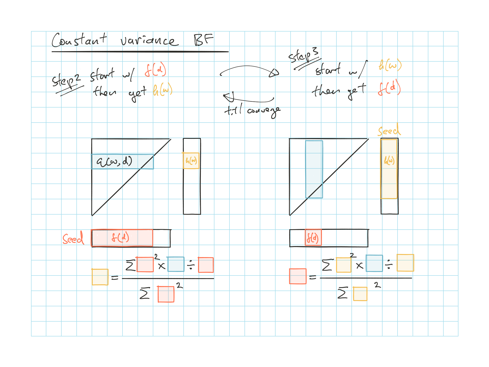

# Testing the Assumptions of Age-to-Age Factors - G. Venter

Definitions and standards used for Venter

* $n$, $m$, $p$

    * $\star$ The $n$ excludes the first column
  
    * Important for implication 2 [counting parameters](#venter-count-para) for adj SSE

* $\star$ Project **incremental** losses, $q(w,d+1)$ here

    * Column parameter $f(d)$ is LDF - 1

$\star \star$ [Goodness of fit](#venter-goodness-fit) measure: 

* Adj SSE \@ref(eq:adj-sse-venter)

* AIC \@ref(eq:aic-venter)

* BIC \@ref(eq:bic-venter)

6 testable implications

1) [Statistical significance](#venter-imp-1) of factors

    * Coefficient $> 2 \sigma$ is significant

2) $\star \star$ Is there a [better estimate](#venter-imp-2) for $q$ than $f \times c$

    * Number of parameters (Table \@ref(tab:venter-alt-pattern))
    
    * [Counting parameters](#venter-count-para)
    
    * $\star \star$ BF parameters (Table \@ref(tab:venter-var-weight-BF))
    
    * [Iteration process](#iteration-proc-venter)

3) Check [residuals](#venter-imp-3) against $c(w,d-1)$

4) [Stability](#venter-imp-4) of $f(d)$ down the column

5) $\star \star$ [No correlation among columns](#venter-imp-5)

    * Remember we are testing $f(d)$ so LDF - 1

    * Pearson correlation calculation \@ref(eq:venter-pearson-corr) and test statistics \@ref(eq:venter-pearson-corr-test-stat)
    
    * To test for all different pairs (not just adjacent pairs) \@ref(eq:corr-pair-total)
    
    * Similar to [Mack's adjacent LDF test](#mack-adjacent-ldf)

6) No particularly [high or low diagonals](#venter-imp-6)

    * Setting up regression with CY dummy variable \@ref(eq:venter-cy-regress)

## Definitions and Assumptions {#venter-def}

Table: (\#tab:venter-mack-def) Tables of Definitions

| Venter Notations | Definitions | Mack Notations (\@ref(def:mack-1994-def)) | 
|:--------- |:------------------------------------------------|:----------- |
| $w$       | AYs | $i$ |
| $d$       | Dev period; $d=0$ is age @ end of year 1 | $k$ |
| $c(w,d)$  | Cumulative losses for AY $w$ age $d$ | $c_{i,k}$ |
| $c(w,\infty)$  | Ultimate losses for AY $w$| $c_{i,I}$ |
| $q(w, d+1)$ | **Incremental** losses for AY $w$ age $d$ to $d+1$ | |
| $f(d)$    | Col parameters; **(LDF - 1)**; applies to whole col | $f_k - 1$ |
| $F(d)$    | LDF to ultimate that applies to $c(w,d)$ | |
| $h(w)$    | Row parameters; applies to whole row | |

### Mack's Chainladder Assumptions

Same assumptions as the [Mack 1994](#cl-ass) but stated in Venter's terminology

* Venter refers these as assumptions needed for least-squares optimality to be achieved by the typical age-to-age factor method of loss development

```{proposition, mack-ass-1, name = "Mack Assumption 1"}
$$\mathrm{E}[q(w,d+1) \mid \text{Data to } w+d] = f(d) \times c(w,d)$$
```

```{remark}


* Here $f(d)$ is LDF - 1

* Expected incremental development is $\propto$ reported losses

* See also (Prop \@ref(prp:cl-ass-1)) from Mack (1994)
```

```{proposition, mack-ass-2, name = "Mack Assumption 2"}
$$c(w,d) \perp\!\!\!\!\perp c(v,g) \:\:\:\: \forall \: d,g,v,w \:\:\:\: : \:\:\:\: v \neq w$$
```

```{remark}


* Losses not in the same row are independent of each other

* See also (Prop \@ref(prp:cl-ass-2)) from Mack (1994)
```

```{proposition, mack-ass-3, name = "Mack Assumption 3"}
$$\mathrm{Var}[q(w,d) \mid \text{Data to } w+d] = a_{fun}\big(d,c(w,d)\big)$$
```
    
```{remark}


* Variance of incremental losses depends only on:

    1. Cumulative losses reported to date $c(w,d)$
    
    2. Age of the AY $d$ (Does not vary by AY down the column)

* Different $a_{fun}(\cdots)$ leads to different $\hat{f}(d)$ estimate

* See also (Prop \@ref(prp:cl-ass-3)) from Mack (1994)
```

### Variance Assumptions (for Chainladder)

Same as shown in Mack 1994 Table \@ref(tab:CL-var-weight)

Table: (\#tab:venter-var-weight) Relationships between weight, variance and residual (Venter)

| Weight | Description | Variance $a_{fun}\big(d,c(w,d)\big)$ | LDF - 1 $f(d)$ |
| --------------- | ------------------------ | ------------ | --------------- |
| 1                | Simple Average | $k(d)c(w,d)^2$ | $\dfrac{\sum_w 1 \frac{q(w,d+1)}{c(w,d)}}{\sum_w 1}$ |
| $c(w,d)$        | Weighted Average | $k(d)c(w,d)$ | $\dfrac{\sum_w c(w,d) \frac{q(w,d+1)}{c(w,d)}}{\sum_w c(w,d)}$ |
| $c(w,d)^2$      | Least Square | $k(d)$ | $\dfrac{\sum_w c(w,d)^2 \frac{q(w,d+1)}{c(w,d)}}{\sum_w c(w,d)^2}$ |

* $c(w,\infty) = F(d)c(w,d)$

    $F(d) = \prod_{s \geq d} (1 + f(s))$
    
* Recall $\dfrac{q(w,d+1)}{c(w,d)}$ are the empirical LDF - 1

```{definition, venter-cl-para-def, name = "Chainladder Parameter definition"}
$$\mathrm{E}[q(w,d+1)] = f(d)c(w,d)$$

* $n = \sum \limits_{i=1}^{m-1} i = \dfrac{m(m-1)}{2}$ = predicted data point?

* $p=m-1$ since we don't predict the first column

* $m =$ dimension
```

## 6 Testable Implications

**6 Testable Implications**

1) [Statistical significance of $f(d)$](#venter-imp-1)

2) [Is there a better estimate for $q$ than $f \times c$](#venter-imp-2)

3) [Check residuals against $c(w,d)$](#venter-imp-3)

    * Test for Mack assumption 1 (\@ref(prp:cl-ass-1))?

4) [Stability of $f(d)$ down the column](#venter-imp-4)

    * Test for Mack assumption 1 (\@ref(prp:cl-ass-1))?

5) [No correlation among columns](#venter-imp-5)

    * Test for Mack assumption 1 (\@ref(prp:cl-ass-1))

6) [No particularly high or low diagonals](#venter-imp-6)

    * Test for Mack assumption 2 (\@ref(prp:cl-ass-2))

### Goodness of Fit Measurement {#venter-goodness-fit}

Compare different fit of the models based on adjusted $SSE$ (actual vs projected **excluding** 1st column)

**Adjusted *SSE***

\begin{equation}
  \dfrac{SSE}{(n-p)^2}
  (\#eq:adj-sse-venter)
\end{equation}

**Akaike Information Criterion**

\begin{equation}
  AIC \approx SSE \times e^{2p/n}
  (\#eq:aic-venter)
\end{equation}

**Bayesian Information Criterion**

\begin{equation}
  BIC \approx SSE \times n^{p/n}
  (\#eq:bic-venter)
\end{equation}

```{remark}


* $n =$ # of predicted data points **EXCLUDING 1st column**

    * Exclude because when we do reserving we don't predict anything from the first column
    
    * So usually equals number of cells in the triangle excluding first column

* $p =$ # of parameters

* $SSE = \sum (A - E)^2$

    * Here you **exclude the first column** when calculating the difference
    
* Venter use the adjusted SSE as the AIC can be too permissive of over parameterization for large data sets
```

```{block, type='rmdtip'}
$SSE$ calculation can be done with the table features on TI-30XS

* Plug in each the actual and projected triangle into L1 and L2 (make sure the cells match)

* Calculate L3 = (L1 - L2)^2^

* Calculate $\sum L3$
```

## Implication 1: Significance of Factors {#venter-imp-1}

Check if the parameter coefficient is $> 2 \sigma$ for 95% sure that the parameters are $\neq 0$

* Can do $1.65 \sigma$ for 90% confidence

* Remember $f(d)$ is LDF - 1

* LDFs tend to fail towards the tail

## Implication 2: Superiority of Alternative Emergence Patterns {#venter-imp-2}

If an alternative emergence pattern provides a better explanation of the triangle, maybe it should be used

1. Calculate $q(w,d)$ under various emergence patterns (See Table \@ref(tab:venter-alt-pattern))

2. Calculate the Adjusted SSE \@ref(eq:adj-sse-venter) (based on every cell except the age 0 column)

### Parameters: Alternative Emergence Pattern

Table: (\#tab:venter-alt-pattern) Alternative emergence pattern on a $m \times m$ triangle

| Emergence Patterns | # of Parameters $p$ | Comments |
|:------------------------------ |:---------- |:------------------------ |
| $\mathrm{E}[q(w,d+1) \mid \text{Data to }w+d] = f(d) c(w,d)$ | $m - 1$ | e.g. Chainladder |
| $\mathrm{E}[q(w,d+1) \mid \text{Data to }w+d] = f(d) c(w,d) + g(d)$ | $2m - 2$ | e.g. Least Squares |
| $\mathrm{E}[q(w,d) \mid \text{Data to }w+d] = f(d)h(w)$ | $2m-2$ | e.g. BF |
| $\mathrm{E}[q(w,d) \mid \text{Data to }w+d] = f(d)h$ | $m-1$ | e.g. Cape Cod |

```{remark}
$f(d) c(w,d) + g(d)$

* Often significant in forecasting age 1
```

```{remark}
$f(d)h(w)$

* Here $f(d)$ is related to the % of losses emerged in period $d$

    Incremental % emergence, **NOT** LDF - 1
    
* $h(w)$ can be think of as an estimate of ultimate losses for AY $w$

    Like an a-priori
    
* The -2 for the BF is due to $f(0)$ and constant

* If **BF** is better $\Rightarrow$ Loss emergence is more accurately represented as fluctuating around a proportion of expected ultimate losses (rather than proportion of reported losses)

* **Cape Cod** works when the loss ratio is stable (stable book of business)

    * Use $h(w) = h \times Premium(w)$, so we only need stable ELR
    
    * Cape Cod works out to an additive model $q(w,d) = h \times f(d)$

* Can **further reduce parameters** by **combining** some row and column parameters

    * Might be intuitively appealing to sum up the recent and tail years of the $h(w)$ since there's little empirical data to support different estimates

* We'll be mostly focusing on this form
```

### Variance Assumptions: Alternative Emergence Pattern

Consider $\mathrm{E}[q(w,d) \mid \text{Data to }w+d] = f(d)h(w)$ from Table \@ref(tab:venter-alt-pattern)

We need to minimize the sum of squared residuals to get the optimal $f(d)$ and $h(w)$:

$$\sum_{w,d} \varepsilon^2(w,d) = \sum_{w,d} [q(w,d) - \underbrace{f(d)h(w)}_{\mathrm{E}[q(w,d)]}]^2$$

```{remark}


* Since this is a non-linear model, we need an iterative method to minimize to *SSE*

* We can use weighted least squares if the variances of the residuals are not constant over the triangle
```

We need to minimize the variance of each residual $\varepsilon(w,d)$

$$\mathrm{Var}(\varepsilon(w,d)) \propto f(d)^p h(w)^q$$

```{remark}


* $p$ & $q$ typically $\in [0,1,2]$

* And regression weights (applied to each $f(d)$ or $h(w)$) will be $\dfrac{1}{f(d)^p h(w)^q}$ (inversely proportional to variance, similar to [Mack 1994](#cl-ass-3-proof))

Since $\mathrm{E}[q(w,d)] = f(d)h(w)$

* $f(d) = \dfrac{\mathrm{E}[q(w,d)]}{h(w)}$, and

* $h(w) = \dfrac{\mathrm{E}[q(w,d)]}{f(d)}$

* So the actual $\dfrac{q(w,d)}{h(w)}$ is an estimate of $f(d)$ and vice versa

* And we can estimate $f(d)$ based on a weighted average of each observation

```

Different variance assumption for $\varepsilon$ $\Rightarrow$ different parameters (weight) similar to the Chainladder method in table \@ref(tab:venter-var-weight)

Table: (\#tab:venter-var-weight-BF) Variance and parameters for various form of $\mathrm{E}[q(w,d) \mid \text{Data to }w+d] = f(d)h(w)$

| Method | $\mathrm{Var}(\varepsilon(w,d)) \propto f(d)^p h(w)^q$ | $\mathbf{f(d)}$: Col Parameters | $\mathbf{h(w)}$: Row Parameters |
|:------------------ |:------------------ |:------------------ |:------------------ |
| *BF*^1^ | $p=q=0$ | $f(d) = \dfrac{\sum_w h^2 \frac{q}{h}}{\sum_w h^2}$ | $h(w) = \dfrac{\sum_d f^2 \frac{q}{f}}{\sum_d f^2}$ |
| Cape Cod^2^ | $p=q=0$ | $f(d) = \dfrac{\sum_w h^2 \frac{q}{h}}{\sum_w h^2}$ | $h = \dfrac{\sum_\Delta f^2 \frac{q}{f}}{\sum_\Delta f^2}$ |
| *BF* (Var $\propto$ $fh$)^3^| $p=q=1$ | $f^2(d) = \dfrac{\sum_w h \left( \frac{q}{h} \right) ^2}{\sum_w h}$ | $h^2(w) = \dfrac{\sum_d f \left( \frac{q}{f} \right)^2}{\sum_d f}$ |

1. *BF*: assumes each $q(w,d)$ have constant variance (least square, standard regression)

    For $h(w)$ weight is $f(d)^2$ and cells with higher expectes loss get higher weight
    
    For $f(d)$ weight is expected ultimate losses squared, years with higher expected losses get higher weight
    
2. Cape Cod: also assumes constant variance

3. Variance of the cell is proportional to the expected loss of the cell

Recall from [Mack 1994](#residuals), we need to look at the residual graphs to determine which variance assumption is appropriate

### Iteration Process {#iteration-proc-venter}

Need to seed one of them and iterate until convergence

* e.g. for constant variance BF: $f(d)$ $\sum \downarrow$; $h(w)$ $\sum \rightarrow$

* Use the above to estimate the parameters and then calculate the unpaid

* When combining parameters, don't count the $f(0)$ and always subtract 1

Step 1) Start iteration with the $f(d)$ from Chainladder

* For age greater than 0, these are the incremental ATA factors $\div$ ATU factors
    
* For age 0, subtract the sum of the other factors from unity

Step 2) Find $h(w)$'s that minimize the $SSE$

* One regression for each $w$

* Depending your variance assumption (Table \@ref(tab:venter-var-weight-BF)), see figures below

Step 3) Find $f(d)$'s that minimize the $SSE$ based on the $h(w)$ from step 2

Step 4) Repeat step 2 & 3 till convergence

Step 5) Use the $f(d)$ and $h(w)$ calculated to get the estiamted triangle to calculate $SSE$ or do projection

```{r bf-const-var-fig, echo = FALSE, out.width='100%', fig.show='hold', fig.cap='BF with constant variance'}

```

```{r bf-var-prop-fh-fig, echo = FALSE, out.width='100%', fig.show='hold', fig.cap='BF with variance proportional to $fh$'}
knitr::include_graphics('figures/Exam-7-Notes-18.png')
```

```{r cape-cod-fig, echo = FALSE, out.width='100%', fig.show='hold', fig.cap='Cape Cod'}
knitr::include_graphics('figures/Exam-7-Notes-19.png')
```

### Counting *n* and *p* for SSE {#venter-count-para}

**For *n***

* *For reserving*: number of cell in the triangle minus the first column $\dfrac{m(m-1)}{2}$

    (Since we don't need to forecast the first column to calculate the unpaid)
    
* *For pricing*: number of cell in the triangle

**For *p*** (Just a walk through of how we get the $p$ in Table \@ref(tab:venter-alt-pattern))

* ***BF***: Start with $2m$ parameters all the $f(d)$'s and $h(w)$'s

    1. We don't need $f(0)$ for reserves again since we don't need to forcast the first column
    
    2. Less one more due to degree of freedom
    
        (Since you can fix any one of the parameters and still get the same results)
        
    3. So we have $p = 2m-2$

* Similarly for **Cape Cod** but we only start with $m + 1$ so we ended up with $m-1$ (i.e. taking out the $f(d)$ and the degree of freedom)

* **Grouped *BF*** is similar as well if you don't group the $f(0)$

    * *Note*: If you group the $f(0)$ you can't subtract one for that as you'll be using the parameter
    
* **Chainladder** you have $m$ for all the $f(d)$'s to start with and less the $f(0)$
    
## Implication 3: Linearity {#venter-imp-3}

The forecast incremental losses might not be a linear function (e.g. $q(w,d) = a\sqrt{c(w,d)}$)

* **Test for linearity** by making sure the residuals are not a sequence of positive then negative and vice versa

* Do this for each regression (i.e. every $d$)

* Look at residuals as function of $c(w,d-1)$

* Similar to residual test from [mack](#mack-residuals)

## Implication 4: Stability {#venter-imp-4}

Look at empirical LDFs $f(d)$ down a column

* Use the entire history if factors are stable

* Take more recent average if unstable or follow a trend

* Can compare rolling 5 year averages as well

## Implication 5: No Correlation on Columns (Test for independence) {#venter-imp-5}

Calculate Pearson correlation for every pair of columns with at **least 3 LDFs**

* This is a test on the LDFs (Mack assumption 1 (prop. \@ref(prp:cl-ass-1)), LDFs are not correlated)

* Test with only 2 LDFs will either be 1 or -1

* Not just adjacent LDF pairs like in [Mack-1994](#adjacent-ldf)

    $\therefore$ For a $m \times m$ triangle we have ${7 \choose 2}$ pairs (7 because only 9 columns of LDFs and we take out the 2 columns with less than 3 LDFs)

***Correlation***:

\begin{equation}
  r = \dfrac{\sum {\tilde{x}} {\tilde{y}} }{\sqrt{\sum {\tilde{x}}^2 \sum {\tilde{y}}^2}}
  (\#eq:venter-pearson-corr)
\end{equation}

Where $\tilde{x} = x - \bar{x}$ and $\tilde{y} = y - \bar{y}$

* $x$'s and $y$'s are incremental LDFs - 1

    * But actually not necessary since -1 doesn't affect the correlation
    
* Use calculator data table for $r$ once you have $\tilde{x}$ and $\tilde{y}$

***Test statistics*** for significance is $T \sim t_{n-2}$

\begin{equation}
  T = r \sqrt{ \dfrac{n-2}{1-r^2} }
  (\#eq:venter-pearson-corr-test-stat)
\end{equation}

* Look up the t-value from table for 90%

* $n$ is the number of LDF pairs

* If $|T| <$ table value $\Rightarrow$ Not correlated

Perform test for all columns

* We deem the triangle have significant correlations if the number of correlated pairs are more than

\begin{equation}
  0.1 x + \sqrt{x} \:\:\: : \:\:\: x = {m - 3 \choose 2}
  (\#eq:corr-pair-total)
\end{equation}

* x = # of pair tested for a $m \times m$ triangle

## Implication 6: No High of Low Diagonals (Test for independence) {#venter-imp-6}

Similar to [Mack](#cy-test)'s CY Test

* This is a test on Mack assumption 2 (prop. \@ref(prp:cl-ass-2)), no AY correlation

**Key Idea**: Run regression on the triangle with a dummy variable for each diagonal

Each $q(w,d)$ is regressed against the prior cumulative losses  + dummy variable for which diagonal it is in

\begin{equation}
  q(w,d) \sim c(w,d-1) + dummy_{CY}
  (\#eq:venter-cy-regress)
\end{equation}

* If losses are significantly higher or lower in a diagonal $\Rightarrow$ The coefficient of the dummy variable would be statistically significant (i.e. coefficient is double the $\sigma$)

* Only includes diagonals that **forcast** at least 2 elements

**Caveat**: Diagonal effect is additive

* More likely to see multiplicative impact. e.g. from inflation

* This can be implement with a regression on the logarithm of the losses

### Diagonal Trend as Inflation

Consider CY trend as inflation and model $q(w,d)$ with a diagonal parameter $g(w+d)$, where $w+d$ is the diagonal

$$\mathrm{E}[q(w,d)] = f(d)h(w)g(w+d)$$

This will have parameters for each row, column, and diagonal

* Can be reduce similar to the grouped BF

* We can model a constant CY trend to reduce the parameters

    e.g. $g(w+d) = (1+j)^{w+d}$

## Past Exam Questions

**Concepts**

* 2011 #4: Implication 1

* 2012 #5: Mack assumptions

**Implication Tests**

* $\star$ 2014 #4: correlation tests

* 2015 #5: correlation tests

* $\star$ 2016 #6: Correlation test combine with Mack

* TIA 2: correlation test

* TIA 3: correlation test

* TIA 4: statistical significance test on the correlation

* TIA 5: statistical significance test on the correlation

**Alternative Emergence**

* $\star$ TIA 1: BF with constant variance $3 \times 3$ triangle

    * Can simplify the calculation if one of the parameter is constant
    
* $\star$ TIA 6: BF with variance proportional to $fh$

* $\star$ TIA 7:

    a. $SSE$ calc for $4 \times 4$ triangle
    
    b. Calculate Adj $SSE$, AIC and BIC
    
    c. Pick method that is better

* $\star$ TIA 8: Full blown calc with BF $\propto \: fh$

* $\star$ TIA 9: Calculating $n$ and $p$ and all the goodness of fit metrics for various methods and pick the best

### Question Highlights

n/a