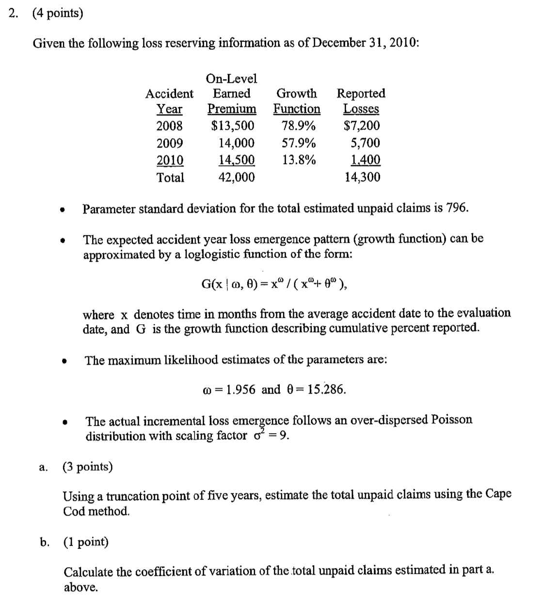
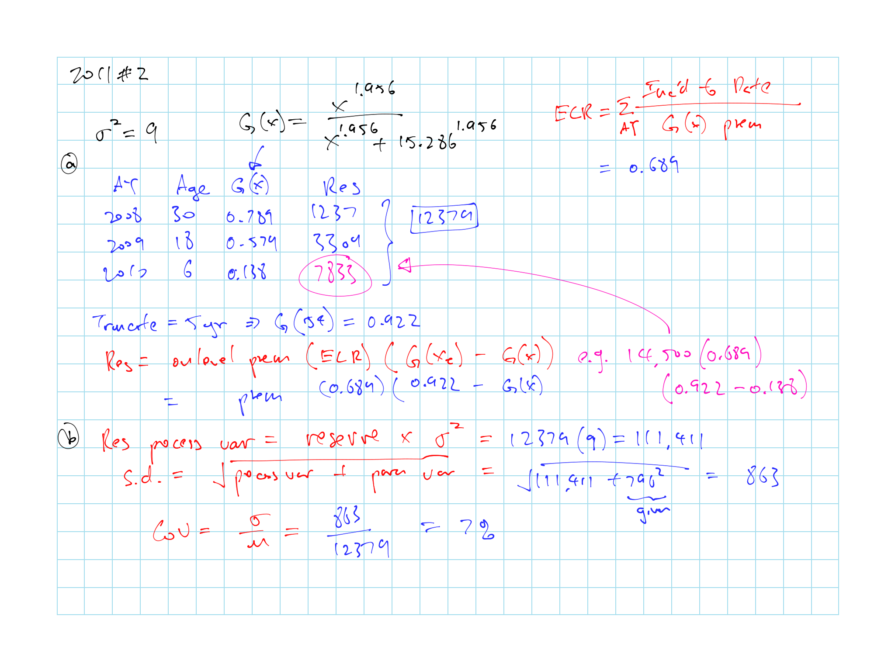
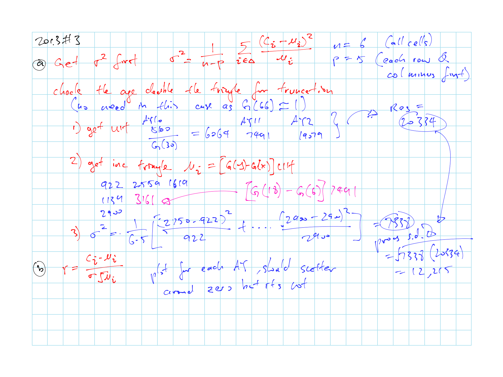
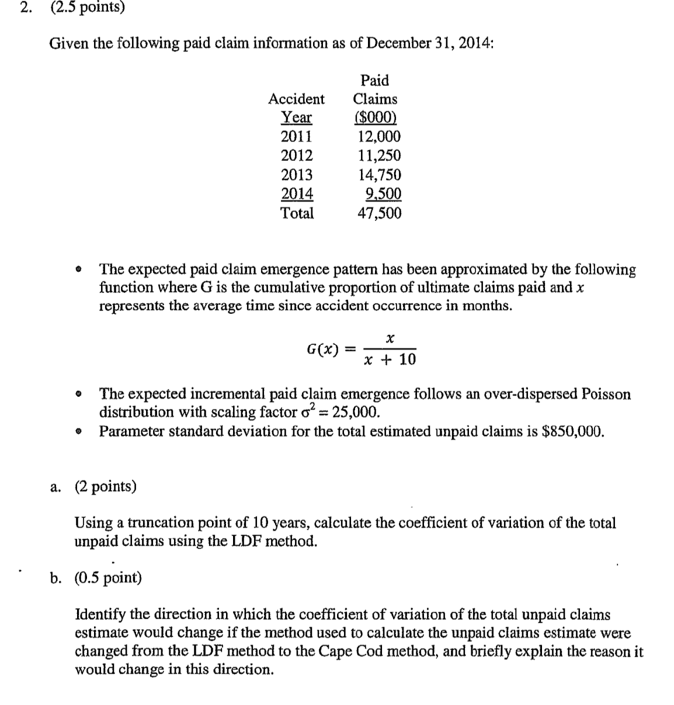

# LDF Curve-Fitting and Stochastic Reserving: A Maximum Likelihood Approach - D. Clark

Memorize the CDF for loglogistic \@ref(eq:clark-loglogistic) and weibull \@ref(eq:clark-weibull)

We use the **average age** of the period here

Know how to calculate reserves given the $G(x)$ and for each of the 2 methods given:

* Growth function distribution and parameter (might have to estimate)

* LDF or Cape Cod

* Data (e.g. paid to date for each AY)

* Test for truncation by looking at age twice the triangle

Other use of the model

## Expected Loss Emergence

```{block, type='rmdnote'}
Important formulas and definition below
```

```{definition, clark-def}


1. $x =$ **average age** of AY

    (e.g. 6mo for the most recent instead of 12mo)

2. $G(x \mid \omega, \theta)$ = % paid to date growth function

    * 2 forms of the growth function below
    
    * The curves move smoothly from 0 to 1
```

**Loglogistic**:

\begin{equation}
  G(x \mid \omega, \theta) = \dfrac{x^{\omega}}{x^{\omega} + \theta^{\omega}}
  (\#eq:clark-loglogistic)
\end{equation}

**Weibull**:

\begin{equation}
  G(x \mid \omega, \theta) = 1- \mathrm{exp}\left\{ { - \left( \dfrac{x}{ \theta } \right)^{\omega}} \right \}
  (\#eq:clark-weibull)
\end{equation}

```{remark}


% Emergence in period $x$ to $x+12$ = $G(x+12) - G(x)$

* Equivalent to the $f(d)$ in Venter Table \@ref(tab:venter-alt-pattern) for the alternative pattern $f(d)h(w)$

    Given $d = x / 12 - 1$

**Advantages** (over Venter):

* Uses only 2 column parameters: $\theta$ for mean; $\omega$ for s.d.

* Can use data @ different age

* Output is a smooth curve $\Rightarrow$ Can interpolate between ages and estimates a tail

Motivation for using a curve is to recognize that adjacent LDFs are related

Doesn't work when there is **expected** negative loss development
```

### Expected Ultimate Loss Methods

***Method 1: Cape Cod***

$$Premium_{AY} \times ELR$$

```{remark}


* A single row parameter $h$ for the entire triangle

* $h$ here is the $ELR$

* Similar parameters in Venter (\@ref(tab:venter-alt-pattern))

* This method is preferred:

    * Only need 3 parameters
    
    * Includes extra information, exposure base
```

Estimate Future Emergence:

$$[G(y \mid \omega, \theta) - G(x \mid \omega, \theta)] \times [Premium_{AY} \times ELR]$$

***Method 2: LDF***

$$ULT_{AY}$$

```{remark}


* $h(w)$ for each row

* $h(w)$ here represents the ultimate loss for each $w$

* Similar parameters in Venter (\@ref(tab:venter-alt-pattern))
```

Estimate Future Emergence:

$$[G(y \mid \omega, \theta) - G(x \mid \omega, \theta)] \times ULT_{AY}$$

## Distribution of Actual Loss Emergence and Maximum Likelihood

Estimate parameters with MLE

### Process Variance

```{block, type='rmdnote'}
Important formulas below
```

***Key assumption***:

$$\mathrm{Var}(c_i) \propto \mathrm{E}[c_i] = \sigma^2 \mathrm{E}[c_i]$$

* Assume ratio of the variance to mean is constant for each cell in the **triangle**

* $c_i$ is the **incremental** loss here

* $\sigma^2$ is the **same for the entire triangle**

```{remark}
Compare variance assumption with Mack and Venter

* Mack-1994:
    
    Proposition \@ref(prp:cl-ass-3): $\mathrm{Var}\left (c_{i,k+1} \mid c_{i,1} \cdots c_{i,k}\right ) = \alpha_k^2 \: c_{i,k}$

    Constant is same for each column $k$ (development period)

    n = includes all here?

* Venter Factors:  

    2 version of BF method \@ref(tab:venter-var-weight-BF)

    Variance is either constant or varied by $\propto f(d)h(w)$

    n = predicted?

```

**Estimate $\mathbf{\sigma^2}$ based on the entire triangle**:

$$\dfrac{Variance}{Mean} = \sigma^2 = \dfrac{1}{n-p}\sum\limits_{i \in \Delta}^n\dfrac{(c_i - \mu_i)^2}{\mu_i}$$

* $n =$ # of data points in triangle

* $p =$ # of parameters

    * Cape Cod: $p=3$
    
        ($\omega, \theta, ELR$)
    
    * LDF: $p=2 +$ # of AYs
    
        ($\omega, \theta,$ row parameters)

* $c_i =$ actual incremental loss emergence

* $\mu_i =$ expected incremental loss emergence

***Assume incremental loss follows ODP Poisson***

$$C_i \sim ODP(\lambda_i, \sigma^2)$$

* Use ODP so that variance $\neq$ mean

* $C_i = \sigma^2 X_i$ where $X_i \sim Poi(\lambda_i)$

* $\mathrm{E}[C_i] = \sigma^2 \lambda_i = \mu_i$

* $\mathrm{Var}(C_i) = \sigma^2 \mu_i$

* Here $C_i$ means the r.v. while $c_i$ is the observation

Caveat:

* Potential issue with ODP is that some granularity is lost since reserves are estimated in multiple of $\sigma^2$

* However $\sigma^2$ is generally small so little precision is lost

### MLE for Best Parameters {#clark-MLE}

```{block, type='rmdcaution'}
Not super testable
```

Given a set of observed incremental losses $\{c_i\}$, we want to find the $\omega$, $\theta$, and $ELR$ that best fit the actual losses

```{proposition, clark-mle-odp}
Maximum likelihood function

$$l = \sum \limits_{i \in \Delta} c_i \mathrm{ln}(\mu_i) - \mu_i$$

* Maximize each $l$ across each parameters $\omega$, $\theta$ and $ELR$ by taking the derivative of $l$ w.r.t. each of the parameters and setting the equation to zero 
```

```{proof}
For each cell $i$ we have incremental losses $C_i$ with mean:

$$\mu_i = \sigma^2 \lambda_i$$

The likelihood function is:

$$\prod \limits_{i \in \Delta} \Pr(C_i = c_i) = \prod \limits_{i \in \Delta} \dfrac{\lambda_i ^{c_i / \sigma^2} e^{-\lambda_i}}{(c_i / \sigma^2)!} = \prod \limits_{i \in \Delta} \dfrac{(\mu_1 / \sigma^2) ^{c_i / \sigma^2} e^{-\lambda_i}}{(c_i / \sigma^2)!}$$

Take the log of the above

$$\sum_{i \in \Delta} \dfrac{c_i}{\sigma^2} \ln \left( \dfrac{\mu_i}{\sigma^2} \right) - \dfrac{\mu_i}{\sigma^2} - \ln \left[ \left(\dfrac{c_i}{\sigma^2} \right)! \right]$$

If we assume the $\sigma^2 is known and constant then we have function in proposition \@ref(prp:clark-mle-odp)

* We can remove $\sigma^2$ in the first 2 terms as it is a constant

* The 3^rd^ term goes away as the whole thing is now a constant

```

#### MLE for Method 1

When maximize the MLE for $ELR$ we get:

$$ELR = \dfrac{\sum_{i \in \Delta} c_i}{\sum_{i \in \Delta} P_i \times [G(y) - G(x)]}$$

* This is the sum of all incremental losses in the triangle $\div$ Premium $\times$ Expected portion of claims paid

* Which is the Cape Cod $ELR$ from [Hurlimann](#hur-remark)

#### MLE for Method 2

When we maximize the MLE for $ULT_{AY}$ we get:

$$ULT_{AY} = \dfrac{\sum_{i \in AY} c_i}{\sum_{i \in AY}[G(y) - G(x)]}$$

* Sum of claims reported to date $\div$ % expected reported to date in a row

* The is the LDF method of estimating ultimate

### Parameter Variance

```{block, type='rmdcaution'}
Not super testable
```

Information matrix $I$ (2^nd^ derivative matrix $l$ vs each parameter)

\begin{equation}
\begin{bmatrix}
  \dfrac{\partial^2 l}{\partial^2 ELR} & \dfrac{\partial^2 l}{\partial ELR \: \partial \omega} & \dfrac{\partial^2 l}{\partial ELR \: \partial \theta}\\
  \dfrac{\partial^2 l}{\partial \omega \: \partial ELR} & \dfrac{\partial^2 l}{\partial^2 \omega} & \dfrac{\partial^2 l}{\partial \omega \: \partial \theta}\\
  \dfrac{\partial^2 l}{\partial \theta \: \partial ELR} & \dfrac{\partial^2 l}{\partial \theta \: \partial \omega} & \dfrac{\partial^2 l}{\partial^2 \theta}\\
\end{bmatrix}
(\#eq:clark-info-matrix)
\end{equation}

Covariance matrix:

\begin{equation}
  \Sigma = -\sigma^2 \times I^{-1}
  (\#eq:clark-cov-matrix)
\end{equation}

* $3 \times 3$ matrix for Cape Cod

* $(n+2) \times (n+2)$ for LDF Method

### Variance of the Reserves {#clark-var-reserve}

**Process Variance of $R$**

$$\sigma^2 \sum_i \mu_i$$

* Technically testable if given $\sigma^2$

* Process variance $\propto$ to the mean with proportion $\sigma^2$

**Parameter Variance of $R$**

$$\mathrm{Var}(\mathrm{E}[R]) = (\partial R)'\Sigma (\partial R)$$

* $\Sigma$ is from equation \@ref(eq:clark-cov-matrix) above

* $\partial R$ = vector that is the derivative of the reserve by each parameter

* Calculation heavy, not testable

## 3 Key Assumptions of Model

1) Incremental losses $iid$

    * Test this using residual analysis

2) $\frac{Variance}{Mean}$ scale parameter $\sigma^2$ is fixed and known

    * Technically this should be estimated with the other parameters but will makes things intractable

3) Variance estimates are based on the approximation to the Rao-Cramer lower bound

    * Variance based on information matrix $I$ \@ref(eq:clark-info-matrix)
    
    * $I$ is exact only when using linear functions
    
    * In our case this is simply a lower bound
    
    * We are using approximated parameters

The above temper the volatility in the model, actual results can be more variable

Model only works for positive expected incremental losses, but a negative loss here or there is fine as well

## LDF Method (Method 2)

Can use either Loglogistic \@ref(eq:clark-loglogistic) or Weibull \@ref(eq:clark-weibull) for $G(x)$

Estimate $\theta$, $\omega$, and $ULT_{AY}$ with [MLE](#clark-MLE)

$$\mu = ULT_{AY} \times [G(y) - G(x)]$$

$$l = c_i \ln(\mu_i) - \mu_i$$

Calculate $\sigma^2$

$$\sigma^2 = \dfrac{1}{n-p}\sum\limits_{i \in \Delta} \underbrace{\dfrac{(c_i - \mu_i)^2}{\mu_i}}_{\chi^2 \text{ term}}$$

* n = all data points (not just the predicted like in Venter)

* p = 2 + 10 AYs

* This is for **incremental** losses

### Residual Review

Normalized residuals:

$$r_i = \dfrac{c_i - \mu_i}{\sigma \sqrt{\mu_i}}$$

* Divide by the square root of the variance $\sigma^2 \mu$ for ODP

* Same as $\dfrac{\sqrt{\chi^2 \text{ term}}}{\sigma}$

Plot residuals (should be randomly scattered around 0):

1. age $x$ vs $r_{i,x}$ 

2. expected loss $\mu_i$ vs $r_{i,x}$ 

    Test of the constant $\frac{Variance}{Mean}$ assumption

    * If fail, can try alternative variance assumptions (e.g. $\mathrm{Var} \propto \mu^2$)
    
3. AY, CY, etc vs $r_{i,x}$

### Reserve Estimate

***Untruncated***

1) Get G(x): % paid(reported) to date

2) Ultimate = Paid to date (reported to date) $\div$ G(x)

***Truncated*** @ age $x_t$

* To cut of the tail at some point and stop the development

* Remember we're $x$ is in mid year (so year times 12 and minus 6 months)

* Use $G'(x) = \dfrac{G(x)}{G(x_t)}$ instead just like above

[Process Variance](#clark-var-reserve):

$$\sigma^2 \sum_i \mu_i = \sigma^2 \times \text{Unpaid}$$

[Parameter variance](#clark-var-reserve) is huge and computational intensive as it requires inverting a big matrix

* We expect the Cape Cod to have parameter variance (as we only estimate 3 parameters)

Total variance can be calculated by summing the process and parameter variance

## Cape Cod Method (Method 1)

Requires exposure base:

* e.g. on-level and trended EP, original loss projection, trended # of vehicles, claim counts, etc

* We want an exposure base that allow us to assume a constant ELR across AYs

Estimate $\theta$, $\omega$ and $ELR$ with [MLE](#clark-MLE)

$$ELR = \sum_{AY} \dfrac{\text{Losses Paid to Date}}{\underbrace{G(x)}_{\text{Expected portion paid}} \times Premium}$$

* **Do not truncate** when calculating ELR

$$\mu = Premium_{AY} \times ELR \times [G(y) - G(x)]$$

Calculate $\sigma^2$:

$$\sigma^2= \dfrac{1}{n-p}\sum\limits_{i \in \Delta}^n\dfrac{(c_i - \mu_i)^2}{\mu_i}$$

* $n =$ all data points

    (Not just the predicted like in [Venter](#venter-count-para))

* $p = 3$

Check if the assumption of one expected LR is reasonable by looking for any upward or downward trends in the ultimate LR

* Since we're assuming a single $ELR$

### Reserve Estimate

**Untruncated**

* Reserve = On-level Premium $\times \: ELR \: \times [1 - G(x)]$

**Truncated** @ age $x_t$

* Reserve = On-level Premium $\times \: ELR \: \times [(G(x_t) - G(x)]$

Similar story for the process variance and parameter variance as the LDF method

The Covariance matrix $\Sigma$ is smaller just $3 \times 3$

Parameter variance is smaller than the LDF method since we have more information (exposure) in the Cape Cod method 

## Other Use of Model

### Variance of Prospective Losses

Estimate variance for the **next u/w year**

* Need to be given the $\mathrm{Var}(ELR)$

Process Variance:

$$\sigma^2 \times \: ELR \: \times Premium$$

Parameter Variance:

$$\left(\sqrt{\mathrm{Var}(ELR)}\times Premium \right)^2$$

Total Variance: Process Variance + Parameter Variance

CoV:

$$\dfrac{\sqrt{Total \: Variance}}{ELR \times Premium}$$

### Calendar Year Development

Estimated paid losses over the next 12 months:

$$[G(x+12) - G(x)] \times a \: priori \:Ultimate$$

* No truncation here

* *a priori* from the LDF method here

* Sum for all AYs and compare with actual calendar year emergence

* Can calculate the s.d. to see if it's in range (process var is still $\sigma^2 \times$ estimate)

### Variability in the Discounted Reserves

Similar to the above, but CoV will be smaller since the tail with the most variability gets discounted the most

## Comments and Conclusion

* Can use data in table format (AY, From and To Age, Incremental Paid, Exposure)

* Can we Use the CoV from the model even if select a different reserve?

    * No: since you don't trust the reserve estimate
    
    * Yes: since the s.d. is a selection and the CoV from this model is a reasonable basis
    
* Curve was selected because:

    * The move smoothly from 0 to 1
    
    * Closely match empirical data
    
    * 1st and 2nd derivative are calculable
    
    * Others can be used as well
    
MLE is useful for estimating both the expected emergence pattern and the variance

ODP is convenient link to LDF and Cape Cod estimates
    
## Average Age of Claims

```{block, type='rmdcaution'}
From paper appendix, to be included later...(Not crucial)
```

## Past Exam Questions

```{block, type='rmdcaution'}
Haven't done TIA practice questions
```

**Reserve Calculation**

* $\star$ 2011 #2 (\@ref(fig:2011-2)): Cape Cod truncated and reserve CoV

* 2012 #2: Cape Cod method and reserve CoV

* $\star \star$ 2013 #3 (\@ref(fig:2013-3)): LDF method with $\sigma^2$ calc

* 2013 #10: Stanard-Buhlmann

* 2014 #5: plug and play LDF and Cape Cod method with Benktander

* 2015 #2 (\@ref(fig:2015-2)): LDF Method and concept where if we switch to Cape Cod the CoV should go down as it incorporates additional information

**Other**

* 2012 #3: Residual plot from projection and assumptions

### Question Highlights

```{r 2011-2, echo = FALSE, out.width='100%', fig.show='hold', fig.cap='2011 Question 2'}


```

```{r 2013-3, echo = FALSE, out.width='100%', fig.show='hold', fig.cap='2013 Question 3'}
knitr::include_graphics('questions/2013-3Q.png')

```

```{r 2015-2, echo = FALSE, out.width='100%', fig.show='hold', fig.cap='2015 Question 2'}

knitr::include_graphics('questions/2015-2A.png')
```
