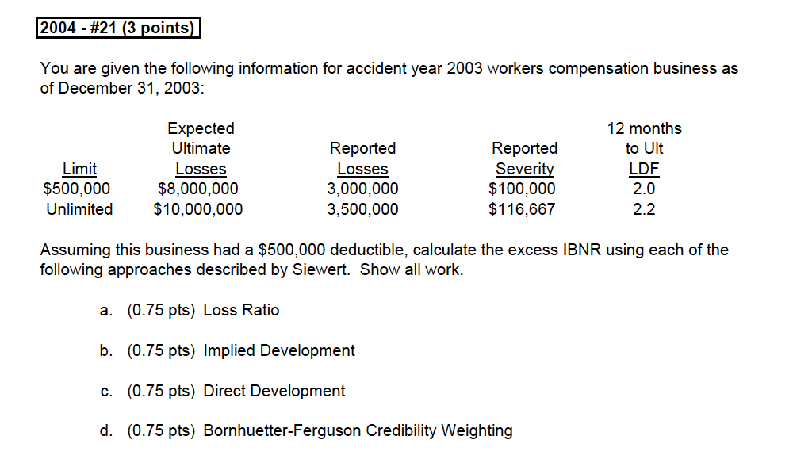

# A Model for Reserving Workers Compensation High Deductibles - J. Siewert

6 methods and their **pros** and **cons**:

1) [Loss Ratio Method](#siewert-lr-method)

    * Per occ \@ref(eq:siewert-lr-per-occ) and aggregate \@ref(eq:siewert-lr-agg) formula

2) [Implied Development](#siewert-implied-dev)

3) [Direct Development](#siewert-direct-dev)

    * See the 2 methods, \@ref(eq:siewert-direct-form-1) and \@ref(eq:siewert-direct-form-2), for calculating the $^{XS}LDF^L_t$
    
    * \@ref(eq:siewert-direct-form-2) is basically from method 5 proposition \@ref(prp:siewert-ldf-rel-3)
    
4) [Credibility Weight Method](#siewert-cred-weight-model)

    * Formula \@ref(eq:siewert-cred-wtd) weighting 1 and 3

5) [Development Method](#siewert-dev-method)

    i. Severity needs to be trended
    
    ii. Claim counts are developed separately ground up
    
    iii. $\star \star$ Relativities \@ref(def:siewert-rel-form), severity LDF formulas, know them well to manipulate and know what formula requires what

        * Proposition \@ref(prp:siewert-ldf-rel-1) and  \@ref(prp:siewert-ldf-rel-2) are simlar one for limited one for XS
        
            * Might need to break out the $LDF_t$ into it's components
        
        * Proposition \@ref(prp:siewert-ldf-rel-3) combines the above
            * Note the 3 proposition above works with LDF if we sub out the ultimate relativities
        
        * Proposition \@ref(prp:inc-ldf-rel-1) and  \@ref(prp:inc-ldf-rel-2) are for *incremental* LDFs

6) [Distribution Method](#siewert-dist-model)

    * Use Weibull for $R_t^L$

Finally there's the method for accounting for [aggregate charge](#siewert-agg) with collective risk model or [table M](#siewert-agg-tbl-M)

## Introduction

WC high deductible reserving with occurrence and/or aggregate deductible

* Reserving for layers XS of a per occ limit and/or aggregate limit

```{block, type='rmdtip'}

The rest of this section is not important for exam but just background information on high deductible WC program
```

High deductible WC became popular in the 90's and actuarial efforts focused on pricing issues

Program was developed to provide both **insurer and insured many advantages**:

1. Achieving pricing flexibility while passing additional risk to larger insureds in what was considered at the time an unprofitable LoB

2. Ameliorating onerous residual market charges and premium taxes in some states

3. Realizing cash flow advantages similar to paid loss retro

4. providing insureds with another vehicle to control losses while protecting them against random large losses

5. Allowing self-insurance without submitting insureds to sometimes demanding state requirements

After the program matures, the focus shifts to **issues on the liability side**

1. How to estimate these liabilities when losses are not expected to emerge above deductible limits for many years

2. How to construct development factors in the absence of long-term histories under a deductible program

3. How to determine development patterns that reflect the diversity of deductible size and mix

4. How to determine consistent development factors between limited and XS values

5. What is a reasonable approach for the indexing of deductible limits over time

6. How to estimate the liability associated with aggregate loss limits

7. Is there a sound way to determine the proper asset value for associated service revenue

    * Similar to loss conversion factor in retro rating, loss multipliers are applied to deductible losses to capture expenses that vary with loss

## Method 1) Loss Ratio Method {#siewert-lr-method}

**Expected Ultimate lossXS Per Occ limit**

\begin{equation}
  P \cdot E \cdot \chi
  (\#eq:siewert-lr-per-occ)
\end{equation}

* $P$ = Premium

* $E$ = Expected ground up loss ratio

* $\chi$ = Occurrence charge = % of losses above deductible

**Expected Ultimate Loss XS Aggregate Limits**

\begin{equation}
  P \cdot E \cdot (1-\chi) \cdot \varphi
  (\#eq:siewert-lr-agg)
\end{equation}


* $\varphi$ = Aggregate charge = % of losses in deductible layer that exceed the aggregate

```{remark}

$\chi$ and $\varphi$ are from industry tables

* Specific to the *deductible*, *aggregate*, and size of *expected losses*

* E.g. From NCCI Table M

These are ultimate loss estimate

```

***Advantages***

* Useful when little data is available

* Ties to pricing

* Can include industry experience

***Disadvantages***

* Ignores actual emergence

* May not properly reflect account characteristics

## Method 2) Implied Development {#siewert-implied-dev}

Ultimate excess loss = ultimate unlimited loss - ultimate limited loss

* Need to make sure **LDFs are consistent** with the different layers (especially for the tail)

    * $LDF^L \leq LDF$
    
    * Don't develop limited losses at a layer above limited losses at a higher layer

* Need to adjust the deductible at different exposure year for **inflation** when selecting limited LDFs

    * Keeps the proportion of deductible/XS losses consistent over time
    
    * Otherwise historical losses take too long to hit the deductible limit and distorts the LDF

***Advantages***

* Get estimate for early period with no losses

* Limited factors are more stable

***Disadvantages***

* Does not directly estimate the XS loss

## Method 3) Direct Development {#siewert-direct-dev}

Directly applying XS LDF to XS loss to date

Different ways to get $^{XS}LDF^L_t$:

**Formula 1**: Given unlimited & limited LDFs and $\chi$

\begin{equation}
  ^{XS}LDF_t^{L} = \dfrac{^{XS}Ult}{^{XS}Loss_t} = \dfrac{Ult \cdot \chi}{\frac{Ult}{LDF_t} - \frac{Ult\cdot(1-\chi)}{LDF_t^L}} = \dfrac{\chi}{\frac{1}{LDF_t} - \frac{(1-\chi)}{LDF_t^L}}
  (\#eq:siewert-direct-form-1)
\end{equation}

* Based on $\underbrace{Loss_t \cdot LDF_t}_{100\%} = \underbrace{Loss^L_t \cdot LDF^L_t}_{100\% - \chi} + \underbrace{^{XS}Loss_t^L \cdot {^{XS}LDF}^L_t}_{\chi}$

* Can't use the actual losses to date for this as it'll just be equal to the implied method mathematically

**Formula 2**: Given unlimited & limited LDFs and $R^L_t$

\begin{equation}
  ^{XS}LDF^L_t = \dfrac{LDF_t - R^L_t \times LDF^L_t}{1-R^L_t}
  (\#eq:siewert-direct-form-2)
\end{equation}

* Based on Question 21 from 2004 (\@ref(fig:2004-21))

* $R^L_t = \dfrac{Sev^L}{Sev}$, or

* $R^L_t = \dfrac{Ult^L \div LDF^L}{Ult \div LDF} = \dfrac{\text{Expected Limited Reported}}{\text{Expected Unlimited Reported}}$

**Disadvantages**

* LDFs large and volatile, not recommend this method

## Method 4) Credibility Weighting Techniques / Bornhuetter-Ferguson {#siewert-cred-weight-model}

Credibility weighting between [Method 1](#siewert-lr-method) and [Method 3](#siewert-direct-dev)

\begin{equation}
  L = Z \times ({^{XS}Loss}_t^L \cdot {^{XS}LDF}_t^{L}) + (1 - Z) \times E
  (\#eq:siewert-cred-wtd)
\end{equation}

* If $Z = \frac{1}{^{XS}LDF_t^L}$ then we have the BF method

* $E$ is from [method 1](#siewert-lr-method)

## Method 5) Development Method {#siewert-dev-method}

Method overview:

1. Select *trend* to adjust historical layers

2. Develop *ground up* **claim count**

3. Calculate **severity** $^{XS}LDF^L_t$ based on $R^L_t$

**Data Required**

* Ground up WC claims level data

    (Allows individual losses to ber capped at different amounts)

* Includes indemnity, medical and ALAE together

* Can split the data by *account*, *injury*, and *state* as a future step

### Severity Trend

Need to account for loss trend when capping losses

* Apply different limits to the historical data by AYs

    (or else there will be more and more losses piercing the limiting layer $\therefore$ Distorting the LDFs)

**Adjusting for loss trend**

1) Select a trend by fitting an exponential curve to the average severity of *unlimited losses* by AY (e.g. $y = ce^{bx}$)

    * Optional: Use different trend for different years
    
    * Optional: Adjust for large losses
    
2) Cap the historical losses at **lower** amount to compensate for the loss trend by detrending the historical layer

### Claim Count Development

Split claim count development from severity development

For claim count development we focusing on **ground up** claims

**Advantages**:

* Most claims are reported not too deep in the tail even if the full severity in not yet known

* If you only count claims once they pierce the deductible layer you have to deal with uncertain claim count development deep into the tail

* If your claim counts depend on the limits, every time you update the severity trend assumptions the claim counts will change

### Severity Development

Fit LDFs for each layer to the power curve

* Power curve needs a cutoff

* Using the same cut off for all layers might introduce a bias as lower layers will cease development earlier

* Different layer LDFs need to respect the relationships lay out below (Proposition \@ref(prp:siewert-ldf-rel-1), \@ref(prp:siewert-ldf-rel-2) and \@ref(prp:siewert-ldf-rel-3))

#### Relativities

```{definition, siewert-rel-form}
Relativity

$$R_t^L = \dfrac{\text{Limited Sev @ }t}{\text{Unlimited Sev @ t}} = \dfrac{S^L_t}{S_t}$$

$$R^L = \dfrac{\text{Limited Sev @ Ult}}{\text{Unlimited Sev @ Ult}} = \dfrac{S^L}{S}$$
```

```{remark}
Relativity (for different limits) over time

* Relativity starts close to 1.00, and drops over time before reaching the ultimate relativity

* The losses limited at higher limits start with a very high relativity (close to 1.00), and take longer to come down

* Here they define $LDF_t = \dfrac{S}{S_t}$ (So severity LDFs, not sure what's the implication)
```

```{proposition, siewert-ldf-rel-1}
$$LDF_t^L = LDF_t \dfrac{R^L}{R_t^L}$$
```

```{proof}


$LDF_t^L = \dfrac{\text{Ultimate Loss}}{\text{Losses @ t}} = \dfrac{C \cdot S^L}{C_t \cdot S^L_t} = \dfrac{C \cdot S \cdot R^L}{C_t \cdot S_t \cdot R^L_t} = \underbrace{\dfrac{C \cdot S}{C_t \cdot S_t }}_{LDF_t} \times \dfrac{R^L}{R^L_t} = LDF_t \dfrac{R^L}{R_t^L}$

```

```{remark}
$C$ is claim count and $S$ is severity
```

```{proposition, siewert-ldf-rel-2}
$$^{XS}LDF_t^L = LDF_t \dfrac{(1-R^L)}{(1-R_t^L)}$$
```

```{remark}
Analogous relationship for XS LDFs
```

```{proposition, siewert-ldf-rel-3}
$$LDF_t = R^L_t \cdot LDF^L_t + (1 - R^L_t) \cdot {^{XS}LDF}^L_t$$
```

```{remark}


* This follows from Proposition \@ref(prp:siewert-ldf-rel-2) and \@ref(prp:siewert-ldf-rel-3)

* This formula doesn't require $R^L$

* Formula only work once claim reporting is finished

* Relativity based on average from historical losses

* All the above can be adjusted to work with incremental LDFs if we don't use the ultimate relativities
```

#### Incremental LDFs and Change in Relativities

```{proposition, inc-ldf-rel-1}
$$\dfrac{_{inc}LDF^L_t}{_{inc}LDF_t} = \Delta R^L_t = \dfrac{R^L_{t+1}}{R^L_t}$$
```

```{remark}


* Difference of limited and unlimited incremental LDFs is driven by the change in relativity

* With $R_t$ and $R_{t+1}$ we can get the limited or unlimited LDF given one or the other
```

```{proposition, inc-ldf-rel-2}
$$\dfrac{_{inc}^{XS}LDF^L_t}{_{inc}LDF_t} = \Delta (1 - R^L_t) = \dfrac{1 - R^L_{t+1}}{1 - R^L_t}$$
```

## Method 6) Distribution Model {#siewert-dist-model}

Use a modeled severity distribution (e.g. Weibull) **for each age**

* Parameters vary @ different ages; make sure they are consistent

    e.g. Parameters for Weibull, $(\theta, \omega)_t$, are different depending on age

* $R^L_t = \dfrac{\mu^L_t}{\mu_t}$

    * Mean of Weibull: $\mu^L_t = \theta \cdot \Gamma \left(1 + \frac{1}{\omega}\right)$

***Advantages***

* Maintain the relationships of the limited and unlimited over time

* Can easily interpolate among limits and years

Then we can use the distribution and then applies all the relationships discussed in [Method 5](#siewert-dev-method)

## Aggregate Limits {#siewert-agg}

Use collective risk model to model individual losses

* *Poisson* (frequency) and *Weibull* (severity)

* Build out a table with XS loss for each *deductible* and *aggregate*

* Need a different model for each age?

Need 4 inputs:

1. Expected unlimited

2. Age

3. Deductible

4. Aggregate limit

Reserve (use BF): Expected aggregate loss $\times$ % unreported

* **Caveat**: doesn't take into account if the aggregate is about to be pieced of not

### Table M {#siewert-agg-tbl-m}

Appendix discuss calculation with Table M

```{block, type='rmdcaution'}
From paper appendix, to be included later...(Not crucial)
```

Need adjusted losses to determine ELG

$$\text{Adj Losses} = \underbrace{\dfrac{1 + 0.8 \cdot \chi}{1 - \chi}}_{\text{Adj Factor}} \times \mathrm{E}[\text{Unlimited Loss}]$$

Entry ratio:

$$\dfrac{\text{Agg Limit}}{\text{Expected Losses in Layer}}$$

Use entry ratio to lookup insurance charge and apply to the expected loss in layer to get the expected loss XS the aggregate

## Past Exam Questions

**Concepts**

* 1998 - #41: Discuss methods and pros/cons

* 2000 - #4: Relativities relationship

* 2001 - #11: Development method process

* 2002 - #28 b: Pros/cons implied development

* 2005 - #19 b c: Inflation index limit, implied dev advantages

* 2006 - #6: LR approach advantage

* 2008 - #12 b: LR method pros and cons

* 2011 - #6 c: BF pros (more stable and can be tied to pricing estimates)

**Simple Plug and Play Calculations**

* 2001 - #23: Loss ratio method for aggregate loss charge

* 2002 - #28 a c: XS deductible IBNR reserve and service revenue

* 2003 - #8: Loss ratio method for losses XS aggregate limit

* $\star$ 2004 - #21 (\@ref(fig:2004-21)): IBNR using LR, implied, direct, BF

* 2005 - #19 a: Implied LDF method

* 2008 - #12 a: LR method both occ and aggregate

* 2010 - #3: Back out limited LDF

* $\star$ 2010 - #9 (\@ref(fig:2010-9)): XS limited LDF based on relativity

* 2012 - #6: Get unlimited with limited and XS and relativity with the formula

* $\star$ 2014 - #6 (\@ref(fig:2014-6)): Use incremental formula and also the combined formula

* 2015 - #6 a b: LR and implied dev method

* TIA 1 & 2: Plug and play with relativities

* TIA 3: plug and play with incremental rel

**Full Calcualation**

* $\star$ 2007 - #41 (\@ref(fig:2007-41)): XS and limited implied LDF calc from ground up with aggregate limit

* 2009 - #7: implied and direct development from triangle of unlimited and XS

* 2011 - #6 a b: Direct development and BF (slightly erroneous question)

* $\star \star$ 2015 - #6 c (\@ref(fig:2015-6)): Calculate layer between

* $\star$ 2016 - #9: Use industry and company XS development then the pros and cons of the 2 methods

* $\star$ TIA 4: reserve for policy with deductible and agg limit

    * Lots of arithemtics
    
* $\star$ TIA 5: XS dev and Table M

### Question Highlights

```{r 2004-21, echo = FALSE, out.width='100%', fig.show='hold', fig.cap='2004 Question 21'}

knitr::include_graphics('questions/2004-21A.png')
```

```{r 2007-41, echo = FALSE, out.width='100%', fig.show='hold', fig.cap='2007 Question 41'}
knitr::include_graphics('questions/2007-41Q.png')
knitr::include_graphics('questions/2007-41A.png')
```

```{r 2010-9, echo = FALSE, out.width='100%', fig.show='hold', fig.cap='2010 Question 9'}
knitr::include_graphics('questions/2010-9Q.png')
knitr::include_graphics('questions/2010-9A.png')
```

```{r 2014-6, echo = FALSE, out.width='100%', fig.show='hold', fig.cap='2014 Question 6'}
knitr::include_graphics('questions/2014-6Q.png')
knitr::include_graphics('questions/2014-6A.png')
```

```{r 2015-6, echo = FALSE, out.width='100%', fig.show='hold', fig.cap='2015 Question 6'}
knitr::include_graphics('questions/2015-6Q.png')
knitr::include_graphics('questions/2015-6A.png')
```
