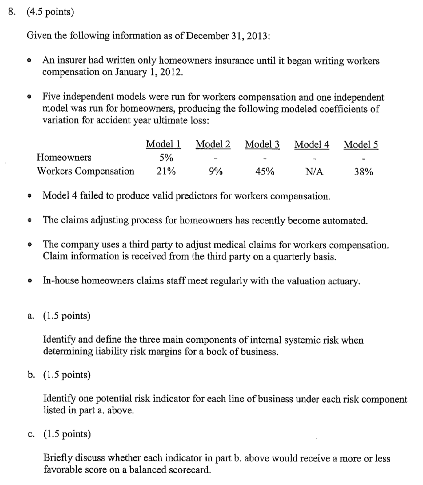
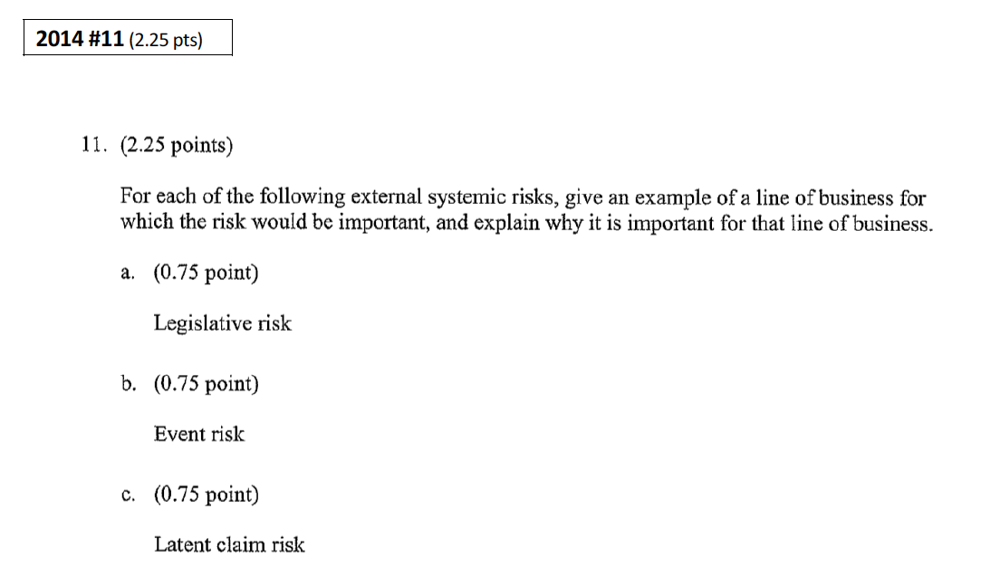
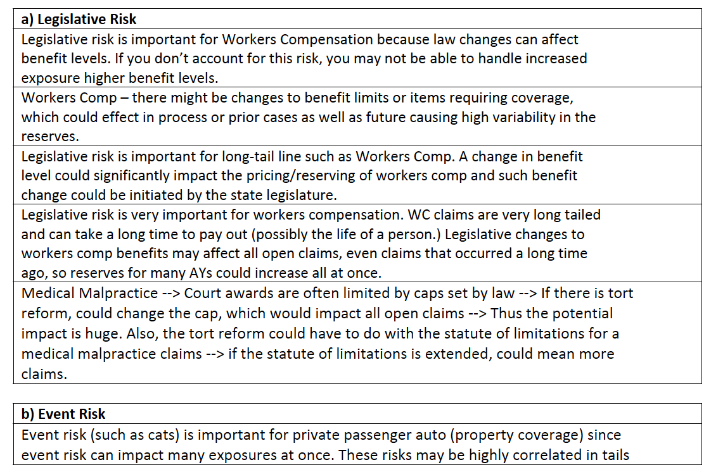
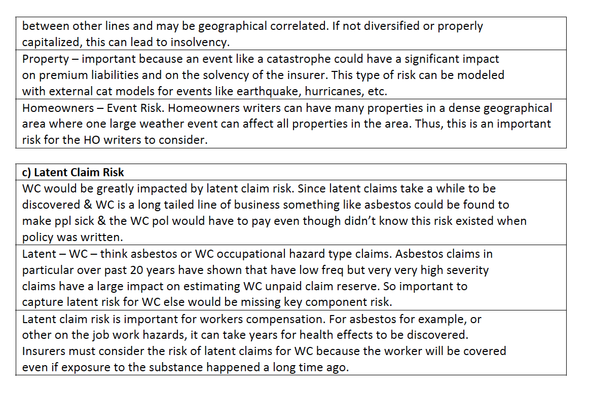
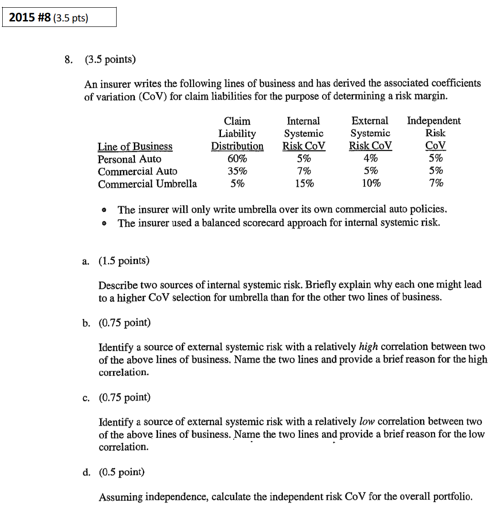
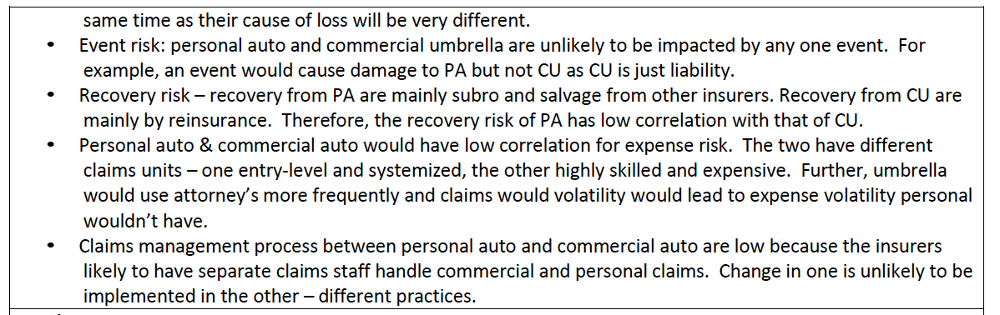
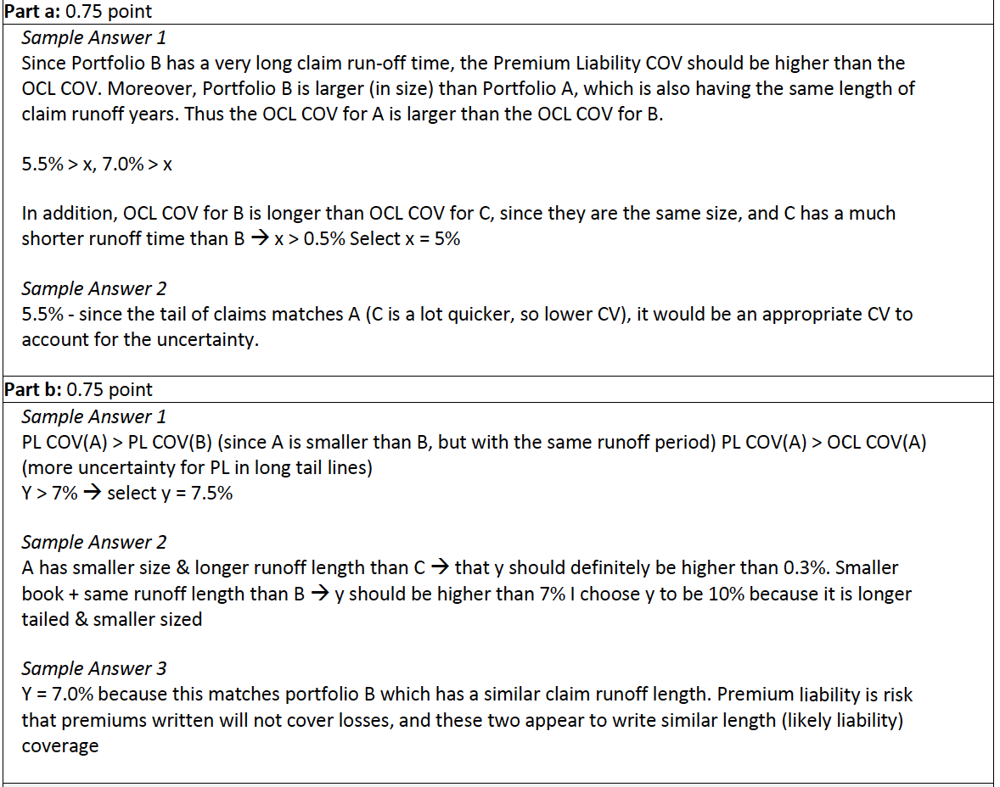

# A9 A Framework for Assessing Risk Margins - K. Marshall et al.

## Cliff's Summary

This had some pretty good past exam questions, need to know the qualitative items quite well

Know why we need qualitative analysis

**Independent**

Parameter and process variance model with stochastic model

**Internal Systemic**

Know the [3 components](#int-sys-comp)

Score against best practice and calibrate to CoV

* Know how to score given actual examples as in past exam
* Hindsight analysis

**Extnernal Systemic**

Know the different [risk categories](#risk-category)

* And what lines they impact most

Use benchmark similar to internal but select CoV directly

**Correlation**

Risk sources are independent of each other

Independent: assume independence across lines, weight by liabilities

Internal: base on correlation matrix $\Sigma$, again weighted by liabilities

External: correlation between each valuation group and risk categories $\Rightarrow$ then roll up to the risk categories and assume they are independent of each other

**Risk Margin**

$\text{Risk Margin} = \underbrace{\mu}_{\text{Expected Loss}} \times \underbrace{\phi }_{\text{CoV}} \times \underbrace{Z_{\alpha}}_{0.67\text{ for the }75^{th}\text{ percentile}}$

**Addiation analysis**

Sensitivity, scenario testing

[Internal benchmarking](#int-bench), important to know the relationships and consistency, been heavily tested in the past

External benchmarking

Hindsight and mechanical hindsight

**Regularity of review**

### Types of Exam Questions

Haven't done TIA practice questions

**Concepts**

* $\star$ [2013 #8 b f g h](#2013-8): Correlations, internal benchmarking
* $\star$ [2014 #8](#2014-8): internal systemic risk 3 components; risk indicator for each LoB for each risk component; Score the risk indicators
* $\star$ [2014 #11](#2014-11): External systemic risk and which lines impact the most
* $\star$ [2015 #8](#2015-8): Internal source, external source
* $\star$ [2015 #9](#2015-9): Internal benchmark

**Calculations**

* $\star$ [2013 #8 a c d e](#2013-8): Correlations, risk margins
* 2015 #8 d: Independent CoV

## Introduction

Estimate risk margin for unpaid losses and premium liabilities

* Risk margin = 75^th^ percentile - mean (an Australian regulatory standard)

* Based on CoV

Need framework because quantitative is not enough, need both quantitative and qualitative measures to examine the uncertainty

* Quantitative analysis requires lots of data

* Only captures historical risk

* Does not capture risk that did not have an episode (of systemic risk) in the experience period

Portfolio for the analysis should be split into reasonably homogeneous groups

* Might combine or further split groups from what was used for liability valuation

* Balance the practical benefits from large groups vs insight gained from smaller groups

* Might want to further split if a LoB has a portion that has significantly more uncertainty than another part (e.g. HO CAT/non CAT)

## Three Sources of Uncertainty

$\phi^2 = \underbrace{\phi_{indep}^2}_{\text{Independent Risk}} + \underbrace{\phi_{internal}^2}_{\text{Internal Systemic Risk}} + \underbrace{\phi_{external}^2}_{\text{External Systemic Risk}}$

* $\phi =$ CoV

Systemic Risk:

* Risks that can vary across valuation classes

* Qualitative approaches is recommended for systemic risk

* Need to make assumptions about the correlation of the different risks

Most quantitative methods are effective for *independent risk* and *past episodes* of external systemic risk. But not very effective with internal systemic risk and external systemic risk that has not yet occurred

* Good stochastic model will fit away past systemic episodes (e.g. high inflation) while we still want to hold a margin for the future

* Outcome dependent significantly on actual episodes of risk, not all potential ones (for systemic risk that was not fitted away)

    * Need to judge if episodes in data are representative going forward

* Model is unlikely to pick up internal systemic risk from the actuarial valuation process

### Independent Risk

Randomness inherent to the insurance process

* Parameter Risk: ability to select correct parameters and appropriate model

* Process Risk: randomness e.g. tossing a die

Use stochastic modeling to analyze independent risk

Focus on periods where episodes of systemic risk were non-existent or minimal so to reduce the impact of the historical external episodes and allow us to focus on the independent risk

* Supplement with internal and external bench marking

#### CoV for Independent Risk

Model the parameter and process risk together

* Mack, bootstrap, stochastic CL, GLM, Bayesian

Ideally the model adequately model away the systemic risk so all that is left is the independent risk

* Residual should only have independent risk

Complexity of the model should be commensurate with the importance of the total risk margin

For small data set, difficult to model away the external systemic risk $\Rightarrow$ Use as starting point and then add a margin for external systemic risks not in data

Models for outstanding claims liabilities:

* GLM and bootstrapping are particularly useful as they can isolate the independent risks; graphing residuals again AY, age, experience period can used to identify past systemic episodes

Models for premium liabilities:

* GLM, bootstrap, Bayesian

* Can model frequency and severity CoV then combine

    * Remove past systemic episodes from the frequency
    
    * Adjust for inflation and seasonality for severity

### Internal Systemic Risk

Uncertainty arising from the liability valuation process/actuarial valuation models. E.g. process the actuary goes through to estimate the liabilities

This can be fro sources anywhere along the chain of valuation: Data record/collection/organization (e.g. not collecting the right data; not using the right data) $\Rightarrow$ Analysis, AJ $\Rightarrow$ reserve selection (e.g. management overrides actuary's opinion)

3 components of internal systemic risk:

1) **Specification Error**: From not perfectly modeling the insurance process because it's too complicated or just don't have the data

2) **Parameter Selection Error**: Trend is particularly difficult to measure

3) **Data Error**: Lack of data, lack of knowledge of the underlying pricing, u/w, and claim management process, inadequate knowledge of portfolio

#### CoV for Internal Systemic Risk

Use **bench marking technique**:  
Need to **define risk indicators**, score them against best practice, map the scores to a CoV

**Score Against Best Practice**

1) For each valuation group, assign a score (1-5) for each risk indicator

    * Specification Error: # of independent models; range of results from model; ability to detect trends
  
    * Parameter Selection Error: Identify best predictors; stability of best predictors (or responsive to process change); Predictors used are close to best predictors
    
    * Data Error: Knowledge of past processes affecting predictors; Extent, timeliness, consistency, and reliability of information from the business; data is reconciled and has quality control; freq and sev of past misestimation due to revision of data

2) Assign weight for each risk indicator (can vary by valuation group)

3) Average the scores using the selected weights

We score the 3 components for each valuation group (OCL and PL) and then roll up the score and assign the average grade for each valuation group to a CoV

**Calibrate Score to CoV**

Significant amount of judgement supplement by quantitative analysis

CoV $\in [5\%, 20\%]$

Analysis of past model performance should aid in estimating the potential variability

* **Hindsight Analysis**: Compare valuation of liabilities at prior point in time to the current view, to gain insight into how a better model can reduce volatility

* **Mechanical Hindsight**: Mechanically do various ex post analysis, and see how prediction error can be reduced; e.g. do a detailed vs crude and see the difference

Additional comments:

* Improvement from poor to fair is greater than from fair to good

* Longer tail line will have higher CoV due to difficulty in estimating the parameters

* Lager liability will have smaller CoV when all else being equal

* OCL and OL might not necessarily be on the same scale

    * PL may have additional uncertainty as it's for future business
    
    * For short tail lines ELR might be sufficient for PL but might not be the best practice for OCL
    
    * Can always just add a load on top if justified

### External Systemic Risk

Systemic risk that are not internal

We don't want to only consider actual episodes of systemic risk in the data set

List of risk categories to consider:

* **Economic and Social Risks**: Inflation, social trends 

* **Legislative, Political Risks, Claims Inflation Risks**: Change in law, frequency of settlement vs suits to completion, loss trend (Long tail lines)

* **Claim Management Process Change Risk**: Change in process of managing claims e.g. case reserve practice

* **Expense Risk**: Cost of managing a run-off book

* **Event Risk**: natural or man-made CAT (Premium liabilities for property)

* **Latent Claim Risk**: Claim from source not currently considered to be covered

* **Recovery Risk**: Recoveries from reinsurers or non-reinsurers

A handful of these risk categories will dominate the uncertainty for that valuation group

Useful to rank the risk categories in order of impact on the uncertainty of a valuation group

Lots of the above should be something the valuation actuary already discussed with the business and with claims

#### CoV for External Systemic Risk

Use bench marking technique similar to internal systemic risk

Straight up select the CoV, rank the risk in order of importance to help with the selection

Quantitative approach can provide in insight but we need to also consider possible future sources of external systemic risk

Consider risk that affect u/w and risk selection, claims management, expense management, economic/legl environment

* **Economic and Social Risks**:
    
    * Inflation; unemployment; GDP growth; interest rates; driving patterns

    * For inflation we are concern with the systemic shifts not just randomness (randomness is in the indepedent risk)

* **Legislative, Political Risks, Claims Inflation Risks**

    * All grouped together since each catergory needs to be uncorrelated with each other
    
    * Short tail lines: can impact premium if there are sudden shifts in law of inflation
    
    * Long tail lines: Current or potential changes to law; medical technology costs; legal costs

* **Claim Management Process Change Risk**:

    * Reporting patterns; payment patterns; reopen rates
    
    * More important to OCL, only impact PL when a change in process change the cost level of claims

* **Expense Risk**:

    * Claim handling expense and policy maintenance expense
    
    * CoV should be small

* **Event Risk**:

    * Mostly premium risk
    
    * Can model from experience, CAT modeling or input from reinsurers

* **Latent Claim Risk**:

    * Unlikely for most LoB but can be severe
    
    * Due to low probability, likely not worth to commit substantial resources to estimate the risk

* **Recovery Risk**:

    * S&S for non reinsurer
    
    * Reinsurers, consider reinsurance contracts in place specifically for reinsurers where a large amount of premium is ceded

## Correlation (Aggregating the CoV)

**Overall**

Assumes the 3 main pieces are independent of each other

$\phi = \sqrt{\phi_{indep}^2 + \phi_{internal}^2 + \phi_{external}^2}$

Quantitative method to measure correlation can be valuable, however:

* Complexity maybe outweigh the benefit

* Results heavily influenced by past correlations while future correlation may differ

* Difficult to separate past episodes of independent risk and systemic risk

* Internal systemic risk cannot be modeled using standard correlation modeling techniques

* Likely won't aligned with our definitions of independent, internal/external systemic risks

Practical guidance:

* Just bucket into 0%, 25%, 50%, 75%, 100%, any finer will likely lead to spurious accuracy

* Introduce dummy variables and see their impact in each risk/valuation group pair (inflation, unemployment, propensity to suit, freq of CAT, fraud)

### Independent Risk Cov Correlation

Assume independence across liabilities, where $i$ is the different valuation groups

$\phi_{indep}^2 = \sum_i (\phi_i w_i)^2 = (\vec{\phi w})(\vec{\phi w})^T$

* $w_i$ can be just claims liabilities or total liabilities (including premium liabilities)

### Internal Systemic Risk Correlation

$\phi_{internal}^2 = (\vec{\phi w}) \times \Sigma \times (\vec{\phi w})^T$

* $\Sigma$ is the correlation matrix

* Again the $\vec{w}$ is the % of total liabilities

### External Systemic Risk

We measure the CoV for each [risk category](#risk-category) for each valuation group

$\Sigma_c$ is the correlation matrix between valuation groups for each risk category $c$

For a given risk category $c$, the CoV is:

* $\phi_{external, c}^2 = (\vec{\phi_{c} w}) \times \Sigma_c \times (\vec{\phi_{c} w})^T$

Then assume independence between risk categories:

* $\phi_{external}^2 = \sum \limits_{c \in risk \: category} \phi_{external, c}^2$

* Important to pick risk categories that are likely to be independent of each other

## Risk Margin

$\text{Risk Margin} = \underbrace{\mu}_{\text{Expected Loss}} \times \underbrace{\phi }_{\text{CoV}} \times \underbrace{Z_{\alpha}}_{0.67\text{ for the }75^{th}\text{ percentile}}$

* $\alpha$ %-ile = $\mu(1+\phi Z_{\alpha})$

## Additional Analysis

**Sensitivity Testing**: By varying the CoV and correlations

**Scenario Testing**: Consider what assumptions need to change in our mid point to eat up the risk margin

**Internal Benchmarking**: Compare CoVs within between OCL and PL and also with other valuation groups

*Independent risk*: 

* Large liability will have smaller CoV due to law of large numbers
    
* Short tail line will have a small CoV as well due to less volatility
    
Therefore:    
    
* Outstanding Claims Liability: $\phi_{short \: tail} < \phi_{long \: tail} < \phi_{long \: tail, \: small \: book}$

* Premium Liability - Long Tail: OCL > PL $\Rightarrow$ $\phi_{OCL} < \phi_{PL}$

    * Because there are many AYs of claims in the reserves
    
* Premium Liability - Short Tail: OCL < PL $\Rightarrow$ $\phi_{OCL} > \phi_{PL}$

    * Because OCL is small
    
    * LoB with significant event risk will have different risk profiles for the PL and OCL
    
*Internal Systemic*: 

* If the methods to estimate liabilities is similar across valuation groups, we would expect the CoV to be similar for classes that have similar claim payment patterns

*External Systemic*:

* Main sources are higher for long tail lines; Event risk is higher for property; Liability for HO can also be significant

**External Benchmarking**: Compare selected CoV with external sources

* Such as APRA 2008

* Use just as a sanity check, not appropriate to simply take the risk margins from benchmarks

* Independent risk CoV depend on the size of liabilities $\Rightarrow$ Similar sized liability today would represent a small book due to inflation $\Rightarrow$ Adjust CoV upward

* Estimate PL with a scale up factor from OCL

**Hindsight Analysis**:

* Compare the actual results with expected

* Blend of all 3 risks

* Useful as a guide if the CoVs are reasonable

**Mechanical Hindsight**:

* Value the liabilities today using a mechanical method and repeat with information at older evaluation date

* Measure independent risk over stable periods

* By using multiple methods you can measure the internal systemic risk

* By measuring over long periods of time, you can measure risk from all sources

## Documentation and Regularity

Full study to support CoV should be done every 3 years

Key assumptions should be examined in the interim:

* Emerging trends

* Emerging systemic risks

* Change in valuation methods

Should consider applying the key steps to any new portfolio

## Past Exam Questions

2013 #8

2014 #8

2014 #11

2015 #8

2015 #9

