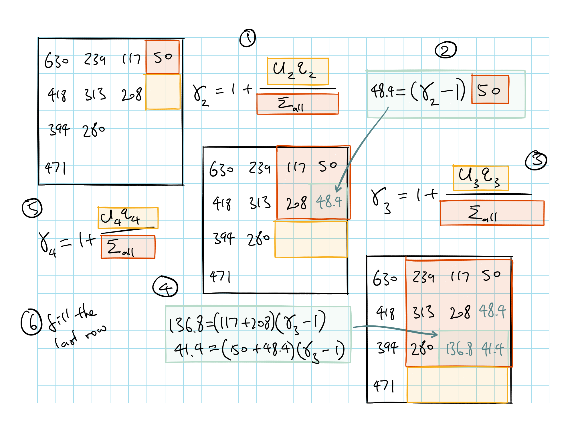
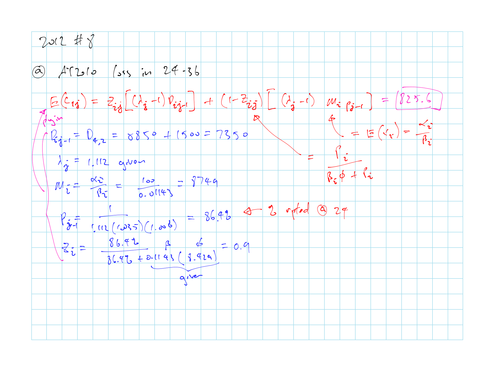

# Obtaining Predictive Distributions for Reserves Which Incorporate Expert Opinions - R. Verrall

Know how the model is defined with ODP and stochastic row parameters

Know the Bayesian BF calculation and assumptions

* $\operatorname{E}[c_{ij}] = Z_{ij} \overbrace{[(\lambda_j - 1) \underbrace{D_{ij-1}}_{\text{Actual up to }j-1}]}^{\text{CL Results}} + (1- Z_{ij}) \overbrace{[(\lambda_j - 1) \underbrace{M_i p_{j-1}}_{\text{Expected up to }j-1}]}^{\text{BF Results}}$

* $Z_{ij} = \dfrac{p_{j-1}}{\beta_i \varphi + p_{j-1}}$

Know the Stochastic column parameters calculation

## Introduction

Uses Bayesian techniques to allow incorporation of expert opinion and also maintain the integrity of the prediction error

* i.e. how expert opinion from sources other than the specific data set under consideration can be incorporated into the predictive distributions of the reserves

* Take into account prior knowledge in setting reserves

    e.g. Adjusting data to reflect changes in benefits or claims handling, or select *L*-year average LDFs

* Calculating prediction error using prior knowledge

* Use Bayesian to take into account our a-priori and the strength of that a-priori (credibility)

Paper focus on use of a-priori knowledge for LDF selection and *BF* Method

Development of MCMC techniques has made Bayesian methods much easier

* Makes it easier to find the **posterior distributions** for future observations (defining the Bayesian model is always easy)

* MCMC breaks down the simulation process into a number of simulations that are easy to carry out

    $\therefore$ This solves the common Bayesian problem of difficulty in finding the posterior distribution (as they can be multidimensional)
    
* MCMC doesn't simulate all the parameters at once, it use the conditional distribution of each parameter, given all the others

    $\therefore$ Reducing the simulation to a univariate distribution
    
* Markov chain is formed because each parameter is considered in turn, and it is a simulation-based method

    $\therefore$ MCMC
    
### Notation {#verrall-notation}

For a $n \times n$ triangle

**Claims**

* Incremental claims for AY $i$ and age $j$: $c_{ij}$

$$\{ c_{ij} \: : \: j=1,...,n-i+1 \: ; \: i = 1,...,n \}$$

* Cumulative claims

$$D_{ij} = \sum_{k=1}^j c_{ik}$$

* Ultimate losses

$$D_{in} = \sum_{k=1}^n c_{ik}$$

```{remark}
We only consider forecasting losses up to the latest development year $n$

* It is possible to extend this to allow a tail factor but not in this paper
```

**Row Parameters**

* Expected ultimate losses for AY $i$: $x_i$

$$x_i = \mathrm{E}[D_{in}]$$

**Column Parameters**

* Expected % reported in each period: $y_j$

    $\sum y_i = 1$

* Expected reported to date: $p_j$

    $\sum_{k=1}^j y_k$

* Expected development from $D_{ij-1}$ to $D_{ij}$: $\lambda_j$ ($= \dfrac{p_j}{p_{j-1}}$?)

$$\{\lambda_j \: : \: j = 2 ,...,n\}$$

* Weighted average LDFs: $\hat{\lambda}_j$

$$\hat{\lambda}_j = \dfrac{\sum_{i=1}^{n-j+1} D_{ij}}{\sum_{i=1}^{n-j+1} D_{ij-1}}$$

## Stochastic Models for the Chainladder

Stochastic models that have the same estimate of Unpaid losses as the Chainladder

For each model, we can calculate the MSE of prediction and therefore a prediction interval

```{proposition}
Prediction variance = process variance + estimation variance
```

```{proof}
$$\begin{array}
\text{MSEP} &= &\mathrm{E}[(y - \hat{y})^2] \\
&= &\mathrm{E}[((y-\mathrm{E}[y]) - (\hat{y} - \mathrm{E}[y]))^2] \\
&\approx &\mathrm{E}[((y-\mathrm{E}[y]) - (\hat{y} - \mathrm{E}[\hat{y}]))^2] \\
&= &\mathrm{E}[(y - \mathrm{E}[y])^2] \\
& &-2\mathrm{E}[(y-\mathrm{E}[y])(\hat{y} - \mathrm{E}[\hat{y}])] \\
& &+ \mathrm{E}[(\hat{y} - \mathrm{E}[\hat{y}])^2]\\
&= &\underbrace{\mathrm{E}[(y - \mathrm{E}[y])^2]}_{\text{Process Variance}}+ \underbrace{\mathrm{E}[(\hat{y} - \mathrm{E}[\hat{y}])^2]}_{\text{Estimation Variance}}\\
\end{array}$$
```

```{remark}


* Assume future observations are independent of past observations and the -2 term above goes to 0

* S.e. = $\sqrt{\text{Estimation Variance}}$

* Prediction error includes both the error in estimating our parameters and the process variance (inherent variability in the data being forecast)

* Both bootstrap and MCMC allows us to calculate the prediction error
```

### Mack-1993 (Non-parametric)

Only the first 2 moments of **cumulative claims** are specified

\begin{equation}
  \mathrm{E}[D_{ij}] = \lambda_j D_{ij-1}
  (\#eq:verrall-mack-mean)
\end{equation}

\begin{equation}
  \mathrm{Var}(D_{ij}) = \sigma^2_j D_{ij-1}
  (\#eq:verrall-mack-var)
\end{equation}

```{remark}


* Mean is the same as the Chainladder

* Variance is $\propto$ claims reported to date $D_{ij-1}$

    $\sigma^2_j$ has to be estimated separately from the development factors

* The simplicity of this allows the parameter estimate and prediction errors to be obtained from a spreadsheet

* Downside is that without specifying a distribution we don't get a predictive distribution
```

### Over-dispersed Poisson and Negative Binomial

Separate stream of research that focused on the use of GLM

**Incremental claims** distribution **OD Poisson**:

\begin{equation}
\begin{split}
& c_{ij} \mid c, \alpha, \beta, \varphi \sim  ODP(m_{ij}, \varphi m_{ij}) \\
& \mathrm{E}[c_{ij}] = m_{ij} \\
& \mathrm{Var}(c_ij) = \varphi m_{ij} \\
& \ln(m_{ij}) = c + \alpha_i + \beta_j \: ; \: \alpha_1 = \beta_1 = 0 
\end{split}
(\#eq:verall-odp)
\end{equation}

```{remark}


* Model result is the same as Chainladder

* $m_{ij}$ mathematically the same as the one defined in [Shapland](#odp-glm-para), we can not include the $c$ term and just use $\alpha_i$'s as the individual level parameters instead of having $\alpha_1 = 0$ and use the $alpha_i$'s as adjustments to the level parameter constant $c$

* This allows for calculating prediction error

```

**Alternative way** of writing ODP

\begin{equation}
\begin{split}
& c_{ij} \mid x,y, \varphi \sim  ODP(x_i y_j, \varphi x_i y_j) \\
& \sum_{k=1}^n y_k = 1 \\
& x = \{x_1, x_2,...,x_n\} \:\: \text{row parameters}\\
&x_i = \mathrm{E}[D_{in}] \:\: \text{Expected ultimate cumulative losses up to }n\\
& y = \{y_1, y_2,...,y_n\} \:\: \text{col parameters}\\
& y_i \:\: \text{Proportions of ultimate losses that emerge in each development year}
\end{split}
(\#eq:verall-odp)
\end{equation}

*Recall*:

\begin{equation}
\begin{split}
&X \sim \text{Poisson}(\mu) \\
&Y = \varphi X \sim ODP(\varphi \mu, \varphi^2 \mu)\\
\end{split}
(\#eq:verall-odp-recall)
\end{equation}

* Where $\varphi$ is typically > 1 $\therefore$ over-dispersed

* This can be extend to other distribution beyond Poisson

    e.g. see over-dispersed negative binomial below

We can get the same predictive distribution (as ODP) with ODNB

* ODNB also make the connection between ODP and Chainladder more apparent

**Incremental claims** distribution for **OD Negative Binomial**:

\begin{equation}
\begin{split}
& c_{ij} \mid \lambda_j, \varphi \sim  ODNB \\
& \mathrm{E}[c_{ij}] = (\lambda_j - 1)D_{ij-1} \\
& \mathrm{Var}(c_ij) = \varphi \lambda_j \mathrm{E}[c_{ij}] \\
\end{split}
(\#eq:verall-odnb)
\end{equation}

**Cumulative claims** distribution for **OD Negative Binomial**:

\begin{equation}
\begin{split}
& D_{ij} \mid D_{ij-1}, \lambda_j, \varphi \sim  ODNB \\
& \mathrm{E}[c_{ij}] = \lambda_j D_{ij-1} \\
& \mathrm{Var}(c_ij) = \varphi (\lambda_j - 1) \mathrm{E}[c_{ij}] \\
\end{split}
(\#eq:verall-odnb-cum)
\end{equation}

```{remark}
For both ODP and ODNB

* Use a quasi-likelihood approach so that the loss data are not restricted to the positive integers

* Reserve estimates are the same as Chainladder

* Both are subject to the positivity constraints

    * It's apparent in the ODNB formula that the column sums must be positive or else we'll have development factor $\lambda_j < 1$ $\Rightarrow$ Varaiance to be negative

* Advantages (over Kremer):

    * Does not necessarily break down if there are negative incremental loss values
    
        *  In a strick sense, the model requires the incremental losses in a column to be positive otherwise it is more difficult to justify and interpret the inferences (but it doesn't necessarily break the model)
    
    * Gives the same reserve estimate as Chainladder
    
    * More stable than the log-normal model of Kremer
    
* Verrall suggest that model can be specified for either incremental or cumulative loss

* Advantage of the NB:

    * Form of the mean is the same as chainladder
    
* If we replace the NB and use normal instead we can deal with the problem of negative incremental claims (not discussed in paper)

```

## Incorporating Expert Opinion about the Development Factors

## Model Specification

Steps:

1) Assign prior dist^n^ to the column parameters

2) Incremental Loss $\sim NB$ (or ODP)

3) If vague priors (large variances) $\Rightarrow$ Bayesian chainladder

    * Prediction error will be similar to CL or slightly larger
4) If strong priors (small variances) $\Rightarrow$ We believe the prior means are appropriate

    * Prediction error will decrease
    
### Chain Ladder Intervention

Adjust LDFs for a development period for the recent years only

**Vauge Priors**

Large variance $\Rightarrow$ Parameter based on data

* Based on recent years average

**Strong Priors**

Small variance $\Rightarrow$ Prior mean has greater influence

### Last 3 Diagonals for LDFs

Use the last 3 diagonals for forecasting to account for CY effects or inflation etc

Pick large variance so data drive the parameter selection

### BF Intervention

Intervention on the level of each row $x_i$ (a-priori)

**Vauge Priors**

Large variance, less strong prior information $\Rightarrow$ Results between BF and CL

Lowers the prediction error but not as much

**Strong Priors**

Small variances, approximate the BF method

Prediction error comes down due to low variance in the prior

## Bayesian Model for BF Method

**Assumptions**:

$c_{ij} \sim ODP(x_i \cdot y_j, \varphi)$

$x_i \sim \Gamma(\alpha_i, \beta_i)$

* $\operatorname{E}[x_i] = \dfrac{\alpha_i}{\beta_i} = M_i$
    
* $\operatorname{Var}[x_i] = \dfrac{\alpha_i}{\beta_i^2}$

* Gamma because the numerical procedures work well (LogNormal is good too)

Mean and variance of $x_i$ is selected from outside the model and back out the parameters

* $\beta_i = \dfrac{\operatorname{E}[x_i]}{\operatorname{Var}[x_i]}$

* $\alpha_i = \dfrac{(\operatorname{E}[x_i])^2}{\operatorname{Var}[x_i]}$

**Model Results**:

<span style="color:red;background:yellow">Memorize Formula</span>

$\operatorname{E}[c_{ij}] = Z_{ij} \overbrace{[(\lambda_j - 1) \underbrace{D_{ij-1}}_{\text{Actual up to }j-1}]}^{\text{CL Results}} + (1- Z_{ij}) \overbrace{[(\lambda_j - 1) \underbrace{M_i p_{j-1}}_{\text{Expected up to }j-1}]}^{\text{BF Results}}$

$Z_{ij} = \dfrac{p_{j-1}}{\beta_i \varphi + p_{j-1}}$

* Large $\beta$ means small variance for the prior $\Rightarrow$ smaller $Z_{ij}$ $\Rightarrow$ less credibility on the actual loss

* $\varphi$, which represents process variance also has impact on the credibility

* Larger $p_{j-1}$ means more developed losses $\Rightarrow$ more credibility to actual losses

Notes:

* Benktander with different weights

* This is applied to *incremental* loss in the triangle

* $\varphi$ will be given

## Stochastic Column Parameters

BF above uses stochastic row parameters and deterministic column parameters

We can use stochastic process for both by first estimating the column parameters then the row parameters

For columns, prior dist^n^ is gamma with wide variance

$\operatorname{E}[c_{ij}] = (\gamma_i - 1) \sum \limits_{m=1}^{i-1} c_{m,j}$

* $\sum \downarrow$

* $\gamma_i$ is the new row parameters

    * This tells you the level of losses in the row relative to the rows above

* Similar to LDFs but just looking at it at the different angle


### Calculate Gamma

Know how to calculate this pictorially

Need to first use CL method to get ultimate loss and % unpaid by AY

$\gamma_1 = 1.000$ always

First calculate LDFs and calculate % unpaid and a-priori for each AY

* $U_i$ = a-priori ultimate based on LDF for AY $i$

* $q_i$ = % unpaid for AY $i$



Note that in step 4 above if you don't need the individual cells you can just take the $U_3 q_3$

## Past Exam Questions

```{block, type='rmdcaution'}
Haven't done TIA practice questions
```

**Concepts**

* 2012 #8: Explain model as trade off between standard CL and BF

* 2013 #9: Model specification stuff on variance of the prior, BF bayesian

    * Bayesian vs Bootstrap: Provide expert opinion while maintaining the integrity of the variance estimates

    * Bayesian vs Mack: Provides full distribution of unpaid losses and not just the first 2 moments

* 2014 #10: Expert opinions in LDFs or row parameters; $\beta$ impact on the bayesian model

**Full Calculation**

* $\star$ 2012 #8 \@ref(fig:2012-8): Bayesian model for BF method

### Question Highlights

```{r 2012-8, echo = FALSE, out.width='100%', fig.show='hold', fig.cap='2012 Question 8'}
knitr::include_graphics('questions/2012-8Q.png')

```
