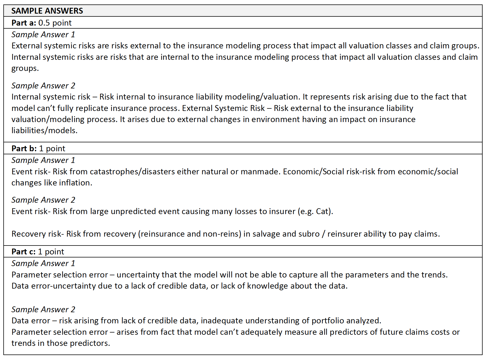

# A Framework for Assessing Risk Margins - K. Marshall et al.

Importance of [qualitative analysis](#marshall-quant-v-qual)

[***Independent Risk***](#indep-risk-marshall)

* Parameter and process variance model with stochastic model

[***Internal Systemic Risk***](#int-sys-comp)

$\star$ Three components of internal systemic risk \@ref(def:three-int-sys-risk)

[CoV calculation](#cov-int-marshall):

* $\star$ [Score against best practice](#score-bp-int-marshall) (Table \@ref(tab:marshall-spec-error-int-sys), \@ref(tab:marshall-para-error-int-sys) and \@ref(tab:marshall-data-error-int-sys))

* [Calibrate to CoV](#cali-score-int-marshall) for each component where CoV $\in [5\%, 25\%]$

    * 2 Hindsight analysis

[***Extnernal Systemic Risk***](#ext-sys-risk)

$\star$ Different [risk categories](#risk-categories-marshall)

* Certain lines are impacted more than other by a given risk

[CoV](#cov-ext-marshall): Use benchmark similar to internal but select CoV directly

***Correlation***

* The 3 main risk sources are independent of each other and therefore can be sum with square root rule \@ref(eq:marshall-source-2)

    * Pros and cons quantitative method for correlation

* **Independent** \@ref(eq:marshall-indep-corr):

    Assume independence across lines, weight by liabilities

* **Internal** \@ref(eq:marshall-int-sys-corr):

    Base on correlation matrix $\Sigma$, again weighted by liabilities

* **External** \@ref(eq:marshall-ext-sys-corr-1) & \@ref(eq:marshall-ext-sys-corr-2):

    Correlation between each valuation group and risk categories $\Rightarrow$ then roll up to the risk categories and assume they are independent of each other

***Risk Margin***: \@ref(eq:risk-margin-marshall)

* $\alpha$-tile \@ref(eq:risk-margin-alpha-marshall)

$\star$ [***Addition analysis***](#marshall-add-analysis)

* Sensitivity, scenario testing

* $\star$ [Internal benchmarking](#marshall-add-analysis), important to know the relationships and consistency, been heavily tested in the past

* External benchmarking

* Hindsight and mechanical hindsight

***Regularity of review***

## Introduction

Estimate *risk margin* for *unpaid losses* and *premium liabilities*

* An additional reserve held as a safety measure in case losses end up worse than expected

* *Risk margin* = 75^th^ percentile - mean

    (an Australian regulatory standard)

* Based on CoV

Goal is to create a framework for an actuary to proceed through to estimate the risk margin

**Data Segmentation**

* Portfolio for the analysis should be split into reasonably *homogeneous groups*

* Might combine or further split groups from what was used for liability valuation

* Balance the practical benefits from large groups vs insight gained from smaller groups

* Might want to further split if a LoB has a portion that has significantly more uncertainty than another part (e.g. HO CAT/non CAT)

## Three Sources of Uncertainty

Coefficient of Variation: $\phi = \dfrac{\sigma}{\mu}$

\begin{equation}
\phi^2 = \underbrace{\phi_{indep}^2}_{\text{Independent Risk}} + \underbrace{\phi_{internal}^2}_{\text{Internal Systemic Risk}} + \underbrace{\phi_{external}^2}_{\text{External Systemic Risk}}
(\#eq:marshall-source)
\end{equation}

```{definition, marshall-sys-risk}
Systemic Risk

* Risks that can vary across valuation classes

* *Qualitative* approaches is recommended for systemic risk

* Need to make assumptions about the correlation of the different risks
```

### Quantitative vs Qualitative Analysis {#marshall-quant-v-qual}

**Limitation of quantitative analysis**

* Requires lots of data that we don't have

* Only captures historical risk

* Does not capture risk that did not have an episode (of systemic risk) in the experience period

$\therefore$ Need qualitative measures as well to examine the uncertainty

Table: (\#tab:marshall-quantitative) Quantitative method effectiveness

| Effective | Not effective |
|:------------------------------------ |:------------------------------ |
| Independent risk | Internal systemic risk |
| *Past episodes* of external systemic risk | External systemic risk that has not yet occurred |

* Good stochastic model will **fit away past systemic episodes** (e.g. high inflation) while we still want to hold a margin for the future

* Outcome dependent significantly on actual episodes of risk, not all potential ones (for systemic risk that was not fitted away)

    * Need to judge if episodes in data are representative going forward

* Model is unlikely to pick up **internal systemic risk** from the actuarial valuation process

## Independent Risk {#indep-risk-marshall}

```{definition}
Independent Risk = Randomness inherent to the insurance process

* *Parameter Risk*: ability to select correct parameters and appropriate model

* *Process Risk*: randomness e.g. tossing a die
```

Use **stochastic modeling** to analyze independent risk

* Focus on periods where episodes of systemic risk were non-existent or minimal

    Limit the impact of the *historical external episodes* and allow us to focus on the independent risk

* Supplement with internal and external benchmarking

### CoV for Independent Risk

Model the parameter and process risk together

* [Mack](#mack-CI-methods), [bootstrap](#odp-boot-sim), stochastic CL, GLM, [Bayesian](#Verall-intro)

Ideally the model adequately **model away the systemic risk** so all that is left is the independent risk

* Residual should only have independent risk

* **For small data set**: difficult to model away the external systemic risk 

    * **Solution**: Do not model away past episodes of systemic risk
    
        Use results as starting point and then add a margin for external systemic risks not in data to have a measure of independent and external systemic risk

Complexity of the model should be commensurate with the importance of the total risk margin

Models for **outstanding claims liabilities**:

* GLM and bootstrapping are particularly useful

* They can *isolate* the independent risks

* *Graphing residuals* again AY, age, experience period can used to identify past systemic episodes

Models for **premium liabilities**:

* GLM, bootstrap, Bayesian

* Can model frequency and severity CoV then combine

    * *Frequency*: Remove past systemic episodes
    
    * *Severity*: Adjust for inflation and seasonality

## Internal Systemic Risk {#int-sys-comp}

```{definition}
Internal systemic risk = Uncertainty arising from the liability valuation process/actuarial valuation models

* From source anywhere along the chain of the valuation
```

Examples:

* Data record/collection/organization (e.g. not collecting the right data; not using the right data)

* Analysis, actuarial judgement

* Reserve selection (e.g. management overrides actuary's opinion)

```{definition, three-int-sys-risk}
*3 components* of internal systemic risk:

1) **Specification Error**:

    From not perfectly modeling the insurance process because it's too complicated or just don't have the data

2) **Parameter Selection Error**:

    Difficulty in measuring all predictors and the *trend* in these predictors are particularly difficult to measure

3) **Data Error**:

    Lack of data, lack of knowledge of the underlying pricing, u/w, and claim management process, inadequate knowledge of portfolio
```

### CoV for Internal Systemic Risk {#cov-int-marshall}

**Benchmarking technique**:  
Need to define a list of **risk indicators**, score them against best practice, map the scores to a CoV

1. [Score against best practice](#score-bp-int-marshall)

2. [Calibrate Score to CoV]()

#### Score Against Best Practice {#score-bp-int-marshall}

1) For each valuation group, assign a score (1-5) for each **risk indicator**

Table: (\#tab:marshall-spec-error-int-sys) Specification Error Risk Indicators

| Risk Indicators | Best Practice |
| --------------------------------- | --------------------------------- |
| # of independent models used | Each model should add value by considering a different dimension of claims experience |
| Range of results produced by models | Low variation in model results |
| # and importance of subjective adjustments to factors | Few subjective adjustments; adjustments regularly monitored and reviewed |
| Ability to detect trends in key claim cost indicators | Models have performed well at detecting trends in the past |

Table: (\#tab:marshall-para-error-int-sys) Parameter Selection Error Risk Indicators

| Risk Indicators | Best Practice |
| --------------------------------- | --------------------------------- |
| Best predictors have been identified (but not necessarily used) | Best predictors have been analyzed and identified (int or ext), and show a strong correlation with claims experience |
| Best predictors are stable over time, or change due to process changes | Predictors stable over time, stabilize quickly and respond well to process changes |
| Value of predictors used | Predictors are close to Best Predictors; lead (rather then lag) claims cost outcomes, modeled, rather than subjectively selected |

Table: (\#tab:marshall-data-error-int-sys) Data Error Risk Indicators

| Risk Indicators | Best Practice |
| --------------------------------- | --------------------------------- |
| Knowledge of past processes affecting predictors | Actuary has good and credible knowledge of past processes and change to processes |
| Extent, timeliness, consistency and reliability of information from the business | Regular, pro-active communication between the actuary and claims staff and the business |
| Data is subject to reconciliations and quality control | Reconciliation against financials, and prior studies; difference are well understood |
| Frequency and severity of past misestimation due to revision of data | No past instances of data revision |


2) Assign weight for each risk indicator (weight can vary by valuation group)

3) Calculate weighted average the scores using the selected weights

We score the 3 components for each valuation group (OCL and PL) and then roll up the score and assign the average grade for each valuation group to a CoV

#### Calibrate Score to CoV {#cali-score-int-marshall}

Significant amount of judgement supplement by quantitative analysis

CoV $\in [5\%, 25\%]$

Analysis of past model performance should aid in estimating the potential variability

* **Hindsight Analysis**:

    Compare valuation of liabilities at prior point in time to the current view, to gain insight into how a better model can reduce volatility

* **Mechanical Hindsight**:

    Mechanically do various ex post analysis, and see how prediction error can be reduced; e.g. do a detailed vs crude and see the difference

*Additional comments*:

* Improvement from poor to fair is greater than from fair to good

* Longer tail line will have higher CoV due to difficulty in estimating the parameters

* Larger liability will have smaller CoV when all else being equal

* OCL and PL might not necessarily be on the same scale

    * PL may have additional uncertainty as it's for future business
    
    * For short tail lines ELR might be sufficient for PL but might not be the best practice for OCL
    
    * Can always just add a load on top if justified

## External Systemic Risk {#ext-sys-risk}

```{definition}
External systemic risk = systemic risk that are not internal

* Risks external to the liability valuation process
```

Need to consider systemic risk not in the data set (i.e. Can't only consider actual episodes of systemic risk in the data set)

See **risk categories** in [section below](#risk-categories-marshall)

```{remark}


* A handful of these risk categories will dominate the uncertainty for that valuation group

* Useful to **rank** the risk categories in order of impact on the uncertainty of a valuation group

    (This will give guidance on how to score them)

* Lots of the above should be something the valuation actuary already discussed with the *business* and with *claims*:

    * Underwriting and risk selection
    
    * Claims management
    
    * Portfolio management process
    
    * Expense management
    
    * Emerging trends - portfolio and claims
```

### CoV for External Systemic Risk {#cov-ext-marshall}

Use [bench marking](#cov-int-marshall) technique similar to internal systemic risk

**Directly select the CoV**

* **Rank** the risk in order of importance to help with the selection

*Quantitative* approach can provide in insight

* But we need to also consider **possible emerging and potential future sources** of external systemic risk

* Should bare in mind the **skewness** (might not be relevant for 75^th^ percentile if it is very skewed)

Consider risk that affect u/w and risk selection, claims management, expense management, economic/legal environment

#### Risk Categories {#risk-categories-marshall}

**Economic and Social Risks**
    
* Inflation; unemployment; GDP growth; interest rates; driving patterns; fuel prices; social trends

* For inflation we are concern with the systemic shifts not just randomness (randomness is in the independent risk)

* Some are more important for PL than OCL (e.g. driving conditions is more important for PL)

**Legislative, Political Risks, Claims Inflation Risks**:  
Change in law, frequency of settlement vs suits to completion, loss trend (Long tail lines)

* All grouped together since each category needs to be uncorrelated with each other
    
* Long tail lines: more material to long tail LoBs since these changes could impact the entire portfolio of unpaid claims

    *Considerations*:
    
    * Impact of recent legislative changes, change in court interpretation
        
    * Potential for future legislative amendments with retrospective impacts
        
    * Precedent setting in courts
    
    * Changes to medical technology costs
        
    * Change to legal costs
        
    * Systemic shifts in large claim frequency or severity
    
* Short tail lines: can impact premium if there are sudden shifts in law or inflation

**Claim Management Process Change Risk**:  
Change in process of managing claims e.g. case reserve practice

* Understand current philosophy and know any current or potential future process changes

* Discuss reporting patterns, payment patterns, finalization rates ,reopen rates, case estimate process
    
* More important to OCL, only impact PL when a change in process change the cost level of claims

**Expense Risk**:  

* Claim handling expense and policy maintenance expense
    
* CoV should be small

* Need to understand the drivers of policy maintenance and claim handling expenses

* Event claims can have a material impact on expenses, typically lower the ratio of expenses to indemnity paid amounts $\therefore$ consider these expense separately

**Event Risk**:  
Natural or man-made CAT (Premium liabilities for property)

* Mostly premium risk
    
* Can model from past experience (with adjustment to portfolio size, geographical spread, inflation, policy terms and reinsurance), CAT modeling or input from reinsurers

**Latent Claim Risk**:  
Claim from source not currently considered to be covered

* Unlikely for most LoB but can be severe
    
* Due to low probability, likely not worth to commit substantial resources to estimate the risk

* Discussion with reinsurers can guide in preparing a range of scenarios

**Recovery Risk**:  
Recoveries from reinsurers or non-reinsurers

* S&S for non reinsurer on LoB like auto
    
* Reinsurers, consider reinsurance contracts in place specifically for reinsurers where a large amount of premium is ceded

## Correlation (Aggregating the CoV)

**Overall**

Assumes the 3 main risk components are independent of each other

\begin{equation}
\phi = \sqrt{\phi_{indep}^2 + \phi_{internal}^2 + \phi_{external}^2}
(\#eq:marshall-source-2)
\end{equation}

**Caveat of quantitative method** to measure correlation:

* Complexity > benefit

* Results heavily influenced by past correlations

    (While future correlation may differ)

* Difficult to separate past episodes of *independent risk* and *systemic risk*

* Internal systemic risk cannot be modeled using standard correlation modeling techniques

* Likely won't aligned with our definitions of independent, internal/external systemic risks

**Practical guidance**:

* Bucket into 0%, 25%, 50%, 75%, 100%

    (Any finer will likely lead to spurious accuracy)

* Introduce dummy variables and see their impact in each risk/valuation group pair

    (Inflation, unemployment, propensity to suit, freq of CAT, fraud)

### Independent Risk Cov Correlation

Assume *independence* across liabilities, where $i$ is the different valuation groups

\begin{equation}
  \phi_{indep}^2 = \sum_i (\phi_i w_i)^2 = (\vec{\phi w})(\vec{\phi w})^T
  (\#eq:marshall-indep-corr)
\end{equation}

* $w_i$ can be just claims liabilities or total liabilities (including premium liabilities)

### Internal Systemic Risk Correlation

Focus on correlation within internal systemic risk

* Can have correlation between the outstanding claim and premium liabilities for the same valuation group

\begin{equation}
  \phi_{internal}^2 = (\vec{\phi w}) \times \mathbf{\Sigma} \times (\vec{\phi w})^T
 (\#eq:marshall-int-sys-corr)
\end{equation} 

* $\mathbf{\Sigma}$ is the correlation matrix

* Again the $\vec{w}$ is the % of total liabilities

### External Systemic Risk Correlation

We measure the CoV for each risk category for each valuation group

* e.g. high inflation will be correlated across all valuation groups that have long tail or event risk across LoB

$\mathbf{\Sigma}_c$ is the correlation matrix between valuation groups for each risk category $c$

For a given risk category $c$, the CoV is:

\begin{equation}
  \phi_{external, c}^2 = (\vec{\phi_{c} w}) \times \mathbf{\Sigma}_c \times (\vec{\phi_{c} w})^T
  (\#eq:marshall-ext-sys-corr-1)
\end{equation}

Then assume *independence* between risk categories:

\begin{equation}
  \phi_{external}^2 = \sum \limits_{c \: \in risk \: category} \phi_{external, c}^2
  (\#eq:marshall-ext-sys-corr-2)
\end{equation}

* Important to pick risk categories that are likely to be independent of each other

## Risk Margin

***Risk Margin***

\begin{equation}
  \mu \times \phi \times Z_{\alpha}
  (\#eq:risk-margin-marshall)
\end{equation}

* $\mu$: Expected loss

* $\phi$: CoV

* $Z_{\alpha}$: 0.67 for 75^th^ percentile

$\alpha$ %-ile

\begin{equation}
  \mu(1+\phi Z_{\alpha})
  (\#eq:risk-margin-alpha-marshall)
\end{equation}

## Additional Analysis {#marshall-add-analysis}

Test the quality of our result

**Sensitivity Testing**:  
Varying the different CoV and correlations

**Scenario Testing**:  
Consider what assumptions need to change in our mid point to eat up the risk margin (similar to back testing)

**Internal Benchmarking**:  
Compare CoVs within between OCL and PL and also with other valuation groups to look for consistency

*Independent risk*: 

* Large liability will have smaller CoV due to law of large numbers
    
* Short tail line will have a small CoV as well due to less volatility
    
Therefore:    
    
* *Outstanding Claims Liability*:  

    $\phi_{short \: tail} < \phi_{long \: tail} < \phi_{long \: tail, \: small \: book}$

* Premium Liability - *Long Tail*:  

    OCL > PL $\Rightarrow$ $\phi_{OCL} < \phi_{PL}$

    * Because there are many AYs of claims in the reserves
    
* Premium Liability - *Short Tail*:

    OCL < PL $\Rightarrow$ $\phi_{OCL} > \phi_{PL}$

    * Because OCL is small
    
    * LoB with significant event risk will have different risk profiles for the PL and OCL
    
*Internal Systemic*: 

* If the methods to estimate liabilities is similar across valuation groups, we would expect the CoV to be similar for classes that have similar claim payment patterns

*External Systemic*:

* Main sources of external systemic risk are higher for long tail lines; Event risk is higher for property; Liability for HO can also be significant

**External Benchmarking**:  
Compare selected CoV with external sources

* Such as [APRA 2008](http://www.apra.gov.au/gi/documents/rp_gi_rmir_09_ex_v2.pdf)

* Use just as a sanity check, not appropriate to simply take the risk margins from benchmarks

* Independent risk CoV depend on the size of liabilities  

    $\Rightarrow$ Similar sized liability today would represent a small book due to inflation
    
    $\Rightarrow$ Adjust CoV upward

* Estimate PL with a scale up factor from OCL

**Hindsight Analysis**:

* Compare the actual results with expected over multiple periods

* Blend of all 3 risks (independent, internal/external systemic), at least the actual episodes of those risk

* Useful as a guide if the CoVs are reasonable

* Works well for short-tailed LoB where the AY's liabilities don't move together too much

    * Where for long tail lines you can change your mind significantly about the liabilities for multiple AYs in one reserve study

**Mechanical Hindsight**:

* Value the liabilities today using a mechanical method and repeat with information at older evaluation date

* Measure independent risk over stable periods

* By using multiple methods you can measure the internal systemic risk

* By measuring over long periods of time, you can measure risk from all sources

## Documentation and Regularity

Level of documentation varies

Full study to support CoV should be done every 3 years

Key assumptions should be examined in the interim:

* Emerging trends

* Emerging systemic risks

* Change in valuation methods

Should consider applying the key steps to any new portfolio

## Past Exam Questions

**Concepts**

* $\star \star$ 2013 #8 b f g h \@ref(fig:2013-8): Correlations, internal benchmarking

* $\star$ 2014 #8 \@ref(fig:2014-8): internal systemic risk 3 components; risk indicator for each LoB for each risk component; Score the risk indicators

* $\star$ 2014 #11 \@ref(fig:2014-11): External systemic risk and which lines impact the most

* $\star$ 2015 #8 \@ref(fig:2015-8): Internal source, external source

* $\star$ 2015 #9 \@ref(fig:2015-9): Internal benchmark

* $\star$ 2016 #10 \@ref(fig:2016-10): int and ext sys risk and exampless, valuation class pick

* TIA 2: Method for estimating internal CoV

* $\star$ TIA 3: Classification of risk categories (int. and ext.)

* TIA 4: Pick the more important risk

* TIA 5: legislative risk

* TIA 8: How to model the risk

**Calculations**

* $\star$ 2013 #8 a c d e \@ref(fig:2013-8): Correlations, risk margins

* 2015 #8 d: Independent CoV

* TIA 1: risk margin calculation

* TIA 6: Find CoV and risk margin

* $\star$ TIA 7: CoV calc

    a. Internal sys risk weighted by libailities amount
    
    b. Combine all risk sources
    
    c. Significance of a give risk source (based on weight)
    
    d. Calculate change
    
    e. Calculate change assuming full dependencies
    
* $\star \star$ TIA 9: CoV Calculation and risk margin full calc

### Question Highlights

```{r 2013-8, echo = FALSE, out.width='100%', fig.show='hold', fig.cap='2013 Question 8'}
knitr::include_graphics('questions/2013-8Q1.png')
knitr::include_graphics('questions/2013-8Q2.png')
knitr::include_graphics('questions/2013-8A1.png')
knitr::include_graphics('questions/2013-8A2.png')
```

```{r 2014-8, echo = FALSE, out.width='100%', fig.show='hold', fig.cap='2014 Question 8'}
knitr::include_graphics('questions/2014-8Q.png')
knitr::include_graphics('questions/2014-8A.png')
```

```{r 2014-11, echo = FALSE, out.width='100%', fig.show='hold', fig.cap='2014 Question 11'}
knitr::include_graphics('questions/2014-11Q.png')
knitr::include_graphics('questions/2014-11A1.png')
knitr::include_graphics('questions/2014-11A2.png')
```

```{r 2015-8, echo = FALSE, out.width='100%', fig.show='hold', fig.cap='2015 Question 8'}
knitr::include_graphics('questions/2015-8Q.png')
knitr::include_graphics('questions/2015-8A1.png')
knitr::include_graphics('questions/2015-8A2.png')
```

```{r 2015-9, echo = FALSE, out.width='100%', fig.show='hold', fig.cap='2015 Question 9'}
knitr::include_graphics('questions/2015-9Q.png')
knitr::include_graphics('questions/2015-9A.png')
```

```{r 2016-10, echo = FALSE, out.width='100%', fig.show='hold', fig.cap='2016 Question 10'}
knitr::include_graphics('questions/2016-10Q.png')

knitr::include_graphics('questions/2016-10A2.png')
```