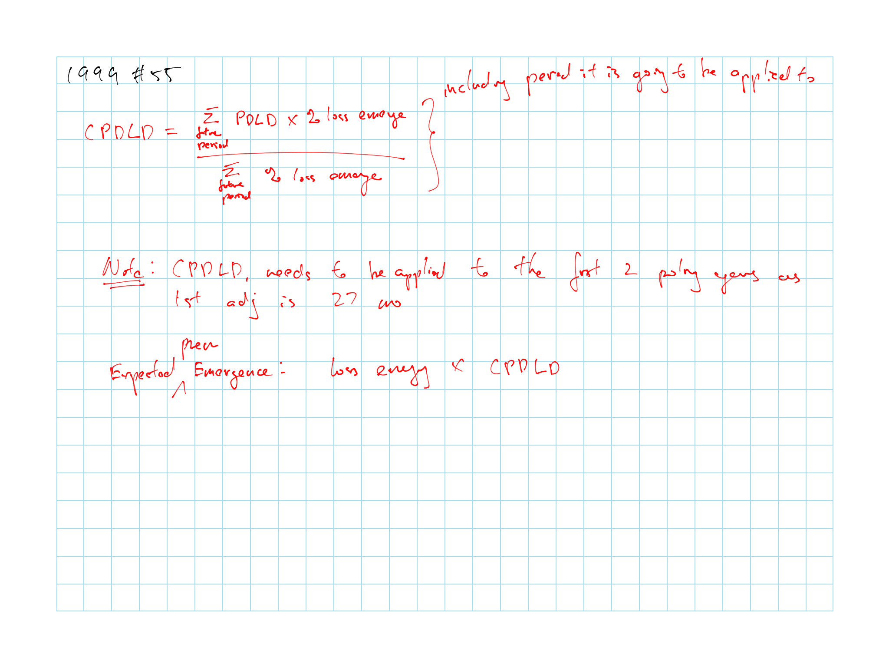
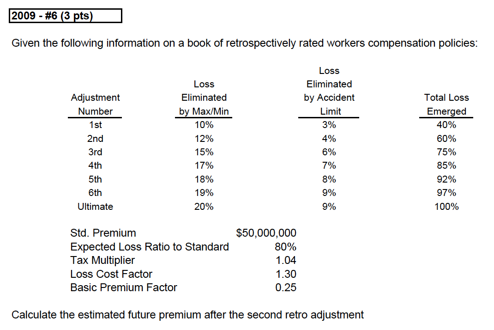
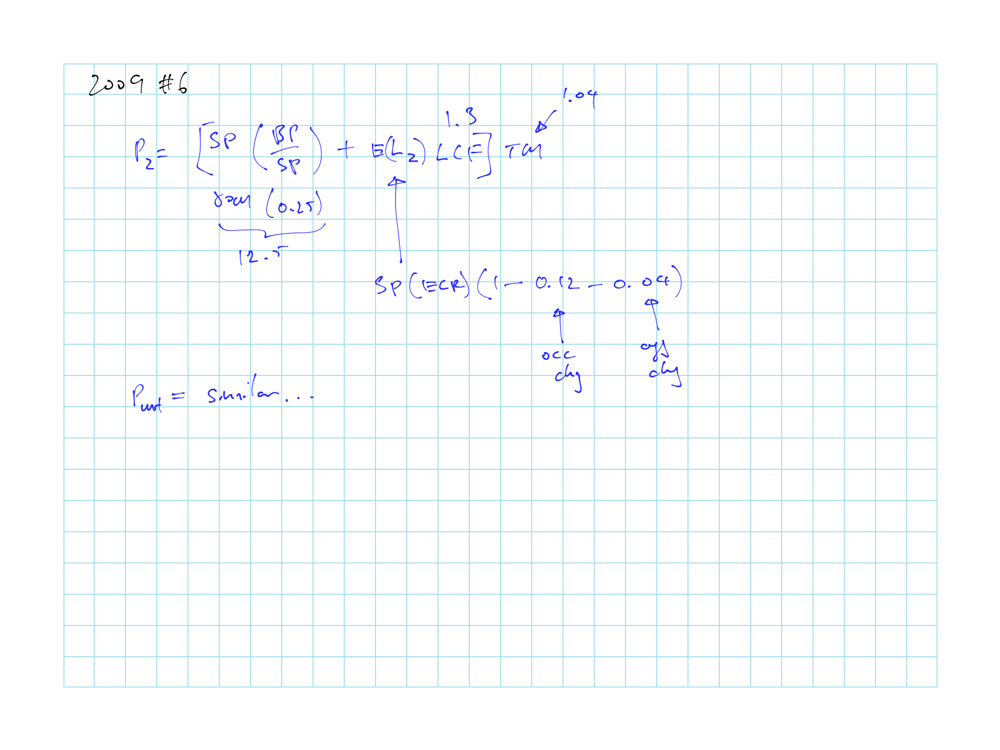
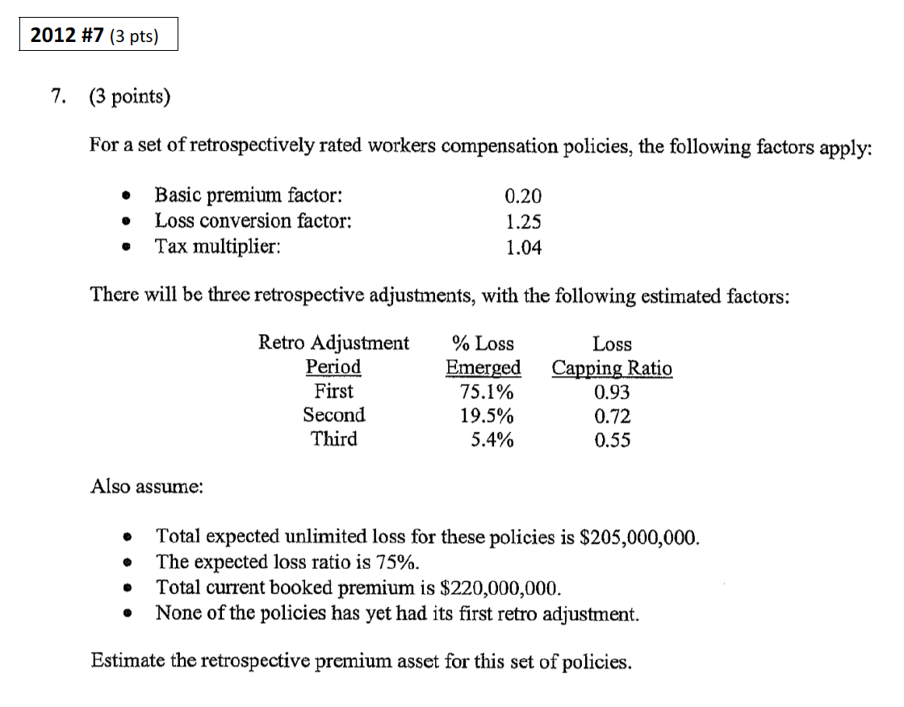
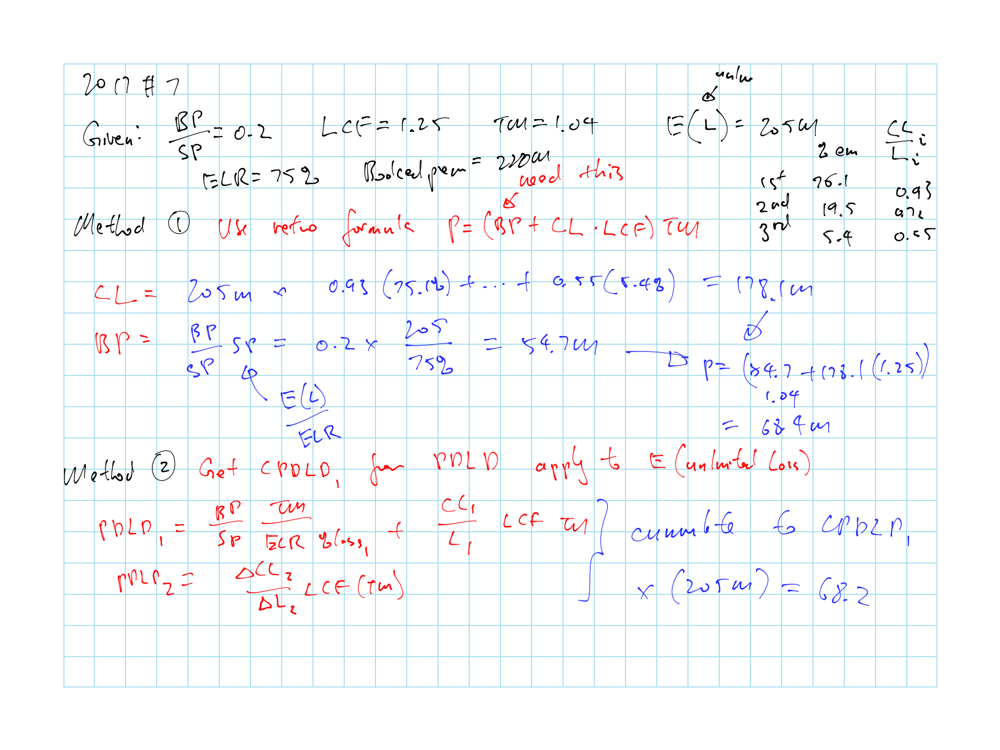
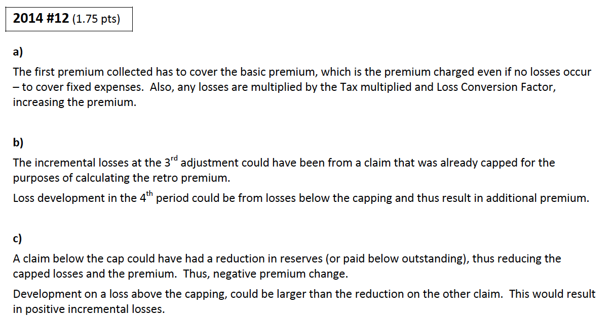

# Estimating the Premium Asset on Retrospectively Rate Policies - M. Teng and M. Perkins

Retro formula: \@ref(eq:teng-retro-formula)

Use PDLD to get the premium development based on the loss development

Know what each term means like basic premium factor or charge

Know the formula approach for PDLD \@ref(eq:pdld-1-form), \@ref(eq:premium-1-form), and \@ref(eq:pdld-n-subseq-form)

Know the empirical approach for PDLD

* Assume premium lags

* Ratio selection

* Cumulative PDLD based on a weighted average with expected % future report for each future periods

* Know the [practical application](#application-teng)

    * First adjustment period might cover more than one policy period

Know the Teng Perkins [improvements](#teng-improvements) and [assumptions](#teng-assumptions)

## Introduction

```{definition, prem-ass-teng}
**Premium Asset** (*3 definitions*)

* On retrospectively rate policies, premium that the insurer expects to collect based on the expected ultimate loss experience *less* the premium that the insurer has already booked, or

* Earned But Not Reported Premium (EBNR) ,or

* Asset supported by premium the insurer expect to collect from clients with retrospective policies as losses develops
```

```{remark}
Admitted portion of the premium asset appears on the balance sheet as the "Asset for Accrued Retrospective Premiums"
```

**Background**: Retrospective policies were popular in 1996:

* For *insured*: 

    * Returns premium to insured for good experience

    * Cashflow: Premiums are due with short lag to losses, as opposed to upfront
    
* For *insurer*:

    * Allows insurer to attracts good customers that expect to see favorable loss experience through loss control and loss management
    
    * Allows an insurance company to shift a significant portion of the risk to the insured
    
        (Uncertainty due to inflation, rate regulations, uncertainty in claims compensation, increase utilization of the insurance benefits, growing attorney involvement)
        
        
Estimating the premium asset was needed for many commercial lines insurers as this asset frequency exceeds 10% of surplus
    
### Discussion of Berry and Fitzgibbon Method

Method for calculating retro reserve [Premium deviation to date] - [Ultimate premium deviation]

```{definition, ten-ult-prem-devi}

$$\dfrac{\text{Ultimate Premium}}{\text{Standard Premium}}$$

**Ultimate Premiums Deviation**: Amount by which the ultimate premium for a retro rated policy is expected to differ from the standard premium (manual premium w/ adj for experience)

**Premium deviation to date**: Amount by which the currently booked premium differs from the standard premium
```

Fitzgibbon Method:

1. Analyze the historical relationship between the *loss ratio* and the *premium deviation* using statistical techniques

2. Apply the relationship to the projected loss ratio to calculate the projected ultimate premium deviation

3. Retro reserve = [Ultimate premium deviation] - [Premium deviation to date]

Berry Method:

1. Estimate ultimate premium with historical premium emergence pattern

2. Subtract estimated ultimate premium by current premium

**Caveat**: Lack intuitive appeal

* Methods do not consider how a retro rating formula actually works
    
* i.e. premium is a function of loss, with retro rating parameters such as the loss conversion factor, tax multiplier, retro min/max
        
$\therefore$ Premium asset should be establish as a function of reported loss and the reserve for loss development

* Where the function is defined by the retro rating parameters

## Teng Perkin Methods Overview

**Key idea**:

* *Premium asset* ~ *Current losses* + *Expected future loss emergence* + *Retro rating parameters*

* Look at how premiums develop as losses develop

    **Ratio** of *premium development* to *loss development* (PDLD ratio)
    
    * Ratio can be based on *retro rating parameters* or *historical development pattern* (which leads to the 2 methods)

The 2 methods discussed here estimate premium asset over a **whole book of business**

1. Framework based on retro rating formula (requires knowledge of rating parameters for the entire book)

2. Estimating parameters based on empirical data (historical development)

Once the relationship is established, we can apply it to the expected future loss development to get the expected future premium development

Sum of all future premium development is the premium asset

## Formula Approach for PDLD

First method, based on retro rating parameters

Formula requires details about the policies written

* Reasonable for individual policies but difficult for an entire book

### Retro Premium Formulas

\begin{equation}
P = \left[BP + \left(CL \times LCF\right)\right] \times TM
(\#eq:teng-retro-formula)
\end{equation}

* $P$: **Ultimate premium**

* $BP$: **Basic Premium**

    Covers minimum premium, commissions and expenses; premium when there are no losses

* $CL$: **Capped Losses**

    Losses are capped from premium calculation, individually and in aggregate

* $LCF$: **Loss Conversion Factor**

    Variable expense loading
    
* $TM$: **Tax Multiplier**

    For premium tax

The above ($P$, $BP$, $CL$) can be expressed in $\propto$ *Standard Premium*

* **Standard Premium** = Manual Rate $\times$ E-Mod $\times$ Sch-Mod = $\dfrac{\text{Expected Loss}}{\text{ELR}}$

#### Premium Adjustment

Polices can allow adjustments up to 6 years

* Typically 1^st^ adjustment is based on losses 18 months after inception of the policy

* Further adjustments every 12 months

Same formula \@ref(eq:teng-retro-formula) is used to calculate the **cummulative premium** due @ *each adjustment* but with the below:

* $P_n$: Cumulative premium @ n^th^ adjustment

* $CL_n$: Capped losses @ n^th^ adjustment

    (This is the loss to date with some capping on large losses)

```{remark}


* Disadvantage for the insurer since the client doesn't finish paying their premium for several years

* No loss development is baked into formula \@ref(eq:teng-retro-formula) so the premium estimate at the first several valuations are likely too low
```

### Calculating PDLD

\begin{equation}
PDLD = \dfrac{\Delta P}{\Delta L} \sim \dfrac{d P}{d L}
(\#eq:pdld-rel)
\end{equation}

* Relationship between premium development and loss development

* Apply to expected loss development to determine the expected premium development

* $L$ here is *not capped*

\begin{equation}
  PDLD_n = \dfrac{P_n - P_{n-1}}{L_n - L_{n-1}}
  (\#eq:pdld-n-form)
\end{equation}

#### Estimating First Period PDLD

First adjustment includes Basic Premium ($BP$) $\Rightarrow$ Requires different treatment from the other adjustments

```{block, type='rmdnote'}
Important formulas below
```

\begin{equation}
  PDLD_1 =\underbrace{\left(\frac{BP}{SP} \right)}_{\text{Basic Prem Factor}} \frac{TM}{ELR \cdot \%Loss_1} + \underbrace{\left( \frac{CL_1}{L_1}\right)}_{\text{Loss Capping Ratio}} \cdot LCF \cdot TM
  (\#eq:pdld-1-form)
\end{equation}

* Loss capping ratio is estimated base on the actual losses and the structure of the contract

The formula above \@ref(eq:pdld-1-form) is too responsive to actual losses in the first period, as only a portion of the formula is related to the $L_1$ as shown below

\begin{equation}
  P_1 = \underbrace{\left( \frac{BP}{SP} \right) \frac{TM}{ELR \cdot \%Loss_1}}_{\text{Not }\propto\text{ Loss}_1} \times \operatorname{E}[L_1] + \underbrace{\left( \frac{CL_1}{L_1} \right) \cdot LCF \cdot TM}_{\propto \text{ Loss}_1} \times L_1
  (\#eq:premium-1-form)
\end{equation}

* So technically only the 2^nd^ part of the formula should be applied to $L_1$ while the first part is in relation to the $\mathrm{E}[L_1]$

* Note that $SP = \dfrac{\text{Expected Loss}}{ELR}$

* Use this formula to address the issue of over responsive

```{remark}
Basic premium factor vs charge

* **Basic Premium Factor** = $\dfrac{BP}{SP}$

    Used by Teng Perkins

* **Basic Premium Charge** = $\dfrac{BP}{SP} \cdot TM$

    Used by Feldblum
```

#### Estimating Subsequent PDLD

\begin{equation}
\begin{array}{cccl}
  PDLD_n &= &\left(\dfrac{CL_n - CL_{n-1}}{L_n - L_{n-1}}\right) &\cdot \: LCF \cdot TM \:\:\:\:\text{For }n>1\\
  &= &\left(\dfrac{\Delta CL}{\Delta L}\right) &\cdot \: LCF \cdot TM\\
\end{array}
(\#eq:pdld-n-subseq-form)
\end{equation}

* $LCF$ and $TM$ are known at policy inception so we only have to estimate the loss capping ratio $\dfrac{\Delta CL}{\Delta L}$

* $LCF$ is smaller at older ages (since more large losses developed and capped)

* This equation is basically the 2^nd^ part of \@ref(eq:pdld-1-form)

## Empirical Approach for PDLD

**Advantages**: Easier to do for an entire book of business as not every client will have the same parameters (e.g. $\frac{BP}{SP}$, $LCF$, $TM$, $LCF$)

Book should be separate into homogeneous groups

* Size of account and type of rating plan

Need to assume a **lag** from the date used to value the losses and when the actual premium is collected

* Typically 3 to 9 months e.g. if the loss age is 18, we want to look at the premium at 27 if we assume a 9 months lag

* First evaluation for loss is typically at 18 months

* e.g. $PDLD_2 = \dfrac{P_2 - P_1}{L_2 - L_1} = \dfrac{^{39}P - {^{27}P}}{^{30}L - {^{18}L}}$

### PDLD Ratios Selection

Compile PDLD triangle for all effective date groupings and make a selection for each age

If you observe increasing trends in the ratios for a give age:

* More losses are within the loss capping layer, can be due to:

    * Higher agg max or lower agg min or higher per claim limits
    
    * Improvement in loss experience (fewer large losses so larger portion is within the cap)
    
* Higher basic limits (for $PDLP_1$)

PDLD can be negative if $\Delta CL$ is negative:  
Losses > max increase while claims within retro limit have a reduction in reserves

### Cumulative PDLD Ratios

Cumulative PDLD based on a weighted average with expected % future report for each future periods

$CPDLD_d = \dfrac{\sum_{i=d}^{\infty} PDLD_i \times \text{% Reported in period i}}{\sum_{i=d}^{\infty} \text{% Reported in period i}}$

### Application {#application-teng}

For each period:

1. Use losses reported to date to estimate ultimate losses

2. Subtract losses reported at prior retro adjustment date to get $\Delta L$

3. Multiply by CPDLD to get $\Delta P$

**For each quarter**

1) Determine reported losses @ prior adjustment

2) Estimate ultimate losses

3) $\Delta L$ = (2) - (1)

4) $\sum \limits_{qtr \in last \: adj \: age \: i} \Delta L_{qtr}$

**For each year**

1) Expected premium emergence = $\Delta P = CPDLD \times \Delta L_{yr}$

2) Determine premiums booked through prior adjustment

3) Estimated total premium = (1) + (2)

4) **Premium asset** = Premium booked as of current evaluation - (3)

    * Premium booked as of current eval $\neq$ premium booked through prior adjustment due to: timing of retro adjustments, minor premium adjustments, interim premium booking
    
    * Text doesn't say make adjustment though
    
For the most recent periods need to adjust for only exposure period that is being earned out

* Pro rate your ultimate losses by % earned premium

### Further Issues

If loss plan includes ALAE, you should include ALAE in the losses for this as well

$\Delta$ in mix of business will affect the sensitivity of premium to loss and thus the $PDLD$

For premium that is not secured, a provision for bad debt should be held

## Feldblum's Discussion

We do not develop premium directly because:

* Estimate of ultimate inc'd losses can be obtained sooner

* Retro premium depends on incurred loss

Both Fitzgibbon and PDLD are based on the retro rating formula (with some difference)

Both methods estimate the parameter on the data, downside:

1. Unable to look up retro parameters since this is done for the whole book of business

2. Max/min will be different for account

3. $TM$ is different across state lines

$\therefore$ Easier to do a regression using empirical data to estimate the parameters

**Fitzgibbons and Berry** 

* Also create a linear relationship of premium to losses, but they forecast ultimate premium directly, rather than premium development $\Rightarrow$ can lead to large deviations

* Premium asset $\propto$ expected unreported losses

* Does not respond if the actual premium to loss relationship is different than estimated

* Berry's solution is to give less weight to this method as the year matures and give more weight to his DR2 method

### Improvements from Teng & Perkins {#teng-improvement}

1) Slope of premium to loss changes (reduces) as the year matures

    * Large losses that pierce the claim cap tend to have their development later
    
    * No future development one aggregate max is hit

2) Forecast only future premium development

    * Projected premium asset is based on projected unreported losses, does not consider losses to date
    
    * Errors in projecting premium to date are automatically corrected for since it projects premium development and not ultimate premium
    
### Teng & Perkins Assumptions {#teng-assumptions}

* Premium responsiveness $\dfrac{\Delta P}{\Delta L}$ in a period is $\perp\!\!\!\!\perp$ of responsiveness at prior adjustments

* Premium responsiveness depends on the maturity, not the beginning loss ratio or beginning retro premium ratio

* This is superior to Fitzgibbons since it is projecting only future development

### Enhancement

$PDLD_1$ should separate the basic premium component from the component $\propto$ losses

Simple adjustment, subtract out the fixed component of $CPDLD_1$

Fixed component of $CPDLD_1$:

$$\dfrac{P_{fixed}}{\operatorname{E}[L]} = \underbrace{\dfrac{BP}{SP} \cdot TM}_{\text{Basic Prem Charge}} \Big / ELR$$
    
* Based on $P_{fixed} = BP \cdot TM$ and divided by $\mathrm{E}[L]$

We calculate $P$ as the fixed component $\times$ $\mathrm{E}[L]$ and add the variable component $\times$ $L$

This can help better understand changes in the $PDLD_1$ ratio
    
## Past Exam Questions

```{block, type='rmdcaution'}
Haven't done TIA practice questions
```

**Concepts**

* 1998 - #55: formula vs empirical, expected difference given a scenario

* 2001 - #39 b: PDLD ratio pattern

    * First adjustment the basic premium is included in the retro premium computation; Small portion of loss is limited by the retro; LCF and TM also impacts it

    * At later periods, more losses are capped by the limit

* 2003 - #9: Loss capping ratio properties <span style="color:red">Double check</span>

* 2003 - #10: Feldblum comment on Teng Perkins: premium responsiveness decreases at higher LR for a book of business

* 2007 - #36: Retro premium and reported losses relationship

* $\star$ 2014 #12 \@ref(fig:2014-12): incremental losses vs premium

* $\star$ 2015 #14 \@ref(fig:2015-14): PDLD ratio

**Calculations**

* $\star$ 1999 - #55 \@ref(fig:1999-55): Calculating CPDLD and expected future premium

    * Remember to apply $CPDLD_1$ to all policies that have not have an adjustment

* 2001 - #39 a: CPDLP

* 2002 - #14: Premium asset = Expected Future Premium + Premiums booked 
from prior adjustment - premium booked as of current

* 2004 - #7: Empirical PDLD ratio

* 2005 - #20: Premium asset calc with PDLD

* $\star$ 2006 - #23: $PDLD$ from formula and why the loss capping ratios decrease over time

* 2007 - #5: $PDLD_2$ plug and play

* 2008 - #14: premium asset

* 2009 - #6 \@ref(fig:2009-6): Premium after 2^nd^ retro adjustment

* $\star \star$ 2012 - #7 \@ref(fig:2012-7): Retrospective premium asset, good question, 2 methods to do

* $\star$ 2013 #6 a-c: PDLD 1 to 3 and relationship with loss capping ratio, ratio should decrease monotonically

    * State whether you using the loss capping ration as cumulative or incremental

* 2015 #14 a: PDLD 1 and 2 plug and play

### Question Highlights

```{r 1999-55, echo = FALSE, out.width='100%', fig.show='hold', fig.cap='1999 Question 55'}
knitr::include_graphics('questions/1999-55Q.png')

```

```{r 2009-6, echo = FALSE, out.width='100%', fig.show='hold', fig.cap='2009 Question 6'}


```

```{r 2012-7, echo = FALSE, out.width='100%', fig.show='hold', fig.cap='2012 Question 7'}


```

```{r 2014-12, echo = FALSE, out.width='100%', fig.show='hold', fig.cap='2014 Question 12'}
knitr::include_graphics('questions/2014-12Q.png')

```

```{r 2015-14, echo = FALSE, out.width='100%', fig.show='hold', fig.cap='2015 Question 14'}
knitr::include_graphics('questions/2015-14Q.png')
knitr::include_graphics('questions/2015-14A.png')
```