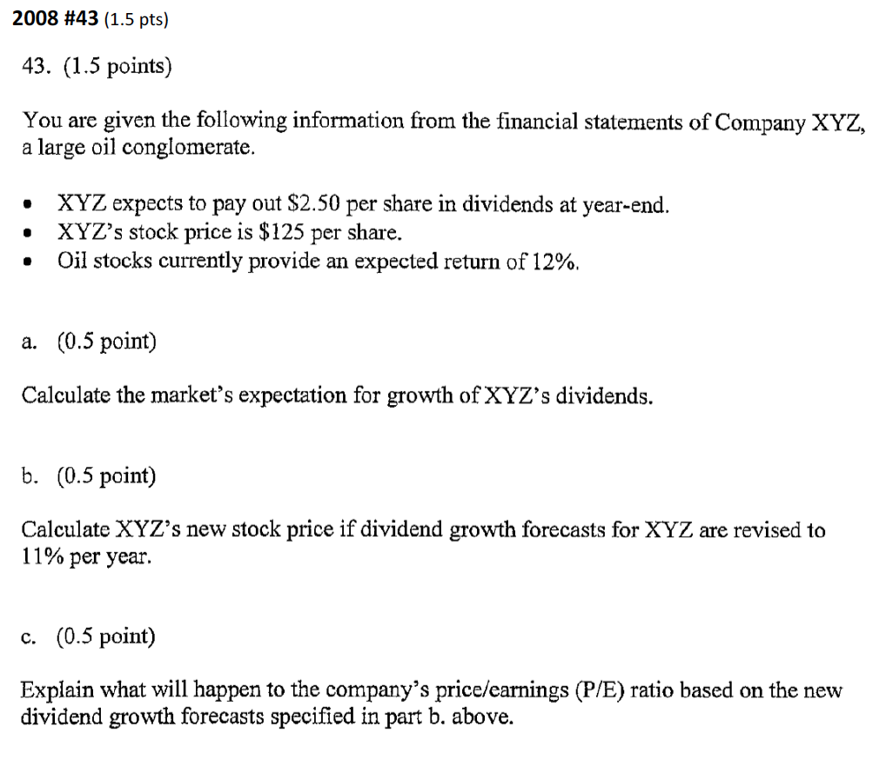
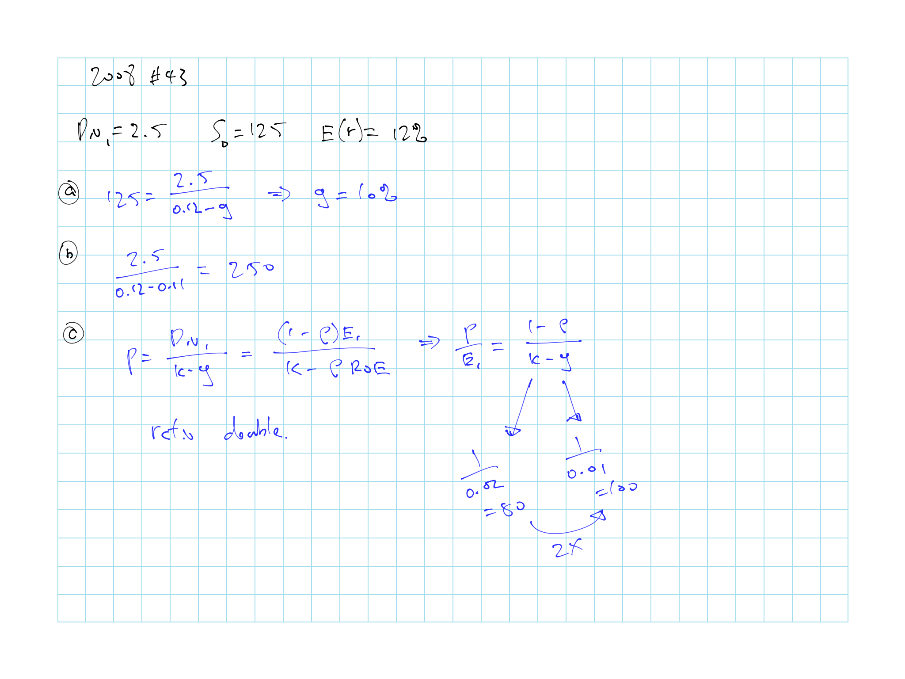
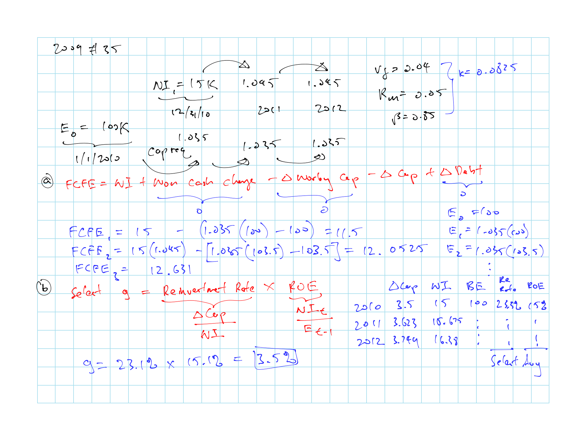
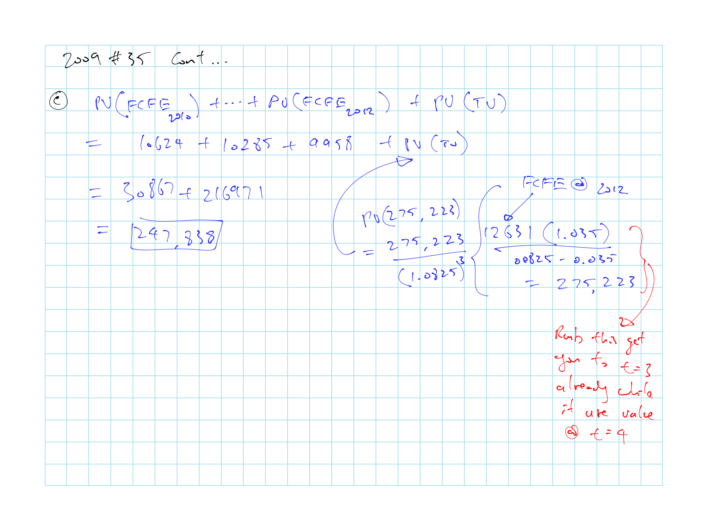
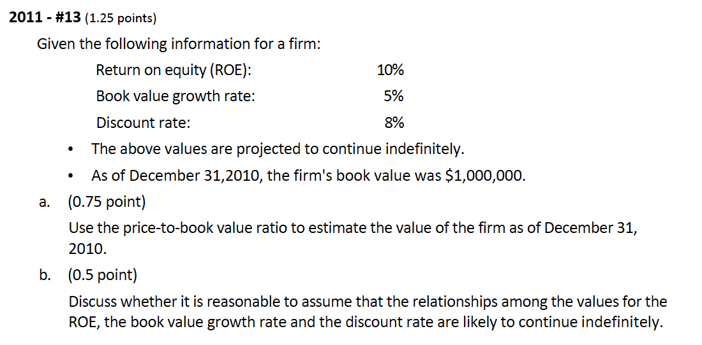
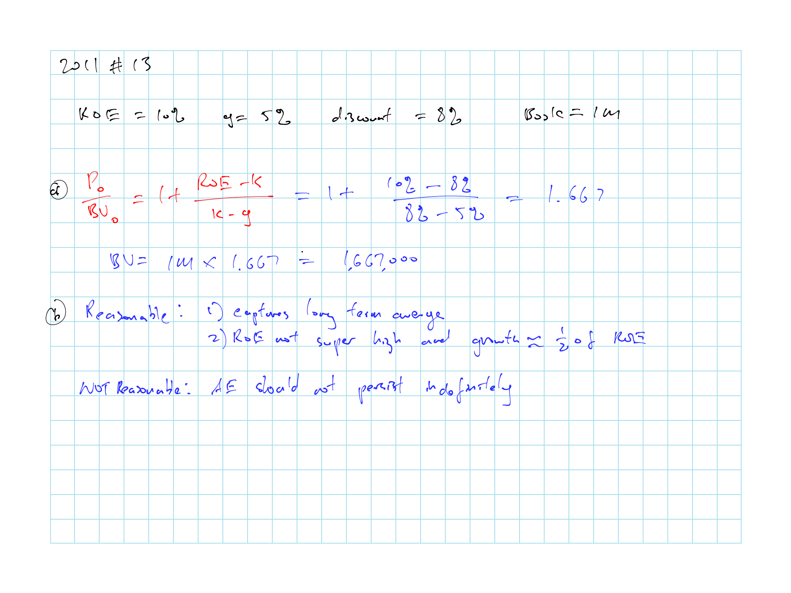
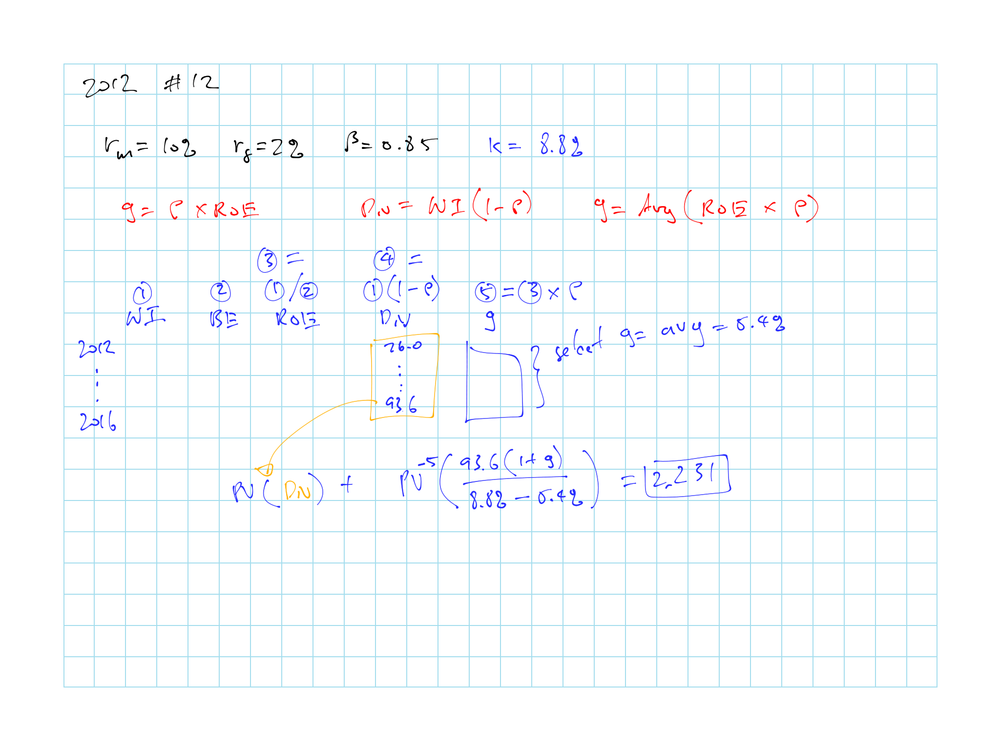

# (PART) Insurance Company Valuation {-}

# P&C Insurance Company Valuation - R. Goldfarb

Know how to get the discount rate and growth rate (table \@ref(tab:goldfard-growth-rate)) for each of the 3 method

[**DDM**](#goldfarb-ddm):

* $V_0 = \dfrac{\mathrm{E}[Div_1]}{k - g}$

* Knows how this can transform to the P:E formula

* Remembers the terminal value formula uses CF at 1 but get you to time 0

[**FCFE**](#goldfarb-fcfe):

* $FCFE = NI + (Non \:Cash\:Charges) - \Delta Working \:Capital - \Delta Capital + \Delta Debt$

* Discount all the FCFE for $V_0$
    
* Advantages

* FCFE vs FCFF

[**AE**](#goldfarb-ae):

* $\begin{align} V_0 = BV_0 + \sum_{t=1} \frac{\overbrace{(ROE_t - k)BV_{t-1}}^{AE_t}}{(1+k)^t}\end{align}$

* Remember to add the $BV_0$

* Advantages

* Considerations

[**Relative multiples**](#goldfarb-relative):

* $\dfrac{P_0}{E_1} = \dfrac{1 - \rho}{k - \rho \times ROE}$; Based on DDM

* $\dfrac{P_0}{BV_0} = 1 + \dfrac{ROE - k}{k - g}$; Based on AE

## Assumptions

Key assumptions are **cost of captial** $k$ and **growth rate** $g$

It is good to sensitivity test these assumptions on the model output

### Risk Adjusted Discount Rate

Recognize the risky cashflow by discounting them at a rate higher than the risk-free rate based on CAPM

\begin{equation}
  k = r_f + \beta \left [ \mathrm{E}(r_m) - r_f \right ]
  (\#eq:goldfarb-capm)
\end{equation}

* Risk of an investment depends on the rest of an investor's portfolio. We focus instead on *equilibrium* rates of return

* Different BU has different risk profile $\Rightarrow$ Different discount rates

* Discount rates can vary by period if business mix change

* Cash flow can have the different risk profile (premium, investment income, paid losses)

* Simplification is to use average discount rate for the portfolio

*Alternative way* to account for the risky cash flow is to convert the cash flow to *certainty equivalent cash flows* and discount with risk free instead of the cost of capital

* Reflect the risk in the cashflow directly

**Risk free Rate: $r_f$**

* 90 days t-bill

* Maturity matched t-notes

* 20 years T-bonds less liquidity & term premium (~1.2%)

**Market Risk Premium: $\mathrm{E}(r_m) - r_f$**

* 6-8% historically

* $r_f$ here should be consistent with the one use for CAPM

* Arithmetic average should be used when forecasting over 1 year (geometric average when forecasting over multiple years)

* Need to sensitivity test

**Systematic Market Risk: $\beta$**

* Based on regression on stock return vs market return

* Using industry $\beta$

    * Mix of business needs to be similar to industry
    
    * Industry $\beta$ should be adjusted for differences in the industry leverage and company leverage

* $\beta$ will be higher for firms with more leverage, riskier business units

    * Alternative is to use *all equity* $\beta$ to remove bias from leverage
    
    * Higher growth should have higher $\beta$

* Insurance company has additional leverage from policyholder liabilities

* Can assume total leverage of insurance companies is similar

### Growth Rate

Used for the period after the forecast horizon

Table: (\#tab:goldfard-growth-rate) Growth rate for each method

| Method | Growth Rate: $g$  |
|:------:|:-----------------:|
| DDM    | $ROE \times \rho$ |
| FCFE   | $ROE \:\: \times$ [Reinvestment Rate] |
| AE     | At most the growth in book value |

**Return on Equity: $ROE$**

$\dfrac{NI}{BE} = \dfrac{\text{Net Income after Tax}}{\text{Beginning Equity}}$

**Plowback Ratio: $\rho$**

% of $NI$ that is reinvested in the firm (e.g. dividend payout ratio)

* Company that have high growth should retain more earnings

**Reinvestment Rate**:

$\dfrac{\Delta Capital}{NI}$

## Dividend Discount Model (DDM) {#goldfarb-ddm}

Value of stock under DDM

\begin{equation}
  V_0 = \dfrac{\mathrm{E}[Div_1]}{k - g}
  (\#eq:goldfarb-ddm-eq)
\end{equation}

* $Div_1$ is paid at the end of year 1

* Constant growth assumption where $\mathrm{E}[Div_i] = \mathrm{E}[Div_0] \cdot (1+g)^i$

* $\mathrm{E}[Div_1] = (1 - \rho) NI$

```{remark}


* Typically forecast a few years and use the above formula for the terminal value

* Need to use $NI$ after tax

* When calculating $g$, calculate $ROE$ and $g$ for all years and make selection

* Firm with high expected growth tend to be riskier $\Rightarrow$ Higher discount rate

    * Forecast is more susceptible to being wrong, so should be discount more?
```

***DDM Assumptions***

* Expected dividends (however they are discretionary)

* Dividend growth rate (from table \@ref(tab:goldfard-growth-rate))

* Risk-adjusted discount rate (From CAPM)

## Free Cash Flow to Equity (FCFE) {#goldfarb-fcfe}

Discount the stream of free cash flow available to pay shareholders:  

\begin{equation}
  FCFE = NI + (Non \:Cash\:Charges) - \Delta Working \:Capital - \Delta Capital + \Delta Debt
  (\#eq:goldfarb-fcfe-eq)
\end{equation}

* FCFE is free cash flow after: paying interest on debt, tax benefits of that interest payment, net borrowings

* $\Delta$ loss reserve reflected in $NI$ only; it gets net out as non-cash charges and capital expenditures

* $\Delta$ Working Capital is negligible for P&C insurer

* $NI$ is net of interest payments to shareholders, after tax

* Growth rate from table \@ref(tab:goldfard-growth-rate), $g = ROE \times \dfrac{\text{Net Income after Tax}}{\text{Beginning Equity}}$

    * Assume portion of FCF not paid out is invested at $k$
    
    * Similar to DDM, calculate the $ROE$ and reinvestment rate for all years and make a pick

**Free Cash Flow**

* Cash flow available to pay out to the firm's source of capital (for FCFE this is only to equity) net of amounts required to be reinvested to the firm for growth

* *Weakness*: require forecasting financial statements, use adjusted accounting measure, large terminal value

**FCFE vs FCFF**

* We don't use the free cash flow to **firm** because there's additional leverage for p/h liabilities from reserves held

* Not clear how to calculate cost of capital due to leverage from 2 different source and it complicates the calculation

* Using FCFE removes the source of leverage

**Discount rate**

* FCFE pays out all free cash flow while DDM only pays out a portion (rest in marketable securities)

* DDM has a larger portion of its risk profile from investment in securities and FCFE has a larger portion from u/w risk

* Should use different discount rate

* But difference is difficult to quantify $\Rightarrow$ Use the same discount rate

**Advantages over DDM**

* Dividend are discretionary

* Firms also return funds via stock buybacks

* Focus on free cash flow

## Abnormal Earnings (AE) {#goldfarb-ae}

Works with **accounting measures** of income

* Need to remove distortions

* Some same it is more accurate

**Clean surplus assumption**

* Requires all changes to book value (on the b/s) flow through the I/S (as earnings, dividends, or capital contributions/reductions)

* Can't have direct changes to equity

Value of Equity

\begin{equation}
  V_0 = BV_0 + \sum_{t=1} \dfrac{AE_t}{(1+k)^t}
  (\#eq:goldfarb-ae-eq)
\end{equation}

**Abnormal Earning** @ $t$

\begin{equation}
  AE_t = NI_t - k \cdot BV_{t-1} = (ROE_t - k)BV_{t-1}
  (\#eq:goldfarb-ae-eq-2)
\end{equation}

* Earnings (net income) XS of cost of capital

* Assume AE will trend to zero overtime since it's difficult to maintain

* AE is difficult to maintain as competitors will see the AE and move into the market

**Parameters Considerations**

```{remark}
$BV_0$

* Reported book value

* Focus on **tangible book value** (e.g. take out goodwill)

* Remove any systematic bias such as over or understated reserve
```

```{remark}
$NI$ is **net of interest payments** to shareholders, **after tax**; Same as DCF model

* Make complement of the book value adjustments here  
e.g. any direct adjustment to the B/S that doesn't flow from the I/S you have to adjust here

* If reserve is discounted in the $BV_0$, need to change (lower) the $ROE$ as the income will be generated from a larger capital base
```

```{remark}
$g$

* Should be negative as AE tend to 0

* Does not require additional capital as the growth from that extra capital will not accrue to today's shareholders
```

```{remark}
$k$

* CAPM as before
```

**Advantages**

* Focus on value creation

    * Earnings above the required return on capital
    
    * Dividends and CF are just consequence of value creation

* Small terminal value as it focus on any added value so less leverage

* Directly using accounting measures so does not need to adjust into a cash flow measure

## Relative Multiples {#goldfarb-relative}

We don't compare to sales (use equity) because of leverage from p/h's liability

Stock price can fluctuate so use an average price

Multiples can vary significantly even over short periods of time

**Assumptions**

Constant $ROE$, $\rho$, and $k$

### Price to Earnings

\begin{equation}
  \dfrac{P_0}{E_1} = \dfrac{1 - \rho}{k - \underbrace{\rho \times ROE}_{g}}
  (\#eq:goldfarb-PE)
\end{equation}

* If $ROE > k$ $\Rightarrow$ Keep a high $\rho$

```{proof}
Formula above is based on the DDM

Start with \@ref(eq:goldfarb-ddm-eq) and $\mathrm{E}[Div_1] = E_1 (1-\rho)$

$g = \rho \times ROE$

If the shares are priced fairly then $P_0 = V_0$

Plug all the above in and we'll have \@ref(eq:goldfarb-PE)
```

```{remark}
P:E Ratio

* Forward or leading P/E = consensus forecast earnings for next year

* Trailing P/E = last year's actual; Can be distorted by unusual events

* Price = value of the firm derived from any of the methods

* Earnings = $NI$; Either forward or trailing

* By default, apply the ratio to next year's earnings per formula
```

Alternative use of P:E

* **Validating assumptions**: reasonability check on the forecast

* **Shortcut to valuation**: if you think company will grow similar to the industry

* **Terminal value**: use the other method for the forecast horizon then P/E for the terminal value

### Price to Book

\begin{equation}
  \dfrac{P_0}{BV_0} = 1 + \dfrac{ROE - k}{k - g}
  (\#eq:goldfarb-PB)
\end{equation}

* $BV_0 =$ equity @ t = 0

* Useful for firms with substantial holdings in marketable securities

```{proof}
Above formula is based on AE method

Start with \@ref(eq:goldfarb-ae-eq) and \@ref(eq:goldfarb-ae-eq-2)

Assume book value grow at constant rate $g$ and the $ROE$ is constant and we have:

$BV_t = BV_0(1+g)^t$

Plug in to the formulas and using the geometric series
```

### Transaction Multiples

We can use multiples from transaction, however:

* Companies tend to overpay

    * Control premium, and other reason M&A overpay

* IPO's are under priced

* Financials used to value the transaction could be different from the information being used now (forecast is different)

* Economic conditions @ transaction $\neq$ economic conditions now

### Relative Valuation for Multi-line firms

Use multiples from pure play peers (monoline firms) to estimate by division

Or compare multiples from diversified insurers

* Choose firms with similar business, $ROE$, claims paying rating, $\beta$

## Option Pricing Models

2 different ways to value insurance company using options

1. **Equity** of the firm as a call option

2. Valuation of **real options**

    (Additonal source of value the firm has from its ability to engage or disengage in various projects)
    
### Equity as Call Option

**Merton's method**:  
Owners of the firm have given assets of the firm to the debt holders, but maintain the right to purchase them at price $D$ when the debt is due at time $T$

* At $T$, if the value of the firm $V_T > D$ then the owners will pay back the debt

* If $V_T < D$, the option will not be exercised and firm goes bankrupt

$$E_T = \max[V_T - D, 0]$$

```{remark}


* Call option with strike price $D$ and "stock" price $V_T$

* Price with Black-Scholes

* Assume debt to have one expiration date $T$

* We need the volatility of the value of **all** assets of the firm
```

***Application to P&C Insurers***

* Mostly theoretical

* Moody's KMV credit default model is based on this to estimate probabilities of default for publicly traded companies

* Difficult to apply to P&C companies due to the additional complexity of having policyholder liabilities that look just like debt to the shareholders

    * And with policyholder liabilities it is hard to reduce it into a debt with single expiration date
    
### Real Options Valuation

```{block, type='rmdcaution'}
Not super sure how the 'value' of each of the options work
```

```{definition, name="Real Options"}
Management of a company has flexibility on when to take action on projects

Real options examples:

* Abandonment

    (e.g. Abandoning a project so you cut off the future cash outflow)
    
    * Value as an American put option (You have the right to sell at a predetermined price anytime up to the expiration date)

    * $K$ = liquidation proceeds

* Expansion

    (e.g. similar to the abandonment but with investing)
    
    * Value as an American call option
    
    * $K$ = additional investment

* Contraction

    (Not total abandonment)
    
    * Value as American put
    
    * Value is the gross value of the lost capacity
    
    * $K$ = cost savings (reduced investment)

* Defer

    * Value as an American call (since it's still an investment project\)

* Extend

    * Value as European call since it would only be exercised at the end of the project
    
    * Extend the life of the project by paying a fixed amount

Value is added when the firm can purchase assets below their fair value or has exclusive access to opportunities

* e.g. flexibility to purchase assets at market price **doesn't** add value
```

**Practical Considerations**, difficulty in:

* Identifying a new business where such a real option with value exists

* Assess the current value of these business

* Determine if the firm has the ability to enter this business at a fixed price, or a price that significantly differs from market value

**Valuation considerations**, technical issues to consider:

* Valuing the underlying cash flow

* Time to maturity

* Exercise type (American vs European)

* Appropriate valuation formula (e.g. Black-Scholes assumes lognormal distribution for asset price)

**Reasonableness of real option values**

* Options are more valuable when new information will be available before the expiration

* Expansion options are only valuable if they have some exclusive right

* Exercise price must be fixed for the option to have value

## Past Exam Questions

```{block, type='rmdcaution'}
Haven't done TIA practice questions
```

**Concepts**

* $\star$ 2011 - #12 a: higher $g$ should be matched with higher $\beta$ for being more risky
* 2011 - #12 c: relationship between $g$ and $k$
* 2015 #17 b-c: $\beta$ discussion

**DDM**

* [2008 #43](#2008-43): DDM calc and convert to P:E
* $\star$ 2008 #44: DDM calc and interpretation
* 2008 #45: Comparison on P:E
* 2009 #34
* 2011 - #12 b: DDM calc (Get $r_f$ as t-bond less liquidity premium)
* $\star$ [2012 #12](#2012-12): Full calc with DDM
* 2014 #16: DDM calc
* 2015 #17 a: DDM calc 

**FCFE**

* $\star$ [2009 #35](#2009-35): Full FCFE calc
* $\star$ [2013 #11](#2013-11): Full FCFE calc with discussion
    * [FCFE vs FCFF](#FCFE-v-FCFF)
* 2014 #17: FCFE Calc; <span style="color:red">Not sure bout the reserve increase impact on required capital</span>
* $\star$ 2015 #16: Discussion on DCF

**AE**

* $\star$ [2010 #31](#2010-31): Full AE calc
* [2011 - #13](#2011-13): Price to Book value calc + discussion on assumption
* 2013 #12: Full AE Calc + discussion
* 2015 #15: AE Calc + discussion

**Relative Valuation**

* $\star$ 2014 #15: Price to Book calc using all the ratios given by LoB

### Question Highlights

```{r 2008-43, echo = FALSE, out.width='100%', fig.show='hold', fig.cap='2008 Question 43'}


```

```{r 2009-35, echo = FALSE, out.width='100%', fig.show='hold', fig.cap='2009 Question 35'}
knitr::include_graphics('questions/2009-35Q.png')


```

```{r 2010-31, echo = FALSE, out.width='100%', fig.show='hold', fig.cap='2010 Question 31'}
knitr::include_graphics('questions/2010-31Q.png')
knitr::include_graphics('questions/2010-31A.png')
```

```{r 2011-13, echo = FALSE, out.width='100%', fig.show='hold', fig.cap='2011 Question 13'}


```

```{r 2012-12, echo = FALSE, out.width='100%', fig.show='hold', fig.cap='2012 Question 12'}
knitr::include_graphics('questions/2012-12Q.png')

```

```{r 2013-11, echo = FALSE, out.width='100%', fig.show='hold', fig.cap='2013 Question 11'}
knitr::include_graphics('questions/2013-11Q.png')
knitr::include_graphics('questions/2013-11A.png')
```