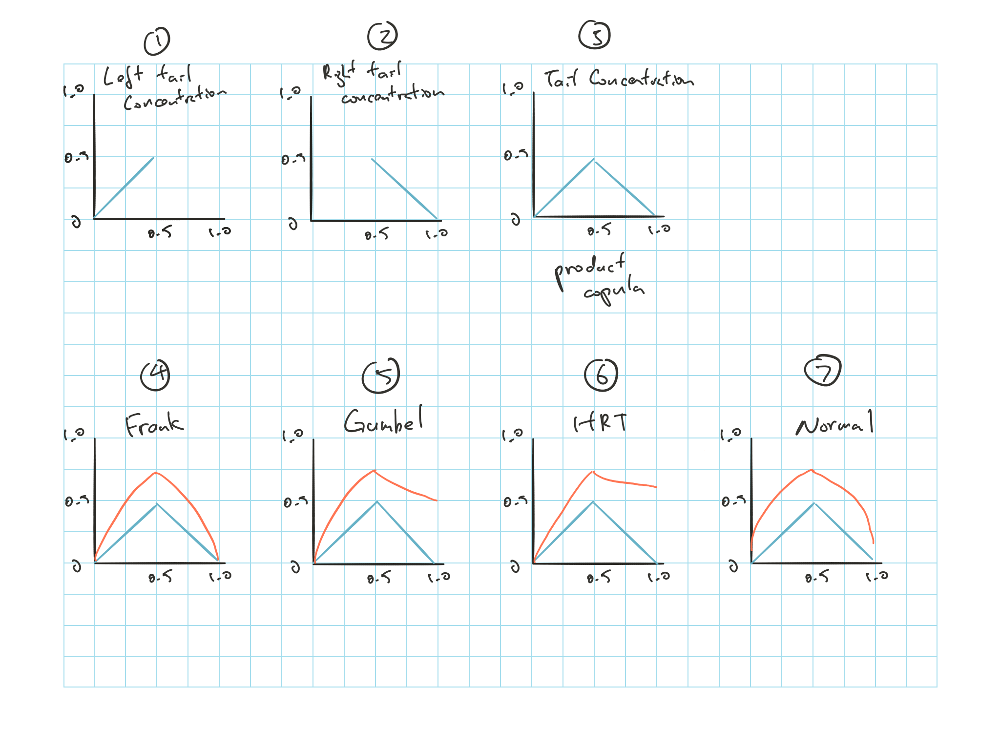

# ERA 3.3 Modeling and Dependency: Correlations and Copulas - G. Venter

**Correlation**

[Pearson's](#pearson) correlation: Formula and its properties

* Outliers will have disproportionate weight

[Kendall's](#kendall) $\tau$: depends on the rank

* Know the formula for discrete and continuous

**Copulas**

Know the limitation of joint distribution and [advantages](#copula-advantages) for using copulas

Different joint distribution plots

* Best method is to plot the percentile from each marginal distribution; each box should have the same number of points if independent

How to use a copula and [Sklar's Theorem](#sklar)

Joint density function express with copula: $h(x,y) = \underbrace{c \left( F(x), G(y) \right)}_{\text{Density of copula}} \cdot \underbrace{\left[f(x) \cdot g(y) \right]}_{\text{Joint dist if }\perp\!\!\!\perp}$

| Copula | Shape | Dependency | $\tau$ |
| ------ | ------ | ------ | ------ |
| Frank's | Symmetric | Light tails | Complicated has an integral |
| Gumbel | Asymmetric | More weight in the right. Higher tail than Frank | $1 - \dfrac{1}{a}$ |
| HRT | Asymmetric | Less tail on the left but high on the right | $\dfrac{1}{2a + 1}$ |
| Normal | Symmetric | Higher tail than Frank | $\dfrac{2\operatorname{arcsin}(a)}{\pi}$ |

* There's also the partial perfect correlation copula

Know how the simulation is done for each of the copula

* [Frank](#sim-1), [Gumble](#sim-2), HRT is same as Frank, and [Normal](#sim-3)

**Tail Concentration Functions**

[Left tail](#left-tail) and [right tail](#right-tail) concentration function

* Know what each copulat looks like

**Methods for selecting Copulas**

* Plot the percentile plot
* Empirical tail concentration function

**Multivariate Copulas**

Normal and t-copula and their properties

**Fitting copulas to data**

Using the $J(z)$ and $\chi(z)$

Graph the possible $J(z)$ with empirical $J(z)$ to see which fits best; Similarly for $\chi(z)$

## Introduction {#era3-3-intro}

We need loss distribution for the whole group

1) Create distribution for each LoB or Company
2) Combine them into one distribution that reflects all the inter dependencies between BUs

Go through 4 copulas that are useful in practice and how to select them for a given dataset

## Pearson's Correlation

$\rho = \dfrac{\sum_i \tilde{y}_i \tilde{z}_i}{\sqrt{\sum_i \tilde{y}_i^2 \sum_i \tilde{z}_i^2}} = \dfrac{\operatorname{E}[YZ] - \operatorname{E}[Y] \cdot \operatorname{E}[Z]}{\sigma_{y} \cdot \sigma_{z}}$

* $\tilde{y}_i = (y_i - \bar{y})$

* $\sigma_y^2 = \operatorname{E}[Y^2] - \operatorname{E}[Y]^2$

Only appropriate for dist^n^ *symmetric* and have *thin tail*

Value far from the mean will have a disproportionate weight as it focus on the *amount* of each $\tilde{y}_i$ and $\tilde{z}_i$

Properties:

* Pearson correlation will stays the same under positive linear transformation on $Y$ or $Z$

* Monotone function that is not linear might change the Pearson correlation

## Kendall's Tau

Depends on the *order* not the *value* of the data

**Concordant**:  
When one pair dominates the other given $(x_1, y_1)$ and $(x_2, y_2)$

* $x_1 > x_2$ and $y_1 > y_2$ or,
* $x_2 > x_1$ and $y_2 > y_1$

**Discordant**:  
when the pair is mixed

$\tau = \dfrac{C - D}{\text{# of pairs}}$

* $\tau = \dfrac{C - D}{C + D}$ if there are no ties

* $\tau \in [-1, 1]$ with same interpretation as Pearson's

Focus on the rank $\Rightarrow$ changes in one extreme value won't change the indication

**Continuous**

$\tau = 4 \operatorname{E}[C(u,v)] - 1$

$\tau = -1 + 4 \int_0^1 \int_0^1 C(u,v)c(u,v)dudv$

***

Def^n^

* Correlation = mathematical calculation, a statistic, and measure of dependency

* Dependency = interaction between random variables (boarder term)

* e.g. correlation can be 0 while there are still dependency

## Motivations for Using Copulas

There are only a few joint distributions that are tractable to work with (normal, lognormal, exponential, etc)

* We can't do weibull, Pareto or gamma
* We can't mix distributions like joining normal with exponential

Modeling all business together is not feasible due to inconsistent of mix of business over time

***

**Joint Distribution Plots**

3 ways to look at them to try and see if there are dependencies

1) Straight plotting on (x,y)
  
    * Draw lines at 25%, 50% and 75% and segment the plot into 16
    
    * If the 2 marginal distributions are independent $\Rightarrow$ there should be about $\frac{1}{16}$ of the points in each rectangles
    
    * This is useful to show us actual values, but
    
    * Might be difficult to see points in some of the rectangles
    
2) Plot on log log scale (ln(x), ln(y))

    * This alleviate the issue above and shows a clearer picture of the dependencies
    
3) Plot the percentile from each marginal dist^n^

    * This gives us a clean picture as all the rectangles are the same size since the axis are now the percentile
    
 Advantages of using copula to describe dependency with percentiles

* It is independent of the underlying distributions

* Can update the marginal dist^n^ without changing the dependency structure

* Can joint dist^n^ that is not the same

## How to Use a Copula

We can fully describe the joint distribution with:  
$H(x,y) = P(X \leq x \: \& \: Y \leq y)$

* If we know this then we know the entire dist^n^

Marginal dist^n^:

* $F(x) = \lim \limits_{y \rightarrow \infty} H(x,y)$

* $G(y) = \lim \limits_{x \rightarrow \infty} H(x,y)$

Density:

* $h(x,y) = \dfrac{\partial^2 H(x,y)}{\partial x \partial y}$

* Describes where the probability lies

* A bit more intuitive to looks at rather than the CDF

It is easier to work with percentiles, so instead of using $x$ & $y$, we'll use the percentiles $u$ & $v$ and we'll compare them to the percentile of the r.v.

***

 **Sklar's Theorem**

* For any joint dist^n^ $H(x,y)$ $\exists$ a function $C(u,v)$ such that $H(x,y) = C(F(x), G(y))$

* $C(u,v)$ is a copula

    * Input is 2 percentiles and output is the joint percentile
    
***

**Density of a Copula**

Graphs of actual copula is difficult to interpret, so focus on the density

$c(u,v) = \dfrac{\partial^2 C(u,v)}{\partial u \partial v}$

Relate the density of the copula to the density of the joint dist^n^

$h(x,y) = \underbrace{c \left( F(x), G(y) \right)}_{\text{Density of copula}} \cdot \underbrace{\left[f(x) \cdot g(y) \right]}_{\text{Joint dist if }\perp\!\!\!\perp}$

* Think of the $c(u,v)$ as a multiplier

* Scales up and down the independent distribution

    * $c(u,v) > 1$ $\Rightarrow$ Higher density
    
    * $c(u,v) = 1$ $\Rightarrow$ Independence
    
    * $c(u,v) < 1$ $\Rightarrow$ Lower density
    
***

Different copulas have different behavior w.r.t. where the dependencies are located

We'll use Kendall's $\tau$ to measure correlation as it won't be affected by the underlying distribution

Note, don't have to memorize the formulas

## Summary of Copulas

| Copula | Shape | Dependency | $\tau$ |
| ------ | ------ | ------ | ------ |
| Frank's | Symmetric | Light tails | Complicated has an integral |
| Gumbel | Asymmetric | More weight in the right. Higher tail than Frank | $1 - \dfrac{1}{a}$ |
| HRT | Asymmetric | Less tail on the left but high on the right | $\dfrac{1}{2a + 1}$ |
| Normal | Symmetric | Higher tail than Frank | $\dfrac{2\operatorname{arcsin}(a)}{\pi}$ |

### Frank's Copula

Small tail dependencies compared to Gumbel and HRT

Density of the copula is the 2^nd^ derivative w.r.t. both $u$ and $v$

$\tau$ for Frank is not closed form

Conditional probability of $y$ is the derivative of the copula w.r.t. $u$

 **Simulation**

Need the conditional distribution $P(Y \leq y \mid X = x)$

Given $tau$ we can solve for $a$ which is used in the conditional formula

1) Simulate 2 r.v.: $u,p \sim U[0,1]$

2) Use $u$ to determine $x$ and use $p$ to find $y \mid x$

    * $x = F^{-1}(u)$

3) $p = P(Y \leq y \mid X = x) = C_1(u,v)$ and solve for $v$

    * We know the formula for $p$ and can do some algebra to get $v$
    
4) Use the $(u,v)$ we get from above and then find the values in the 2 dist^n^ associated with the percentiles

### Gumbel Copula

$\tau$  has a simple form $= 1 - \frac{1}{a}$

$v$ can't be solve from $p=C_1(u,v)$ $\Rightarrow$ Need to simulate to some other ways

 **Simulation**

1) Simulate 2 r.v.: $p,r \sim U[0,1]$

2) Numerically solve for $s$ that satisfies $s \operatorname{ln}(s) = a(s-p)$ where $0<s<1$

3) Use $s$ we can get $(u,v) = \left( \operatorname{exp}\left[ \operatorname{ln}(s)r^{\frac{1}{a}} \right], \operatorname{exp}\left[ \operatorname{ln}(1-r)r^{\frac{1}{a}} \right] \right)$

### Heavy Right Tail Copula

Less correlation in the left tail but high in the right tail

$\tau(a) = \dfrac{1}{2a + 1}$

We can solve $v$ from $p=C_1(u,v)$ so we can simulate it same way as Frank's

**Joint Burr Distribution**

Joint dist^n^ where marginal dist^n^ are Burr and the conditionals are also Burr

Join the 2 marginal Burr using the HRT

Also need the 2 marginal dist^n^ to have the same $a$ parameter as the HRT

Analogous to the joint normal, in that the marginal and conditional dist^n^ are the same

$a$ is to control correlation

$p$ & $q$ is used to fit the tail

$b$ & $d$ are used to set the scales of the dist^n^

### Normal Copula

Joins 2 dist^n^ using correlations from the bi variate normal

More tail dependencies than Frank and symmetrical

The copula take $u$ and $v$ from any dist^n^ and converts them to standard normal variables and calculates the probability under the join normal dist^n^ with parameter $a$

(See a whole lot from full manual)

Normal copula is simple to simulate from and also easy to generalizes to multiple dimensions

 **Simulation**

Solve for $a$ with the $\tau$

1) Simulate 2 r.v. $u$ and $r$

2) Get the standard normal value of the 2 percentiles

3) Join the 2 normal value from 2 to get $z = ax + y \sqrt{1 - a^2}$

4) Convert $z$ to a percentile with the normal function to get $v$

### Partial Perfect Correlation Copula

Krep's Partial Perfect Correlation Copula

Sort of artificial, more useful for simulating evens then for description of actual outcomes

Generates dependencies by sometimes simulating $u$ & $v$ where they are independent and sometimes 100% dependent by setting $v=u$

* Level of dependency is controlled by $q(u,p): [0,1]^2 \rightarrow [0,1]$

* $q(u,p)$ needs to be symmetric

**Definition**

Simulate PPC by drawing $u$, $p$ & $w$ from $U[0,1]$

$v =  
  \begin{cases}
    p &:q(u,p) < w & Independent \\
    u &:q(u,p) \geq w & Dependent \\
  \end{cases}$

**Partial Perfect Power**

$h(u,p) = q(u,p) = (up)^a$

More concentrate at the top right, since if either $u$ or $v$ is large then the other will likely be at the same percentile $\Rightarrow$ perfectly correlated

## Tail Concentration Functions

Measure how much probability is concentrated in the tails

 **Left Tail Concentration Function**

$L(z) = P(U < z \mid V < z) = P(V < z \mid U < z)$

* What is the probability that $U$ is small given that $V$ is small

* Works both ways can do $L(z) = P(V < z \mid U < z)$ as well

$L(z) = \dfrac{C(z,z)}{z}$

Independent copula: $L(z) = z$

* Graph this to 0.5 because all copulas have $L(1) = 1$

* See Graph (1)

 **Right Tail Concentration Function**

$R(z) = P(U > z \mid V > z) = P(V > z \mid U > z)$

* What is the probability that one variable is large given that the other variable is large

$R(z) - \dfrac{1 - 2z + C(z,z)}{1-z}$

Independent copula: $R(z) = 1 - z$

* Graph this from 0.5 to 1.0 because all copulas has $R(0) = 0$

* See Graph (2)

***

Combine the 2 above we have the tail concentration graph or the LR graph

* See Graph (3)

The independent copula = product copula

* Graph (4) it approaches 0 on the left and right

* Graph (5) asymmetric, right limit is not 0

* Graph (6) asymmetric, right limit is not 0, and higher than Gumbel. Has the thinnest left tail

* Graph (7) it approaches 0 on the left and right but slower, simply because we couldn't calculate the tail so deep

As the $\tau$ gets higher, we can start the see the difference between them

## How to Select Copula Given Dataset

Plot the percentile plot to diagnose

Calculate the empirical tail concentration function (LR function) and you can see how each copula fit best

Figure 3.3.5 and 3.3.6 is not very good as it mix the underlying dist^n^ with the copula

**Multivariate Copulas**

Many options of copulas for 2 variables but not multivariate

Normal and t-copula are the only well known ones

Parameters are the full correlation matrix

Normal copula has no correlation deep in the tail

* The right tail concentration is very small, and approaches 0 at the limit

* Just to be clear, the density deep in the tail (z > 0.999) you get very high values still

Properties of the t-copula

* Can be very strongly correlated in the tails, controlled with $n$

* $n \rightarrow \infty$, the t-copula approaches the normal copula

* For small n, it has high density in the tails

* T-copula also have some density in the other corners

## Fitting Copulas to Data {.tabset}

$J(z)$ and $\chi(z)$ are the empirical statistics we're interested in that are related to $\tau$ and $R$

### $J(z)$

$J(z) = - z^2 + \dfrac{4 \int_0^z \int_0^z C(u,v) \cdot c(u,v)dudv}{C(z,z)}$

$C(1,1) =1$ so $\lim limits_{z \rightarrow 1} J(z) = \tau$

$J(z)$ build up to $\tau$ from 0 (when no data points are considered), up to $\tau$ when all the data points are considered

Note that 3.3.14 is incorrect

Look at 3.3.16 we can tell that t-copula is the best fit and MM2 is the next closest, MM1 is the worst

### $\chi(z)$

Don't have much on an intuitive explanation for what the graph represents

$z \rightarrow 1$ approaches $R$

$\chi(z) = 2 - \dfrac{operatorname{ln}C(z,z)}{\operatorname{ln}(z)}$

$R = \lim limits_{z \rightarrow 1} R(z) = \lim limits_{z \rightarrow 1} \dfrac{1 -2z + C(z,z)}{1-z}

Compare the empirical graph of $\chi(z)$ with the theoretical for the three copulas to determine which is best fit