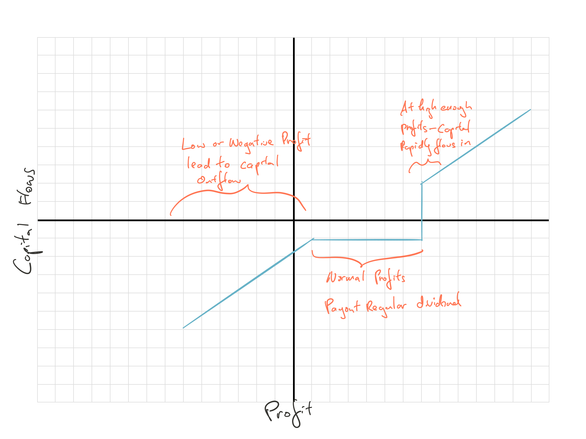
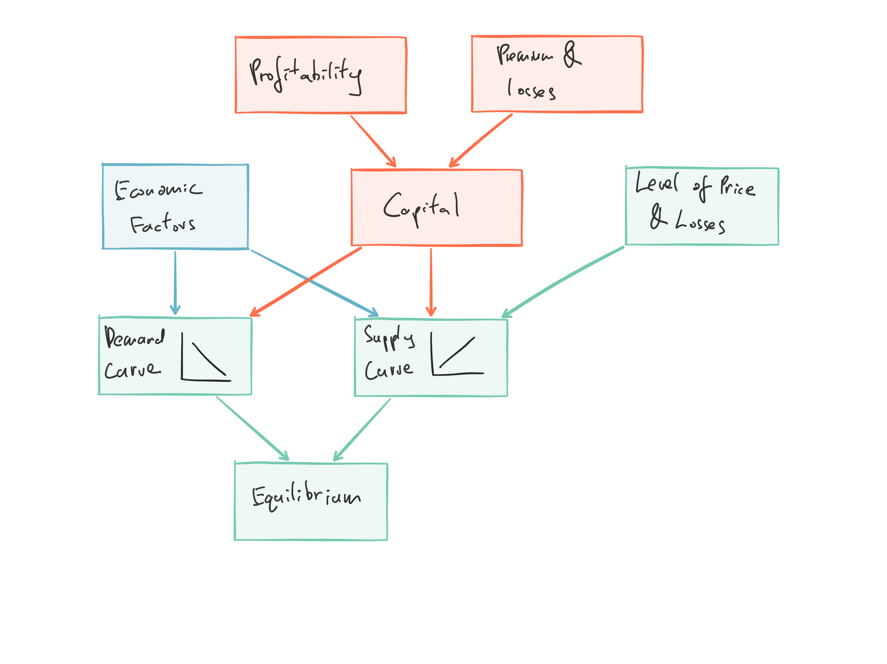

# ERA 5.4 Approaches to Modeling the Underwriting Cycle - Major

[Characteristics](#era-5-uw-cycle) of underwriting cycle

[4 stage](#era-5-4-stage) of insurance business and what drives each of them

* First stage is the classic cycle and the next 3 shows how things stabilize and then eventually breakdown

Various [theories](#era-5-cycle-theory) of underwriting cycle

[Approaches](#era-5-cycle-mod-app) to modeling the cycle

* Need: Criterion variable, predictor variable, and competitor intelligence

$\star \star$ Styles of modeling:

* [Soft](#era-5-4-soft) has 3 methods (Scenarios, Delphi, Formal Competitor Analysis)

* [Technical](#era-5-4-hard) use different time series models

* [Behavioral](#era-5-4-behav) is in between

Different impact on [supply and demand](#era-5-supply-demand) under different scenarios

* [Gron](#era-5-4-gron) supply curve

Capital flow (fig. \@ref(fig:capital-flow)) under different profitability

Interaction of the various components \@ref(fig:compoents-uw-cycle)

## Introduction {#era5-uw-cycle-intro}

Important to consider how the firm **interacts** with a **competitive environment** in an ERM framework

Price competition is inevitable due to:

* Low barriers of entry

* Lack of patent or copyright product

**Price** and **quantity** is difficult to access outside the firm

* Price depends on premium charged as well as *limits*, *deductible*, *terms* and *conditions*

* It's the **ratio** of premium to expected losses that define prices

### Underwriting cycle {#era-5-uw-cycle}

```{definition, era-5-4-uw-cycle, name = "Underwiting Cycle"}
Recurring increase and decrease of prices and profits
```

```{remark}


* Result of a dynamical system with both **feedback** and **external shocks** and **slow adjustment**

* Each LoB has it's own cycle

* Capital plays an important role $\Rightarrow$ multiline insurers creates dependencies between LoBs' cycle
```

### Four Stages Insurance Business {#era-5-4-stage}

Steward describes the evolution of insurance business, the stages has sometimes takes decades to play out

At each stage, different factor drives the cycle

***Stage 1: Emergence*** (Driven by **competitive factors**)
    
* Classic u/w-ing cycle here at this stage

* New LoB, thin data, inaccurate pricing

    $\hookrightarrow$ $\uparrow$ demand with erratic pricing $\Rightarrow$ Price wars

    $\hookrightarrow$ solvency crisis $\Rightarrow$ force out weak competitors $\Rightarrow$ price correction

    $\hookrightarrow$ $\uparrow$ profitability $\Rightarrow$ new entrants and repeat
    
***Stage 2: Control*** (Driven by **statistical lags**)

* Stop the cycle with help from rating bureau or insurance department
    
***Stage 3: Breakdown*** (Driven by **mix of the two**)

* Control regime breaks down due to *new technology* or *social changes*

* New type of competitors take business away
    
***Stage 4: Reorganization*** (Driven by **competitive factors**)

* Return to stage 1, new configuration of the market phase emerges
    
## Theories of the Cycle {#era-5-cycle-theory}

Different researches findings below are often contradictory due to:

* Research typically focused on different LoBs

* Often focus on just one stage

### Institutional Factors

Lags in data can lead to cycles

Reporting and regulatory delays leads to 2^nd^ order autoregression

### Competition

Competition drives prices down:

* Players might not behave rationally

* Someone might underestimate the expected loss (winner's curse)

Companies strategy is either **aggressive growth** (through price reduction) or **price maintenance**

* Once a large portion of the market is dropping prices, price maintenance is not sustainable

* Incumbents drop price so as to convince the aggressive players that they should focus on profits, rather than market share and thus get back to higher prices sooner

Dowling's 4 phases of cycle

1. Cheating (optimistic reserve levels)

2. Pain

3. Fear

4. Restoration

### Supply and Demand, Capital Constraints and Shocks

Capital determines the available **supply** of insurance

* Losses that reduce capital will reduce the supply $\Rightarrow$ Increase price

Capital is not replaced quickly once reduced (debatable now with ILS)

$\therefore$ Market does not rebound quickly

Best clients may leave first when capital $\downarrow$ $\Rightarrow$ anti-selection

$\therefore$ Declining profits exacerbated by anti-selection

### Economic Linkages

Profitability of firm **links to the economy**

* *Investment income*, *cost of capital*

* Expected losses may impacted by: *inflation*, *GNP growth*, *unemployment*

* Price of risk (may be set by the market)

    * Is generally ignored by insurers

### All of the Above

No single theory can explain the u/w cycle completely

## Approaches to Modeling the Cycle {#era-5-cycle-mod-app}

3 approach:

1. [Soft approach](#era-5-4-soft)

2. [Technical approach](#era-5-4-hard)

3. [Behavioral modeling (Econometric)](#era-5-4-behav)

Below show the importance of the dimension to each style:

* **Data quantity, variety and complexity**

    Soft > Behavioral > Technical
    
* **Recognition of human factors**

    Soft > Behavioral > Technical
    
* **Mathematical formalism and rigor**

    Technical > Behavioral > Soft

***

Before we model, first we define what it is we want to know and look for leading indicators that foretell the turn in the cycle:

***Criterion Variable***

* What variable we are interested in?

* *Conceptually* we want **price**

    * e.g. Price to coer a *standard* risk
    
    * But impossible to define in insurance

* Use **loss ratio** or **combined ratio** etc as a proxy

    * Maybe with adjustments for TVM (e.g. include investment income)

***Predictor Variable***:  
Information available to calculate the *current period criterion* and also forecast the *forward period criterion*

* **Historical** criterion variable and it's components:

    (*e.g. loss, expense*)

* **Internal financial** variables:  

    (*e.g. reserve, capital, capital flow, reinsurance cessions*)

* **Regulatory rating** variables:

    (*e.g. downgrades and upgrades*)

* **Reinsurance sector financials**:

    (*e.g. capital held by reinsurers*)

* **Econometric** variable:

    (*e.g. inflation, unemployment, GDP*)

* **Financial market** variables:

    (*e.g. interest rates, stock market returns*)

***Competitor Intelligence***:  
Gather information on customers at renewal time and competitors (*e.g. Firm's own agents, customere surveys at renewal, trade publications/news, rate filing*)

* Provides more detailed information on the state of the u/w cycle

* Need to beware of antitrust and legal issues (*e.g. industrial spying*)

* Goal is to look for **leading indicatiors** that foretell the turn in the cycle

### Soft Approach {#era-5-4-soft}

Starts with intense focus on **data gathering** and **intelligence**

**Goal**: Give analysts insight into the complex u/w cycle

* Collect as much information as we can

This is a human approach, focused on three methods:

1) ***Scenarios***

    Detailed written statement describing a possible future state of the world
    
    * Help company think about how it might respond to different future states
    
    * Goal is to have a detailed description of the environment and **analyzed by minds**
    
2) ***Delphi Method***

    Gather expert opinion without biasing the group to the opinion of the most senior persons
    
    *Process*:
    
    1. Give background to participants
    
    2. Gather opinions using questionnaire
    
    3. Results are summarized and distributed
    
    4. Allow participants to reconsider and articulate reason for disagreeing
    
    5. Repeat until consensus is reached
    
3) ***Formal Competitor Analysis***

    * First determine *current state*, *motives*, and *likely behavior* for the main competitors
    
    * Need database of competitor information that has *key financials*, *new items*, and *behavioral metrics*
    
    * Overtime, distinction between normal and abnormal statistics becomes evident
    
    * Key to predicting turns in the u/w cycle is **unusually profitable** or **distressed** financial conditions reproduced over a **large number** of firms
    
### Technical Approach {#era-5-4-hard}

Focus here is on a small number of industry financial statistics (possibly only 1)

* We have at best only a rudimentary theory underlying the model

***Autoregressive Model***

Research shown cycle can be modeled with $AR(2)$ or $AR(3)$ model

For $AR(2)$:

$$X_t = b_o + b_1 X_{t-1} + b_2 X_{t-2} + \sigma \epsilon_t$$

Use autoregressive model to model **P&C industry combined ratios**

* Results showed weak mean regression with lag 1 but strong mean regression at lag 2

* Model can be used to forecast a few periods into the future and estimate the distribution for those forecasts

***VARMAX***

Generalized multivariate time series that can handle multiple simultaneous variable and utilize external variables

***General Factor Model***

* Looks like $AR(1)$ but with non-normal mean and a moving temporary mean (determined by $z_{t-1}$)

$$X_t = c + d(Z_{t-1} - X_{t-1}) + \tau \delta_t$$

* $Z_t = a + b \cdot Z_{t-1} + \sigma \epsilon_t$
    
* $Z_t$ maybe an unknown or unobservable variable

* Neither error term needs to be normal
    
Complicated to fit this model

* Generalized method of moments or efficient method of moments

### Behavioral Modeling {#era-5-4-behav}

Econometric Modeling

* Sit between soft and technical model's concern for **structural insight** (soft) and **statistical validity** (technical)

* Same as soft approach:

    * Where we need large quantity, variety and complexity of data
    
    * Recognize human factors
    
* Same as technical approach:

    * Require mathematical formalism
    
    * Tehcnical $\Rightarrow$ statistical validity

Can be done at an *industry* level or *company* level

* Industry level can be more detailed

* Company level requires maintaining many individual models and their interactions

    * Can lead to insight from emergent properties (See [ERA 4.2](#era-4-2-intro))
    
## Supply and Demand {#era-5-supply-demand}

```{r supply-and-demand, echo = FALSE, out.width='100%', fig.show='hold', fig.cap='Supply and Demand on quantity vs price'}
knitr::include_graphics('figures/Exam-7-Notes-6.png')
```

**Supply**

* New competition or technology increases the quantity available at a given price

    $\hookrightarrow$ Shifting curve $\searrow$
    
    * More quantity for same price

* Higher capital requirement

    $\hookrightarrow$ Shifting curve $\uparrow$
    
    * Less quantity for same price

**Demand**

* Excess capital makes insurance more valuable

    $\hookrightarrow$ Shifting curve $\nearrow$

* Shock to capital  

    $\hookrightarrow$ Shifting curve $\swarrow$

```{remark}


* Curve above is for **industry**

    * If the industry is well capitalized, its promise to pay claims are worth more and the insurance produce is more valuable and more demand for it
    
    * If there's a shock event that reduce the industry's capital, it will reduce demand for the product

* Company demand curve will be flatter since customers can go to another company for small changes in price
```

$Quantity  = f(Price)$

* Alternative way to think about this

* When companies are capital rich, customers want more product for the same price

* When new competition comes into the market, the same price will have more produce available

**Market price** = where supply meets demand

* Difficult to empirically estimate the curves because only the equilibrium is observable

### Gron Supply Curve {#era-5-4-gron}

Plot 4 above in fig. \@ref(fig:supply-and-demand)

***The first flat section***:

* There is a minimum price for insurance product

$$\text{Minimum Price} = \text{Expected Losses} + \text{Marginal Expenses}$$

* *Supply* is **perfectly elastic** for a certain quantity, where the supply 
will increase without an increasing price

***The curved section***:

* At certain point firm will require **additional capital** to support the business, and the price must increase

* Once price hits a a certain level, profits are enough to cover the additional capital and the supply curve approaches a price asymptotically

* This is [high AE](#goldfarb-ae) from Goldfard's perspective

Plot 5 above in fig. \@ref(fig:supply-and-demand)

***Shock scenario***:

* Curve would simply shift $\leftarrow$

* Expected loss + marginal expense is still the same

* Amount of capital the company have before it needs to seek additional capital has changed

## Capital Flows

```{r capital-flow, echo = FALSE, out.width='100%', fig.show='hold', fig.cap='Capital Flow'}

```

* Capital $\uparrow$ in a firm from retained earnings and capital infusions

* Capital $\downarrow$ from operating losses and capital withdrawal

* Capital is attracted when profit expectations are high

* Capital exits either voluntarily or under financial distress

## Assembling the Components

```{r compoents-uw-cycle, echo = FALSE, out.width='100%', fig.show='hold', fig.cap='Underwriting Cycle Components'}

```

* Economic factors and capital both affect the supply and demand curves

* Level of price and losses affect the supply curve (but possibly with delay)

* Capital is impacted directly by premium and losses and specifically profitability

Output of this model is an equilibrium price

The behavioral model can be used to simulate a dist^n^ of this price

* Should be validated against historical experience

## Conclusion

U/w cycle is the behavior of a complex dynamic system

Output of the modeled u/w cycle should feed into the firm's **demand** and **retention** models

* They help to forecast how clients will react to the difference between the firm's pricing and that of other prices available in the market

## Past Exam Questions

**TIA Exercise 4.1**

* TIA 1: System performance of insurance company

* TIA 2: Manage u/w cycle to improve performance

* TIA 3: Risk of setting apriori LR using historical for long tail LoBs

* TIA 4: Op risk for comp structure for CEO

* TIA 5: How to use KRI

* TIA 6: Op risk to consdier when expanding business

**TIA Exercise 4.2**

* TIA 7: How to react to competitors and avoid operational inertia

* TIA 8: Why scenarios will be less detail than plan

* TIA 9: Best practice of scenario planning

* TIA 10: Advance scenario planning

* TIA 11: Mango's definition of strategic risk vs the OCC version

* TIA 12: Categories of strategic risk

* TIA 13: Essence of Mango's definition of strategic risk

* TIA 14: Categorize strategic and op risk

    * Op risk is mostly implementation and execution
    
    * Strategic risk is more decisions
    
**TIA Exercise 5.4**

* TIA 15: difficulty with modeling price in insurance

* TIA 16: Stewert's u/w cycle stages

* TIA 17: Definition of u/w cycle and how is it driven by competition and capital

* $\star$ TIA 18: Model underwriting cycle based on lag of information

* TIA 19: VARMAX vs AR model

* TIA 20: supply demand curve for firm vs market

* TIA 21: Gron supply curve features

* TIA 22: Industry capital flow graph features

* TIA 23: Industry capital flow graph features

* TIA 24: Soft vs technical approach of u/w cycle modeling

* TIA 25: Drawback of technical approach

* TIA 26: Delphi method

* TIA 27: Formal Competitor Analysis for u/w cycle review

**Past Exam**

* 2011 #20: Identify and describe op risk presented in sample

* 2012 #22: Describe op-risk and identify op-risk in example

* 2014 #25: Issue with bridging model and u/w cycle management to improve performance

* $\star$ 2015 #28: Op risk vs strategic risk and strategic risk faced by insurance companies

* 2016 #22: ALM strategy to deal with u/w cycle

* 2016 #26: Op risk with planned loss ratio and difficulty in seperating op risk from underwriting risk

* 2016 #27: agency theory and problems when they're not align, 4 actions to manage properly u/w cycle

### Question Highlights

n/a