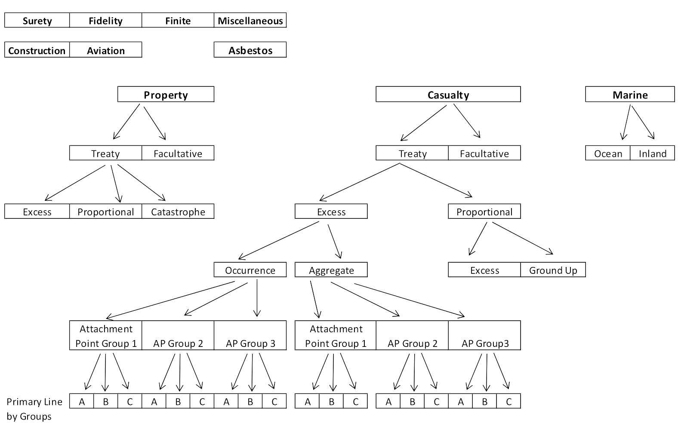

## 7 Problems with Reinsurance Reserving

Problem 1: **Longer report lag of claims**

* Claim must be perceived as report-able to the reinsurer by the cedant (e.g. half of the attachment point) and then flow through cedent's system to reinsurer

* Cedant may undervalue the claim for a long time and thus not report to the reinsurer

* Extreme delays in discovery or reporting for mass tort claims

Problem 2: **Persistent Upward Development of Most Claim Reserves**

* Economic and social inflation

* Tendency to underestimate LAE

* Tendency of claims to reserve at the modal value

Problem 3: **Reporting Pattern Differ Greatly**

* Differ by: LoB, contract type, contract terms, cedant, intermediary

* Extremely heterogeneous exposures

* Extreme fluctuation in historical loss data due to low frequency and report lags

* Less information on the underlying exposure than primary carrier

Problem 4: **Industry Statistics Not Useful**

* Due to heterogeneity exposures

* Sch P doesn't break down the exposure fine enough and ISO not directly applicable

* Reporting lag grows with attachment point

Problem 5: **Reports Received Lack Important Information**

* Proportional covers require only summary claims info

* Might only have u/w year info (no AY or PY)

* Need exposure measure

    * Can use reinsurance premium but often it is allocated to primary lines using a fixed percentage. If % not correctly reflect loss exposure, premium by line may be distorted
    
* Reporting is typically done with a quarter lag so always missing a quarter of premium

Problem 6: **Data Coding and IT System Problems**

* Due to the heterogeneity in coverage

* Might have grown in size and complexity faster than data system could handle

Problem 7: **Reserve to Surplus Ratio is Higher for Reinsurer**

* Management problem

* Management may underestimate level of reserves need until claims emerge and difficulty with actuary convincing management to post the appropriate reserve

***

Standard techniques requires: Homogeneous book, sufficient frequency, and detailed exposure info (Problems 3, 4, 5); Difficult to supplement with industry info

## 6 Components to a Reinsurance Loss Reserve

1) **Case reserve** reported by *cedent*

    * Summary reporting for proportional contracts
    
    * Individual case reports for XS contracts
    
2) **Additional Case reserve** from reinsurer

3) **IBNER**

4) **Pure IBNR**

5) **Discount** for future investment income

    * For tabular discount as well as for tax purposes
    
6) **Risk Load**

    * For adverse deviation so uncertain income doesn't flow into profits too quickly
    
## General Reinsurance Reserving Procedure

Partition $\Rightarrow$ Development Patterns $\Rightarrow$ Estimate $\Rightarrow$ Monitor and AvE

### Portfolio Partition

Data needs to be split into reasonably **homogenous** exposure groups that are relatively consistent **over time** with respect to mix of business (exposures)

Variables to consider when partitioning data in approximately priority order:

**LoB** $\Rightarrow$ **Contract type** (fac, treaty, finite) $\Rightarrow$ **Types of Cover** (QS, SS, XS per risk/occ, agg XS, CAT, LPT) $\Rightarrow$ **Primary LoB** (for cas) $\Rightarrow$ **Att Pt** (for cas) $\Rightarrow$ **Contract terms** (flat-rates, retro rated, sunset clause, LAE share, CM, Occ) $\Rightarrow$ **Type of cedant** (Small, large, E&S) $\Rightarrow$ **Intermediary** (brokers)

Need to balance homogeneity with credibility of data

Review loss statistics and reporting pattern to see if data is still credible

### Analyze Distorical Data and Projection

Backwards looking (Step 2): Analyze the historical development patterns. If possible, consider individual case reserve development and the emergence of IBNR claims separately

* Use long periods where practical and curve fit where practical

Forward looking projection (Step 3): Estimate the future development. If possible, estimate the bulk reserve for IBNER and pure IBNR separately

**Short Tailed Lines**

Settlement is quick, basic methods work fine

For property, beware of recent CATs

Exclude the high layers for XS property

Exclude construction for Fac Prop

Fidelity proportional is short tail as well

Book LR for new lines and maybe allocate claims to AY for reserving

**Medium Tailed Lines**

Average dollar lag of 1-2 years and nearly complete within 5 years

XS Property (separate from working layers), Construction (separate from other), Surety, XS Fidelity, Marine, Agg XS (non-casualty)

Surety should estimate gross and recovery separately as the recovery has a longer tail

Chainladder works fine for paid and incurred with or without ACR

**Long Tailed Lines**

Any time of casualty reinsurance, XS Cas is the longest before APH

APH should be analyzed separately:

* Use different methods specifically for APH

* Separate commuted contracts

***Chainladder***:

* Don't' use, too much leverage

***BF***:

* Better than CL

* Dependent on selected LR

    * Consider u/w cycle in selecting LR since AY LR is strongly correlated to the place in the reinsurance profitability cycle

    * May use LR from pricing work
    
***Stanard Buhlmann***:

* Must on-level the historical premium and adjust to be pure premium

    * Remove commissions and brokerage and internal expenses (but might not worth the effort)

    * Remove any suspected rate level differences

* $ELR = \dfrac{\sum C_k}{\sum E_k p_k}$

    * $C_k$: reported to date; $E_k$: Adj Prem; $p_k$: expected % reported to date
    
***Credibility IBNR Estimates***:

Weight the CL method with SB or BF

* $R_k = Z \cdot R_{CL} + (1-Z) \cdot R_{SB}$

* $Z_k = p_k \cdot CF$, $CF \in [0,1]$

* $CF$ is the credibility factor, Benktander = 1, BF = 0\

***Alt Methods***:

Fit losses reported to date to a curve

Model claim counts or use stochastic model (Bootstrap). Caveat being that it might be difficult to explain to management

## Monitoring and Testing Predictions

Compare AvE over quarters and do this for several quarters to see if any trends become apparent

Expected = $\dfrac{\text{Expected % Reported in Period}}{\text{Expected % Unreported}} \times IBNR$

Sometime difficult to tell if the difference is large or small

Look for deviations over time and look for trends

It could be IBNR is too small, claims are paying faster than expected, or just random fluctuation