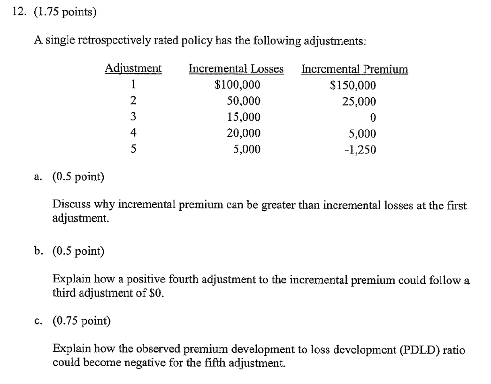
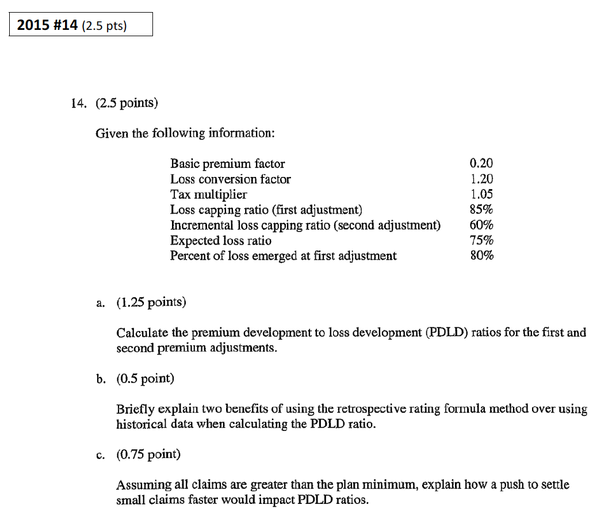

## Cliff's Summary

Retro formula

$\underbrace{P}_{\text{Premium}} = [\underbrace{BP}_{\text{Basic Premium}} + (\underbrace{CL}_{\text{Capped Losses}} \cdot \underbrace{LCF}_{\text{Loss Conversion Factor}})] \cdot \underbrace{TM}_{\text{Tax Multiplier}}$

Use PDLD to get the premium development based on the loss developement

Know what each term means like basic premium factor or charge

Know the formula approach for PDLD

$\begin{align}
  PDLD_1 =\underbrace{\left(\frac{BP}{SP} \right)}_{\text{Basic Prem Factor}} \frac{TM}{ELR \cdot \%Loss_1} + \underbrace{\left( \frac{CL_1}{L_1}\right)}_{\text{Loss Capping Ratio}} \cdot LCF \cdot TM
\end{align}$

* To adjust for being too responsive: $\begin{align}
  P_1 = \underbrace{\left( \frac{BP}{SP} \right) \frac{TM}{ELR \cdot \%Loss_1}}_{\text{Not }\propto\text{ Loss}_1} \times \operatorname{E}[L_1] + \underbrace{\left( \frac{CL_1}{L_1} \right) \cdot LCF \cdot TM}_{\propto \text{ Loss}_1} \times L_1
\end{align}$

* Subsequent PDLD: $\begin{array}{cccl}
  PDLD_n &= &\dfrac{CL_n - CL_{n-1}}{L_n - L_{n-1}}&LCF \cdot TM \:\:\:\:\text{For }n>1\\
  &= &\dfrac{\Delta CL}{\Delta L}&LCF \cdot TM\\
\end{array}$

Know the empirical approach for PDLD

* Assume premium lags
* Ratio selection
* Cumulate PDLD based on a weighted average with expected % future report for each future periods
* Know the [practical application](#application)
    * First adjustment period might cover more than one policy period

Know the Teng Perkins [improvements](#tp-improvements) and [assumptions](#tp-assumptions)

### Types of Exam Questions

Haven't done TIA practice questions

**Concepts**

* 1998 - #55: formula vs empirical, expected difference given a scenario
* 2001 - #39 b: PDLD ratio pattern
    * First adjustment the basic premium is included in the retro premium computation; Small portion of loss is limited by the retro; LCF and TM also impacts it
    * At later periods, more losses are capped by the limit
* 2003 - #9: Loss capping ratio properties Double check
* 2003 - #10: Feldblum comment on Teng Perkins: premium responsiveness decreases at higher LR for a book of business
* 2007 - #36: Retro premium and reported losses relationship
* $\star$ [2014 #12](#2014-12): incremental losses vs premium
* $\star$ [2015 #14](#2015-14): PDLD ratio

**Calculations**

* $\star$ [1999 - #55](#1999-55): Calculating CPDLD and expected future premium
    * Remember to apply $CPDLD_1$ to all policies that have not have an adjustment
* 2001 - #39 a: CPDLP
* 2002 - #14: Premium asset = Expected Future Premium + Premiums booked from prior adjustment - premium booked as of current
* 2004 - #7: Empirical PDLD ratio
* 2005 - #20: Premium asset calc with PDLD
* $\star$ 2006 - #23: $PDLD$ from formula and why the loss capping ratios decrease over time
* 2007 - #5: $PDLD_2$ plug and play
* 2008 - #14: premium asset
* [2009 - #6](#2009-6): Premium after 2^nd^ retro adjustment
* $\star \star$ [2012 - #7](#2012-7): Retrospective premium asset, good question, 2 methods to do
* $\star$ 2013 #6 a-c: PDLD 1 to 3 and relationship with loss capping ratio, ratio should decrease monotonically
    * State whether you useing the loss cappting ration as cummulative or incremental
* 2015 #14 a: PDLD 1 and 2 plug and play

## Introduction

**Premium Asset**:  
Asset supported by premium the insurer expect to collect from clients with retrospective policies as losses develops

The method discussed here estimate premium asset over a whole book of business

* Framework based on retro rating formula (requires knowledge of rating parameters for the entire book) and estimating parameters based on empirical data

Retospective policies were popular in 1996:

* For insured 

    * Returns premium to insured for good experience

    * Premiums are due with short lag to losses, as opposed to upfront
    
* For insurer

    * Plans allow an insurance company to shift a significant portion of the risk to the insured
    
*Ultimate Premiums Deviation*: $\dfrac{\text{Ultimate Premium}}{\text{Standard Premium}}$

## Formula Approach for PDLD

### Retro Premium Formulas

$\underbrace{P}_{\text{Premium}} = [\underbrace{BP}_{\text{Basic Premium}} + (\underbrace{CL}_{\text{Capped Losses}} \cdot \underbrace{LCF}_{\text{Loss Conversion Factor}})] \cdot \underbrace{TM}_{\text{Tax Multiplier}}$

* **Basic Premium**: Covers minimum premium, commissions and expenses; premium when there are no losses

* **Capped Losses**: Losses are capped from premium calculation, individually and in aggregate

* **Loss Conversion Factor**: Variable expense loading

The above can be expressed in proportion to the Standard Premium

* **Standard Premium** = Manaul Rate $\times$ E-Mod $\times$ Sch-Mod = $\dfrac{\text{Expected Loss}}{\text{ELR}}$

Same formula is used to calculate the cummulative premium due at each adjustment but with the below:

* $P_n$: Premium @ n^th^ adjustment

* $CL_n$: Capped losses @ n^th^ adjustment

**Basic Premium Factor** = $\dfrac{BP}{SP}$

**Basic Premium Charge** = $\dfrac{BP}{SP} \cdot TM$

### Calculating PDLD

$PDLD = \dfrac{\Delta P}{\Delta L} \sim \dfrac{d P}{d L}$

* Relationship between premium development and loss development

* Apply to expected loss development to determin the expected premium development

* The $L$ here is not capped

$PDLD_n = \dfrac{P_n - P_{n-1}}{L_n - L_{n-1}}$

Requires details about the policies written

* Resonable for individual policies but difficult for an entire book

### Estimating First Period PDLD

$\begin{align}
  PDLD_1 =\underbrace{\left(\frac{BP}{SP} \right)}_{\text{Basic Prem Factor}} \frac{TM}{ELR \cdot \%Loss_1} + \underbrace{\left( \frac{CL_1}{L_1}\right)}_{\text{Loss Capping Ratio}} \cdot LCF \cdot TM
\end{align}$

* Can you just also write it as $PDLD_1 = \left( \dfrac{BP}{L_1} + \dfrac{CL_1}{L_1} \cdot LCF \right) \cdot TM$

The formula above is too responsive to actual losses in the first period, as only a portion of the formula is related to the $L_1$ as shown below

Memorize Formula

$\begin{align}
  P_1 = \underbrace{\left( \frac{BP}{SP} \right) \frac{TM}{ELR \cdot \%Loss_1}}_{\text{Not }\propto\text{ Loss}_1} \times \operatorname{E}[L_1] + \underbrace{\left( \frac{CL_1}{L_1} \right) \cdot LCF \cdot TM}_{\propto \text{ Loss}_1} \times L_1
\end{align}$

So technically only the 2^nd^ part of the formula should be appied to $L_1$ while the first part is in relation to the $\operatorname{E}[L_1]$

### Estimating Subsequent PDLD

$\begin{array}{cccl}
  PDLD_n &= &\dfrac{CL_n - CL_{n-1}}{L_n - L_{n-1}}&LCF \cdot TM \:\:\:\:\text{For }n>1\\
  &= &\dfrac{\Delta CL}{\Delta L}&LCF \cdot TM\\
\end{array}$

* $LCF$ and $TM$ are known at policy inception so we only have to estimate the loss capping ratio $\dfrac{\Delta CL}{\Delta L}$

## Empirical Approach for PDLD

**Advantages**: Easier to do for an entire book of business as not every client will have the same parameters

Book should be seperate into homogenous groups

* Size and typce of rating plan sold

Need to assume a **lag** from the date used to value the losses and when the actual premium is collected

* Typically 3 to 9 months e.g. if the loss age is 18, the premium will be at 27 if we assume a 9 months lag

* First evaluation for loss is typically at 18 months

* e.g. $PDLD_2 = \dfrac{P_2 - P_1}{L_2 - L_1} = \dfrac{^{39}P - {^{27}P}}{^{30}L - {^{18}L}}$

### PDLD Ratios Selection

Compile PDLD triangle for all effective date groupings and make a selection for each age

If you observe increasing trends in the ratios for a give age:

* More losses are within the loss capping layer

    * Higher agg max or lower agg min or higher per claim limits
    
    * Improvement in loss experience (fewer large losses so larger portion is within the cap)
    
* Higher basic limits (for $PDLP_1$)

PDLD can be negative if $\Delta CL$ is negative: losses > max increase while claims within retro limit have a reductiion in reserves

### Cumulative PDLD Ratios

Cumulate PDLD based on a weighted average with expected % future report for each future periods

### Application

**For each quarter**

1) Determine reported losses @ prior adjustment

2) Estimate ultimate losses

3) $\Delta L$ = (2) - (1)

4) $\sum \limits_{qtr \in last \: adj \: age \: i} \Delta L_{qtr}$

**For each year**

1) Expected premium emergence = $\Delta P = CPDLD \times \Delta L_{yr}$

2) Determine premiums booked through prior adjustment

3) Estimated total premium = (1) + (2)

4) **Premium asset** = Premium booked as of current evaluation - (3)

    * Premium booked as of current eval $\neq$ premium booked through prior adjustment due to: timing of retro adjustments, minor premium adjustments, interim premium booking
    
    * Text doesn't say make adjustment though
    
For the most recent periods need to adjust for only exposure period that is being earned out

## Further Issues

If loss plan includes ALAE, you should include ALAE in the losses for this as well

$\Delta$ in mix of business will affect the sensitivity of premium to loss and thus the $PDLD$

For premium that is not secured, a provision for bad debt should be held

## Feldblum's Discussion

We do not develop premium directly because:

* Estimate of ultimate inc'd losses can be obtained sooner

* Retor premium depends on incurred loss

**Fitzgibbons and Berry** 

* Also create a linear relationship of premium to losses, but they forecast ultimate premium directly, rather than premium development $\Rightarrow$ can lead to large deviations

* Premium asset $\propto$ expected unreported losses

* Does not respond if the actual premium to loss relationship is different than estimated

**Improvements from Teng & Perkins**

1) Slop of premium to loss changes as the year matures

    * Large losses that pierce the claim cap tend to have their development later
    
    * No future development one aggregate max is hit

2) Forecast future premium development

    * Projected premium asset is based on projected unreported losses, does not consider losses to date
    
    * Errors in projecting premium to date are automatically corrected for since it projects premium development and not ultimate premium
    
**Teng & Perkins Assumptions**

* Premium responsiveness $\dfrac{\Delta P}{\Delta L}$ in a period is $\perp\!\!\!\perp$ of responsiveness at prior adjustments

* Premium responsiveness depends on the maturity, not the loss ratio or beginnging reto premium ratio

**Enhancement**

* $PDLD_1$ should separate the basic premium component from the component $\propto$ losses

* Simple adjustment, just estimate the basic premium as a ratio to $SP$ and subtract from $PDLD_1$
    
    * $\dfrac{P_{fixed}}{\operatorname{E}[L]} = \underbrace{\dfrac{BP}{SP} \cdot TM}_{\text{Basic Prem Charge}} \Big / ELR$
    
    * Based on $P_{fixed} = BP \cdot TM$
    
    * Check this how to apply to CPDLD
    
## Past Exam Questions

1999 - #55

2009 - #6

2012 - #7

2014 - #12

2015 - #14

