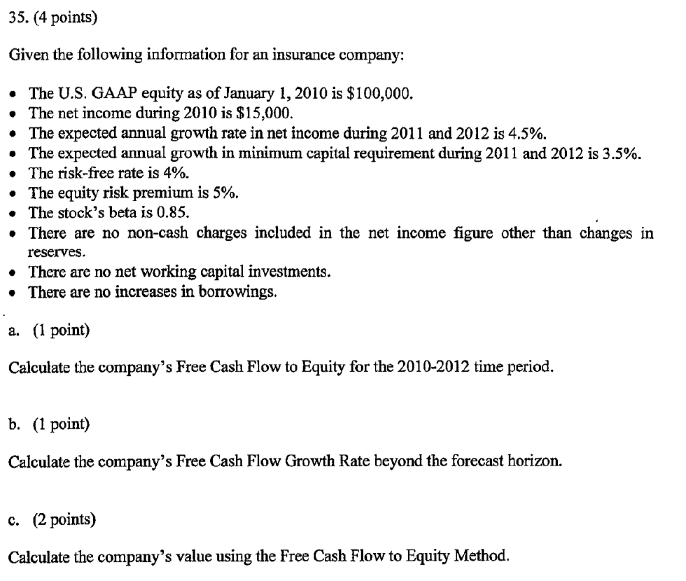
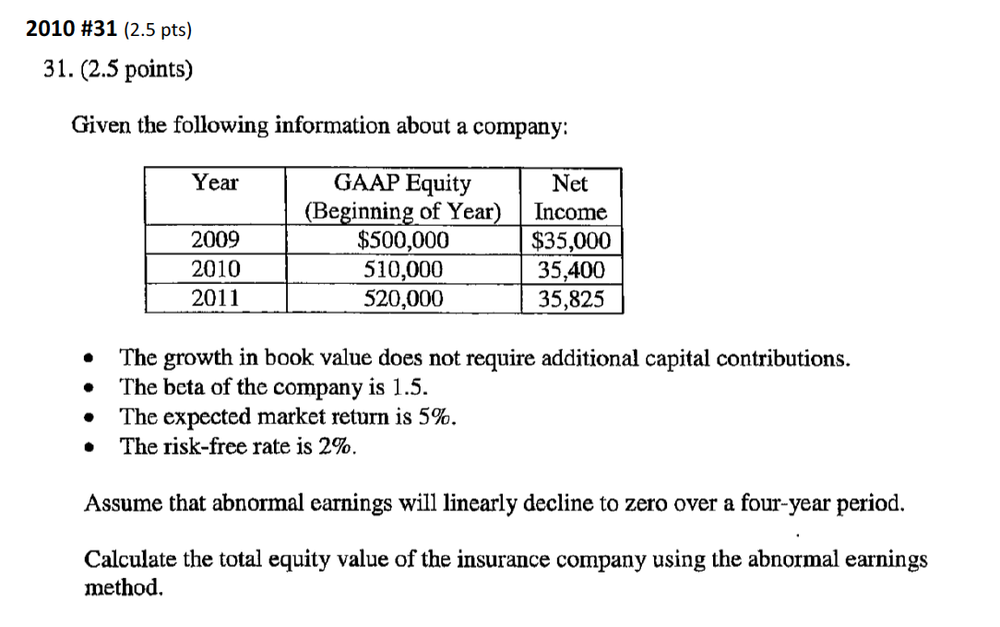

## Cliff's Summary

Know how to get the discount rate and [growth rate](#growth-rate) for each of the 3 method

DDM:

* $V_0 = \dfrac{\mathrm{E}[Div_1]}{k - g}$

* Knows how this can transform to the P:E formula

* Remembers the terminal value formula uses CF at 1 but get you to time 0

FCFE:

* $FCFE = NI + (Non \:Cash\:Charges) - \Delta Working \:Capital - \Delta Capital + \Delta Debt$

* Discount all the FCFE for $V_0$
    
* [Advantages](#fcfe-adv)

AE:

* $\begin{align} V_0 = BV_0 + \sum_{t=1} \frac{\overbrace{(ROE_t - k)BV_{t-1}}^{AE_t}}{(1+k)^t}\end{align}$

* Remember to add the $BV_0$

* [Advantages](#ae-adv)

* [Considerations](#ae-considerations)

Relative multiples:

* $\dfrac{P_0}{E_1} = \dfrac{1 - \rho}{k - \rho \times ROE}$; Based on DDM

* $\dfrac{P_0}{BV_0} = 1 + \dfrac{ROE - k}{k - g}$; Based on AE

### Types of Exam Questions

**Concepts**

* $\star$ 2011 - #12 a: higher $g$ should be matched with higher $\beta$ for being more risky
* 2011 - #12 c: relationship between $g$ and $k$

**DDM**

* [2008 #43](#2008-43): DDM calc and convert to P:E
* $\star$ 2008 #44: DDM calc and interpretation
* 2008 #45: Comparison on P:E
* 2009 #34
* 2011 - #12 b: DDM calc (Get $r_f$ as t-bond less liquidity premium)
* $\star$ [2012 #12](#2012-12): Full calc with DDM

**FCFE**

* $\star$ [2009 #35](#2009-35): Full FCFE calc

**AE**

* $\star$ [2010 #31](#2010-31): Full AE calc
* [2011 - #13](#2011-13): P:B value calc + discussion on assumption

## Assumptions

Key assumptions are **cost of captial** $k$ and **growth rate** $g$

### Risk Adjusted Discount Rate

Recognize the risky cashflow by discounting them at a rate higher than the risk-free rate based on CAPM

$k = r_f + \beta \left [ \mathrm{E}(r_m) - r_f \right ]$

* Risk of an investment depends on the rest of an investor's portfolio. We focus instead on equilibrium rates of return

* Different BU has different risk profile $\Rightarrow$ Different discount rates

* Discount rates can vary by period if business mix change

* Not all cash flow have the same risk profile (premium, investment income, paid losses)

* Simplification is to use average discount rate for the portfolio

One alternative way to account for the risky cash flow is to convert the cash flow to *certainty equivalent cash flows* and discount with risk free instead of the cost of capital

* Reflect the risk in the cashflow directly

**Risk free Rate: $r_f$**

* 90 days t-bill
* Maturity matched t-notes
* T-bonds less liquidity & term premium (~1.2%)

**Market Risk Premium: $\mathrm{E}(r_m) - r_f$**

* 6-8% historically

* $r_f$ here should be consistent

* Need to sensitivity test

**Systematic Market Risk: $\beta$**

* Based on regression on stock return vs market return

* Can use industry $\beta$

* $\beta$ will be higher for firms with more leverage, riskier business units

    * Alternative is to use *all equity* $\beta$ to remove bias from leverage

* Insurance company has additional leverage from policyholder liabilities

* Can assume total leverage of insurance companies is similar

### Growth Rate

Used for the period after the forecast horizon

| Method | Growth Rate: $g$  |
| ------ | ----------------- |
| DDM    | $ROE \times \rho$ |
| FCFE   | $ROE \times$ [Reinvestment Rate] |
| AE     | At most the growth in book value |

**Return on Equity: $ROE$**

$\dfrac{NI}{BE} = \dfrac{\text{Net Income after Tax}}{\text{Beginning Equity}}$

**Plowback Ratio: $\rho$**

% of $NI$ that is reinvested in the firm

* Company that have high growth should retain more earnings

**Reinvestment Rate**

$\dfrac{\Delta Capital}{NI}$

## Dividend Discount Model (DDM)

$V_0 = \dfrac{\mathrm{E}[Div_1]}{k - g}$

* $Div_1$ is paid at the end of year 1

* Constant growth assumption

* $\mathrm{E}[Div_1] = (1 - \rho) NI$

Typically forecast a few years and use the above formula for the terminal value

Need to use $NI$ after tax

When calculating $g$, calculate $ROE$ and $g$ for all years and make selection

Firm with high expected growth tend to be riskier $\Rightarrow$ Higher discount rate

* Forecast is more susceptilble to being wrong, so should be discount more?

**DDM Assumptions**

* Expected dividends
* Dividend growth rate
* Risk-adjusted discount rate (From CAPM)

## Free Cash Flow to Equity (FCFE)

Free cash flow available to pay shareholders:  
$FCFE = NI + (Non \:Cash\:Charges) - \Delta Working \:Capital - \Delta Capital + \Delta Debt$ Memorize Formula

* $\Delta$ loss reserve reflected in $NI$ only; it gets netted out as non-cash charges and capital expenditures

* $NI$ is net of interest payments to shareholders, after tax

* $g = ROE \times$ [Reinvestment Rate] $= ROE \times \dfrac{\Delta Capital}{NI}$

We don't use the free cash flow to **firm** because there's additional leverage for p/h liabilities $\Rightarrow$ Not clear how to calculate cost of capital due to leverage from 2 different source

Similar to DDM, calculate the $ROE$ and reinvestment rate for all years and make a pick

**Advantages over DDM**

* Dividend are discretionary
* Firms also return funds via stock buybacks
* Focus on free cash flow

## Abnormal Earnings (AE)

Works with **accounting measures** of income

* Need to remove distortions

* More accurate some say

Clean surplus assumption

* Requires all changes to book value (on the b/s) flow through the I/S

* Flow through as earnings, dividends or capital contributions

$V_0 = BV_0 + \begin{align}\sum_{t=1} \frac{AE_t}{(1+k)^t}\end{align}$

* Assume AE will trend to zero overtime since it's difficult to maintain

$AE_t = NI_t - k \cdot BV_{t-1} = (ROE_t - k)BV_{t-1}$ Important Formula

* Earnings (net income) XS of cost of capital

**Parameters Considerations**

$BV_0$

* Reported book value

* Focus on **tangible book value** (e.g. take out goodwill)

* Remove any systematic bias such as over or understated reserve

$NI$ is **net of interest payments** to shareholders, **after tax**; Same as DCF model

* Make complement of the book value adjustments here  
e.g. any direct adjustment to the B/S that doesn't flow from the I/S you have to adjust here

* If reserve is discounted in the $BV_0$, need to change (lower) the $ROE$ as the income will be generated from a larger capital base

$g$

* Should be negative as AE tend to 0

* Does not require additional capital as the growth from that extra capital will not accrue to today's shareholders

**Advantages**

* Focus on value creation

    * Earnings above the required return on capital
    
    * Dividends and CF are just consequence of value creation

* Small terminal value

## Relative Multiples {.tabset}

We don't compare to sales because of leverage from p/h's liability

Stock price can fluctuate so use an average price

Multiples can vary significantly even over short periods of time

**Assumptions**

Constant $ROE$, $\rho$, and $k$

### Price to Earnings

Based on DDM

$\dfrac{P_0}{E_1} = \dfrac{1 - \rho}{k - \underbrace{\rho \times ROE}_{g}}$ Memorize Formula

* If $ROE > k$ $\Rightarrow$ Keep a high $\rho$

P:E Ratio

* Forward or leading P/E = consensus forecast earnings for next year

* Trailing P/E = last year's actual; Can be distorted by unusual events

* Price = value of the firm derived from any of the methods

* Earnings = $NI$; Either forward or trailing

* By default, apply the ratio to next year's earnings per formula

Alternative use of P/E

* **Validating assumptions**: reasonability check on the forecast

* **Shortcut to valuation**: if you think company will grow similar to the industry

* **Terminal value**: use the other method for the forecast horizon then P/E for the terminal value

### Price to Book

Based on AE method

$\dfrac{P_0}{BV_0} = 1 + \dfrac{ROE - k}{k - g}$ Memorize Formula

* $BV_0 =$ equity @ t = 0

* Useful for firms with substantial holdings in marketable securities

### Transaction Multiples

Can use multiples from transaction, however caveat:

* Companies tend to overpay

    * Control premium, and other reason M&A overpay

* IPO's are under priced

* Financials used to value the transaction could be different from the information being used now (forecast is different)

* Economic conditions @ transaction $\neq$ economic conditions now

### Relative Valuation for Multi-line firms

Use multiples from pure play peers (monoline firms) to estimate by division

Or compare multiples from diversified insurers

* Choose firms with similar business, $ROE$, claims paying rating, $\beta$

## Past Exam Questions

2008 #43

2009 #35

2010 #31

2011 #13

2012 #12

