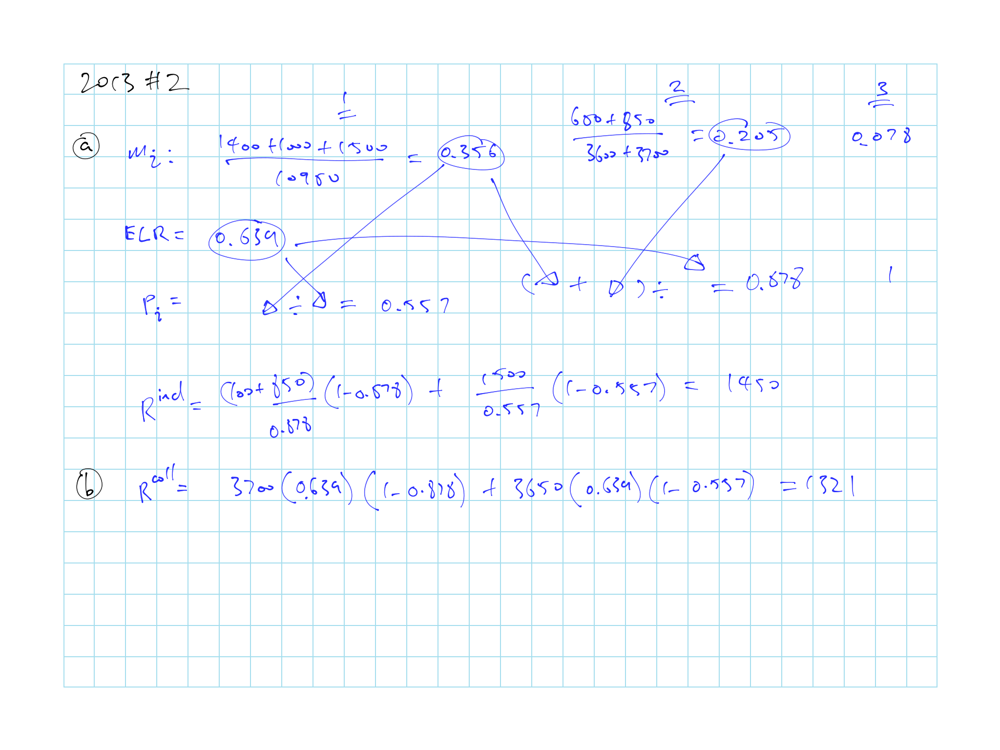

# Credible Claims Reserve: Benktander, Neuhaus and Mack - W. Hurlimann

Everything is based on a special method to calculate the $ELR$ and $LDFs$

* $ELR$ is based on the whole triangle $\sum$-ing up column LRs

* $LDFs$ are based $\dfrac{\text{Col LRs}}{ELR}$

* Key is just to watch out for incremental vs cummulative

Know the $Z$ for different methods (Table \@ref(tab:method-tbl-cred))

* The $Z$ is for weighting the **reserve**

* Optimal credibility formula assumes $U_i^{BC} {\perp\!\!\!\!\perp} C_i$ and $R_i$

## Loss Ratio Claims Reserve

$m_k$: **Expected loss ratio @ each age** $k$

* Based on **incremental** column paid loss ratios

* $k \in \{1, ..., n \}$ For $n$ development periods

$ELR$: **Expected loss ratio**:  

* $ELR = \sum \limits_{k=1}^n m_k$

* a priori ELR for collective loss ratio approach

* Use for the entire triangle

$p_k$: **% Losses emerged** for exposure period $k$

* $p_k = \dfrac{\sum \limits_{j=1}^{n} m_j}{ELR}$

* Based on column loss ratios $m_k$

* Loss ratio payout factor or loss ratio lag-factor

* $q_k = 1 - p_k$ is the loss ratio reserve factor

### Loss Ratio Claims Reserve Summary

$$R_i^c = Z_i \times R_i^{ind} + (1-Z_i) \times R_i^{coll}$$

Table: (\#tab:method-tbl-cred) Comparison of $Z_i$ for Different Methods

| $\mathbf{Z_i}$ | Method |
|:------------------:|:------------------:|
| 1     | Chainladder; Individual LR|
| 0     | BF; Collective LR|
| $p_k$ | Benktander (GB) |
| $p_k \times ELR$ | Neuhaus (WN) |
| $\dfrac{p_k}{p_k + \sqrt{p_k}}$ | Optimal Credibility |

\BeginKnitrBlock{remark}
\iffalse <em>Remark. </em> \fi 

* Neuhaus gives low credibility to lines with low loss ratios 
* Since Neuhaus use loss ratio, $\Delta$ exposure base will $\Delta$ result

* Neuhaus credibility = expected loss ratio to date

* Optimal credibility is capped @ 0.5

* Benktander and Neuhaus reduce the MSE of the reserve estimate nearly to an optimal level outperforming individual and collective
\EndKnitrBlock{remark}

\BeginKnitrBlock{proposition}\iffalse{-91-73-110-100-105-118-105-100-117-97-108-32-76-111-115-115-32-82-97-116-105-111-32-67-108-97-105-109-115-32-82-101-115-101-114-118-101-93-}\fi
<strong>(\#prp:indi-res) \iffalse (Individual Loss Ratio Claims Reserve) \fi </strong>Analogous to chainladder

$\begin{align}
  R_i^{ind} &= \dfrac{C_{ik}}{p_k} \times q_k \\
  &= \dfrac{C_{ik}}{p_k} - C_{ik} \\
  &= U_i^{ind} - C_{ik} \\
\end{align}$
\EndKnitrBlock{proposition}

\BeginKnitrBlock{proposition}\iffalse{-91-67-111-108-108-101-99-116-105-118-101-32-76-111-115-115-32-82-97-116-105-111-32-67-108-97-105-109-115-32-82-101-115-101-114-118-101-93-}\fi
<strong>(\#prp:coll-res) \iffalse (Collective Loss Ratio Claims Reserve) \fi </strong>Analogous to BF

$\begin{align}
  R_i^{Coll} &= q_k(V_i \times ELR) \\
  &= q_k(U_i^{BC}) \\
\end{align}$

* BC = Burning Cost
\EndKnitrBlock{proposition}

### Optimal Credibility Weights

Optimal credibility weights for loss ratio claims reserve

$Z^*_i$ is the credibility that minimizes the $MSE(R_i^c) = \mathrm{E}[(R_i^c - R_i)^2]$

\BeginKnitrBlock{theorem}
<strong>(\#thm:unnamed-chunk-2)</strong>Optimal credibility factor $c^*$ that minimizes $MSE(R_i^c) = \mathrm{E}[(R_i^c - R_i)^2]$ is

$Z^*_i = \dfrac{p_i}{q_i} \dfrac{Cov(C_i, R_i) + p_i q_i Var(U_i^{BC})}{Var(C_i) + p_i^2 Var(U_i^{BC})}$
\EndKnitrBlock{theorem}

Table: (\#tab:Z-impact) Impact of different components on $Z_i^*$

|  | Impact on $\mathbf{Z_i^*}$ | Comments |
| ------------------ | ------------| --------------------------- |
| Losses emerge | Increase | Since $\dfrac{p_i}{q_i}$ increases as losses emerge | 
| $\mathrm{Cov}(C_i, R_i)$ increase | Increase | Large covariance implies that $C_i$ is predictive of $R_i$ $\Rightarrow$ More weight on $CL$ method |
| $\mathrm{Var}(C_i)$ increase | Decrease | If $C_i$ is volatile, we want to rely less on $CL$ method |
| $\mathrm{Var}(U_i^{BC})$ increases | Increase | Trust $CL$ method more when a-priori is volatile |

\BeginKnitrBlock{remark}
\iffalse <em>Remark. </em> \fi 

* Assumes $U_i^{BC} {\perp\!\!\!\!\perp} C_i$ and $R_i$

* Large $Var(U_i^{BC})$ $\Rightarrow$ $Z \approx \dfrac{p}{q} \times \dfrac{pq}{p^2} = 1$
\EndKnitrBlock{remark}

Assumes $\mathrm{E}\left[ \dfrac{C_{ik}}{U_i} \mid U_i \right] = p_k$ and $\mathrm{Var}\left( \dfrac{C_{ik}}{U_i} \mid U_i \right) = p_k q_k \beta^2(U_i)$

\BeginKnitrBlock{theorem}
<strong>(\#thm:unnamed-chunk-4)</strong>Under the additional assumptions above, we have 

$Z_i^* = \dfrac{p_k}{p_k + t_k}$

Where $t = \dfrac{\mathrm{E}[\alpha^2(U)]}{\mathrm{Var}(U_0) + \mathrm{Var}(U) - \mathrm{E}[\alpha^2(U)]}$
\EndKnitrBlock{theorem}

\BeginKnitrBlock{theorem}
<strong>(\#thm:unnamed-chunk-5)</strong>If we assume $\mathrm{Var}(U_i) = \mathrm{Var}(U_i^{BC})$ then

$Z_k^* = \dfrac{p_k}{p_k + \sqrt{p_k}}$

Where the above assumption lead to $t_k \sim \sqrt{p_k}$
\EndKnitrBlock{theorem}

## Remark 6.1

Doing all the above with more "Traditional" method

* **Chainladder**

    * Replace $p_k$ with $p_k^{CL}$, inverse of the CDF

    * $R^{ind}_i = \dfrac{C_i}{p_k} - C_i$

* **Cape Code**

    * $ELR = \dfrac{\sum\limits_{i,k}S_{ik}}{\sum\limits_i V_i \times p_i^{CL}}$
    
        Sum of cumulative paid loss $\div$ used up premium
    
    * $R^{Coll}_i = q_k \times (V_i \times ELR)$

* **Benktander** with $Z_i = p_k$

    * $R^{GB}_i = Z_i \times R^{ind}_i + (1 - Z_i) \times R^{coll}_i$

* **Optimal Cape Cod** with $Z_i = \dfrac{p_k}{p_k+\sqrt{p_k}}$

* BF use some other a-priori that varies by AY and $Z = 0$

    * Note that we are talking about applying $Z$ to the formula above (Not the weighting between ultimates)

## Notation

For $n \times n$ triangle and losses fully developed at $n$

Where $i$ is exposure period and $k$ is the age

* $S_{ik} =$ Incremental Paid

* $C_{ik} =$ Cumulative Paid

* $U_i =$ Ultimate loss

* $V_i =$ Exposure base

* $m_k =$ expected loss ratio

* $\hat{m}_k =$ estimate of $m_k$

## Past Exam Questions

Haven't done TIA practice questions

**Full Calculation**

* 2013 #2 (fig \@ref(fig:2013-2)): Reserve calc 

* $\star$ 2015 #1: Neuhaus and optimal
    
    * Why is this needed? $\operatorname{Var}(U_i) = \operatorname{Var}(U_i^{BC})$ for the optimal credibility formula

### Question Highlights

(\#fig:2013-2)2013 Question 2

(\#fig:2013-2)2013 Question 2

